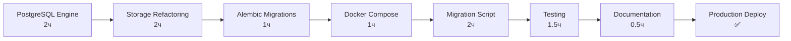

# Подготовка к Session 24: Production Ready

**Цель:** PostgreSQL + Production Deployment  
**Оценка:** ~10 часов разработки  
**Результат:** v3.1.0 — готов к production деплою

---

## ✅ Что уже готово (Session 23)

```
✅ v3.1.0-alpha.2 — Staging Ready
✅ 405 тестов (100% pass)
✅ Structured JSON Logging
✅ GPT-5 Full Support
✅ Configurable Retries
✅ Alembic Migrations (SQLite)
✅ Docker Ready
✅ API Production (Auth + Rate Limiting)
✅ Comprehensive Documentation
```

**Статус:** Можно использовать локально или на staging

---

## 🎯 Что нужно добавить (Session 24)

### 1. PostgreSQL Support (Критично)
```
⏳ PostgresSettings в config
⏳ Engine Factory (SQLite/PostgreSQL)
⏳ Connection Pooling (QueuePool)
⏳ Alembic migrations для PostgreSQL
⏳ Storage refactoring (use engine factory)
```

### 2. Migration Tools
```
⏳ Script: SQLite → PostgreSQL
⏳ Data validation
⏳ Rollback strategy
⏳ Dry-run режим
```

### 3. Production Docker
```
⏳ docker-compose.yml с PostgreSQL
⏳ Health checks для database
⏳ Volume configuration
⏳ Environment templates
```

### 4. Testing
```
⏳ PostgreSQL integration tests
⏳ Connection pool tests
⏳ Concurrent access tests
⏳ Migration tests
⏳ ~30 новых тестов
```

### 5. Documentation
```
⏳ PRODUCTION_DEPLOYMENT.md
⏳ MIGRATION_GUIDE_SQLITE_TO_POSTGRES.md
⏳ ENV updates (DB_* variables)
⏳ USER_GUIDE updates
```

---

## 📋 Pre-Session 24 Checklist

### Опционально (можете сделать сейчас):

#### 1. Подготовить PostgreSQL окружение
```bash
# Если хотите потестировать PostgreSQL локально
docker run -d \
  --name postgres-test \
  -e POSTGRES_DB=tg_parser \
  -e POSTGRES_USER=tg_parser_user \
  -e POSTGRES_PASSWORD=testpass123 \
  -p 5432:5432 \
  postgres:16-alpine

# Проверка
docker exec -it postgres-test psql -U tg_parser_user -d tg_parser -c "SELECT version();"
```

#### 2. Изучить текущую структуру БД
```bash
# Посмотрите что у вас в SQLite
sqlite3 raw_storage.sqlite ".schema"
sqlite3 processing_storage.sqlite ".schema"
sqlite3 ingestion_state.sqlite ".schema"

# Сохраните backup
cp *.sqlite backup/
```

#### 3. Определить production requirements
```
Вопросы для размышления:
- Где будет размещен сервер? (VPS, Cloud, On-premise)
- Какая нагрузка ожидается? (каналов, пользователей)
- Нужен ли SSL/HTTPS?
- Какая backup strategy?
- Мониторинг? (CloudWatch, Datadog, собственный?)
```

#### 4. Проверить текущую конфигурацию
```bash
# Убедитесь что все работает
cd /Users/alexanderefimov/TG_parser
source .venv/bin/activate

# Прогон всех тестов (финальная проверка)
python -m pytest tests/ -v

# Проверка Docker
docker-compose config
```

---

## 📖 Рекомендуемое чтение перед Session 24

### Must Read:
1. **[START_PROMPT_SESSION24_PRODUCTION.md](docs/notes/START_PROMPT_SESSION24_PRODUCTION.md)**
   - Детальный план Session 24
   - Все задачи и scope
   - Критерии успеха

2. **[docs/architecture.md](docs/architecture.md)**
   - Текущая структура БД
   - DDL схемы
   - Инварианты

### Optional (для контекста):
3. **SQLAlchemy Connection Pooling**
   - https://docs.sqlalchemy.org/en/20/core/pooling.html
   - QueuePool configuration
   - Best practices

4. **PostgreSQL Performance**
   - Connection pooling
   - Indexes optimization
   - VACUUM and ANALYZE

---

## 🚀 Session 24: Quick Overview

### Основные этапы (10 часов):



### Критичные компоненты:
1. **Engine Factory** — фундамент для PostgreSQL/SQLite switching
2. **Connection Pool** — производительность и стабильность
3. **Migration Script** — безопасная миграция данных
4. **Tests** — гарантия качества

---

## 🎯 Success Criteria Session 24

### Минимальные требования (Must Have):
- [x] PostgreSQL полностью работает (все 3 БД)
- [x] Connection pooling настроен
- [x] Docker Compose поднимает весь stack
- [x] Migration script работает и протестирован
- [x] 435+ тестов проходят (PostgreSQL + SQLite)
- [x] Health checks показывают database status

### После Session 24 получите:
```
✅ v3.1.0 — Production Ready
✅ PostgreSQL support
✅ Connection pooling
✅ Multi-user ready
✅ Docker Compose production
✅ Migration tools
✅ Deployment guide
✅ 435+ tests (100%)

→ ГОТОВ К PRODUCTION DEPLOY 🚀
```

---

## 📊 Timeline

```
┌─────────────────────────────────────────────────────────┐
│  Сейчас          Session 24         Production          │
│                                                          │
│  v3.1.0-alpha.2  ──────►  v3.1.0  ──────►  Deploy       │
│  Staging Ready    (~10ч)  Production     На сервер      │
│                           Ready                          │
└─────────────────────────────────────────────────────────┘
```

**ETA до production:** ~10 часов разработки + 1-2 часа деплоя

---

## 💡 Tips для Session 24

### 1. Начните с Engine Factory
Это фундамент для всего остального. Сначала создайте абстракцию, потом рефакторите storage модули.

### 2. Тестируйте инкрементально
После каждого этапа прогоняйте тесты:
```bash
# После Engine Factory
python -m pytest tests/test_storage/ -v

# После каждого storage модуля
python -m pytest tests/test_<module>_storage.py -v
```

### 3. Используйте PostgreSQL в Docker
Не нужно устанавливать локально, Docker достаточно:
```bash
docker-compose up -d postgres
```

### 4. Backup перед миграцией
ВСЕГДА делайте backup перед тестированием migration script:
```bash
mkdir -p backups
cp *.sqlite backups/
```

### 5. Dry-run для Migration
Сначала тестируйте с `--dry-run`, потом реально:
```bash
python scripts/migrate_sqlite_to_postgres.py --dry-run --verify
```

---

## ⚠️ Потенциальные проблемы

### 1. PostgreSQL Type Mismatches
**Проблема:** SQLite динамические типы vs PostgreSQL строгие типы  
**Решение:** Явные type casts в Alembic migrations

### 2. Connection Pool Leaks
**Проблема:** Connections не возвращаются в pool  
**Решение:** Proper context managers, `pool_pre_ping=True`

### 3. Migration Data Loss
**Проблема:** Данные теряются при миграции  
**Решение:** Validation step в migration script, rollback strategy

### 4. Docker Networking
**Проблема:** tg_parser не может подключиться к postgres  
**Решение:** `depends_on` + health checks в docker-compose

---

## 📞 Support

### Документация готова:
- ✅ [START_PROMPT_SESSION24_PRODUCTION.md](docs/notes/START_PROMPT_SESSION24_PRODUCTION.md) — детальный план
- ✅ [SESSION23_COMPLETE_SUMMARY.md](SESSION23_COMPLETE_SUMMARY.md) — что уже сделано
- ✅ [DEVELOPMENT_ROADMAP.md](DEVELOPMENT_ROADMAP.md) — общий roadmap

### Полезные команды:
```bash
# Проверка текущего состояния
python -m pytest tests/ -v --tb=short

# Database stats
tg-parser db current

# Docker check
docker-compose config
```

---

## 🎉 Готовы к Session 24?

### Чеклист:
- [ ] Прочитан START_PROMPT_SESSION24_PRODUCTION.md
- [ ] Понятны цели и scope
- [ ] Backup текущих SQLite баз (опционально)
- [ ] PostgreSQL Docker готов (опционально)
- [ ] Все тесты проходят (405/405)

### Когда начинать:
**Когда готовы!** Session 24 можно начинать в любой момент.

После Session 24 → **PRODUCTION DEPLOY** 🚀

---

## 🚀 Next Steps

1. **Прочитайте START_PROMPT_SESSION24_PRODUCTION.md**
2. **Опционально: подготовьте PostgreSQL окружение**
3. **Когда готовы → начинайте Session 24**
4. **После Session 24 → Deploy на production!**

---

**Удачи в Session 24! 💪**

**Target:** v3.1.0 — Production Ready  
**Timeline:** ~10 часов  
**Result:** Готов к production деплою на сервер 🎉

