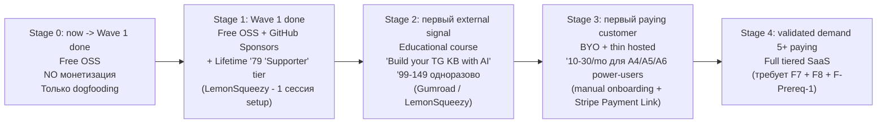

# Monetization Mechanisms — обзор и staged-стратегия

**Назначение:** справочный документ для всех будущих обсуждений
монетизации продукта. Содержит per-segment модели (A1, A2, A4,
A5, A6 из `PRODUCT_STRATEGY_AUDIENCE_DRIVEN_2026-05-02.md`),
cross-cutting паттерны, реальные pricing precedents с рынка,
constraint'ы (solo-dev burden, §7.1 MTProto), staged-подход (5
этапов от Stage 0 = no monetization до Stage 4 = full SaaS) и
decision framework для триггеров перехода между стейджами.

**Дата:** 2026-05-02.

**Статус:** discussion-документ; **не commitment** к конкретной
монетизационной модели. Является input'ом для будущих stage-decision
сессий.

**Связан с:** [`PRODUCT_STRATEGY_AUDIENCE_DRIVEN_2026-05-02.md`](PRODUCT_STRATEGY_AUDIENCE_DRIVEN_2026-05-02.md)
(audience map, Wave 1 plan), [`FUTURE_FEATURES.md § F-Prereq-1`](FUTURE_FEATURES.md)
(SaaS Telegram MTProto Legal Review — блокер для Stage 4),
[`FUTURE_FEATURES.md § F7`](FUTURE_FEATURES.md) (Monetization /
Billing infra — full implementation для Stage 4).

**Когда использовать:**

- Перед любой архитектурной decision'ой, у которой есть
  monetization-implications (multi-tenancy boundaries, credential
  storage, audit logging).
- При появлении первого potential paying-customer'а — для определения
  релевантного Stage.
- При планировании sprint'ов F7 (Billing) или F8 (Scalability).
- При обсуждении OSS vs commercial license (см. § 4.6 strategy doc).

**Что НЕ делает этот документ:**

- НЕ выбирает конкретную модель монетизации сейчас (это делается
  по signal'у, не a priori — см. § 4.6 strategy doc «OSS vs
  commercial — defer decision»).
- НЕ заменяет [`FUTURE_FEATURES.md § F7`](FUTURE_FEATURES.md) —
  тот документ описывает **техническую реализацию** billing infra;
  этот описывает **business-механизмы** и precedent'ы.
- НЕ commit'ится к конкретным price points — все цифры — referenced
  из аналогов рынка, не utterances «продаём за $X».

---

## 1. TL;DR

- **5 staged-этапов монетизации** от «free OSS, no $$$» (Stage 0)
  до «full SaaS» (Stage 4). Переходы по signal'у, не по календарю.
- **Stage 0→1 (GitHub Sponsors + Lifetime Checkout, ~1 час setup)**
  — можно делать **прямо сегодня** параллельно с Wave 1, нулевой
  operational burden.
- **A4 (AI Agent Builder)** — самый «правильный» сегмент для
  монетизации первым (highest WTP, lowest support burden, B2B-flavor).
  Реализуется через **BYO Telegram credentials** — обходит §7.1
  legal-grey-area.
- **A5 (Journalist/Analyst)** — самый «B2B-готовый» по precedent'ам
  рынка (TGStat, Brand24 — $30–100/mo подтверждены).
- **A6 (Domain Curator)** — двусторонний рынок (Substack/Patreon-like
  revenue share), долгий time-to-revenue, но самый sticky.
- **A1 (Solo Curator)** — низкая WTP (тech-savvy = self-host preference);
  не монетизировать как primary, оптимально OSS + GitHub Sponsors +
  Lifetime $79.
- **A2 (Solo Consumer)** — изолированно не монетизируется, нужен
  A6-supply.
- **Anti-pattern:** строить full subscription инфру до validated
  signal'а от 5+ paying customers. Manual provisioning +
  Stripe Payment Link достаточно для Stage 3.
- **Critical constraint:** §7.1 Telegram MTProto blocks centralized
  hosted scraping для commercial; **BYO-credentials** decouples
  legal risk от платформы.
- **Radical alternative:** возможно, оптимально **первые 6–12
  месяцев не монетизировать вообще** — focus на product polish и
  audience signal. Plausible / Cal.com шли этим путём 1.5–2 года.

---

## 2. Per-segment monetization analysis

### 2.1 A1 — Solo Knowledge Curator

**Особенность сегмента:** самые tech-savvy. Они **умеют** self-host.
Сильное идеологическое сопротивление recurring fees («зачем платить,
если могу собрать сам»). Ожидаемая годовая ARPU $0–120, но
conversion-rate низкий (<1%).

| Модель | Реалистичный price | Pro | Con |
|---|---|---|---|
| **Lifetime license** | $50–100 одноразово | Простой setup, нет recurring infra burden | Никакой LTV expansion, нужна постоянная funnel |
| **Open Core + paid hosted** | $5–10/mo | Дополняет OSS, целит на «не хочу настраивать» | Малый ARPU |
| **GitHub Sponsors** | $3–10/mo | Минимум friction, community-driven | Очень малая conversion (<1% от GitHub stars) |
| **BYO LLM + thin convenience fee** | $5/mo | Снижает нашу cost base до 0 | Нужен payment processor для $5 |

**Аналоги рынка:**

| Продукт | Pricing | Модель |
|---|---|---|
| Obsidian | Free for personal; $50/year for commercial; $5/mo для Sync | Open Core |
| Roam Research | $15/mo или $500 lifetime | Subscription only |
| Logseq | Free OSS + planned paid sync | Open Core |
| Foam | Free OSS | Pure OSS |

**Реалистичный путь:** OSS + GitHub Sponsors + Lifetime $79
«Supporter» tier. **Не строить subscription infra под этот сегмент**
— operational cost > revenue.

### 2.2 A2 — Solo Consumer Researcher

**Особенность сегмента:** **не существует без A6** (некому потреблять
без курированной KB). Изолированно монетизировать нельзя.

| Модель | Кто платит | Кому |
|---|---|---|
| **Reader subscription** на конкретный curated KB | A2 → платформа | revenue share с A6 |
| **Free + premium features** (history, bookmarks, advanced search, ad-free) | A2 → платформа | напрямую |
| **Tip jar для curator** | A2 → A6 | прямые transfers |

**Аналоги рынка:**

| Продукт | Pricing | Модель |
|---|---|---|
| Pocket Premium | $4.99/mo | Subscription |
| Readwise | $7.99/mo | Subscription |
| Substack | Free + reader pays per publication | Revenue share с creator |
| Patreon | Free + reader pays per creator | Revenue share с creator |

**Реалистичный путь:** не делать прямой A2-монетизации до того, как
A6 не build'нет supply. Тогда — revenue-share модель Substack-like
(платформа берёт 5–10% с подписок A6 на их KB).

### 2.3 A4 — AI Agent Builder / Integrator

**Это самый «правильный» segment для монетизации** — programmatic
customers, clear unit economics, низкий support burden, готовые рынки
с established pricing patterns.

| Модель | Pricing pattern | ARPU/год |
|---|---|---|
| **Per-request API pricing** | $0.001–0.01/запрос | $50–2000 |
| **Tiered subscription** | Free (1k req/mo), Pro $20–50/mo (50–100k req), Enterprise custom | $240–600+ |
| **Hosted MCP server** | $30–100/mo за hosted instance с quotas | $360–1200 |
| **Custom enterprise SLA** | $500–5000/mo | $6000–60000 |

**Аналоги рынка:**

| Продукт | Pricing | Модель |
|---|---|---|
| SerpAPI | $50/mo (5k searches), $150/mo (15k), … | Tiered + per-request |
| Brave Search API | $3 / 1k queries | Pure per-request |
| Algolia | Free 10k records, $0.50/1k records, $1/1k searches | Tiered + per-unit |
| Pinecone | Free до 100k vectors; $70/mo starter | Tiered |
| Resend | Free 100/day, $20/mo for 50k emails | Tiered |
| Apify | $49/mo starter, pay-as-you-go for compute | Tiered + usage |

**Особенность:** B2B-flavor. Highest WTP среди solo сегментов.
Customers = разработчики → меньше hand-holding.

**Блокер:** §7.1 Telegram MTProto + F4-A (multi-tenancy DONE) +
F7 (billing) + F8 (scale) — для full SaaS всё нужно.

**Workaround — BYO Telegram credentials:** клиент заводит свой
Telegram api_id/api_hash, мы предоставляем только processing/RAG/MCP
layer. Это:

- Снимает §7.1 с нас (legal ответственность на клиенте)
- Снижает infra cost (LLM не наш, Telegram fetch не наш)
- Делает пилот возможным **до** полной F7/F8 инфры
- Stage 3 model — manual provisioning + Stripe Payment Link

### 2.4 A5 — Journalist / Content Analyst

**Это самый «B2B-готовый» segment** — есть прямые конкуренты с
established pricing. WTP подтверждён рынком.

| Модель | Pricing | ARPU/год |
|---|---|---|
| **Pro subscription per analyst** | $20–50/mo | $240–600 |
| **Per-channel** | $1–2/mo за monitored канал | scales с usage |
| **Per-alert** | $0.05/alert | cost-correlated, но непредсказуемый bill |
| **Freemium tier** | Free (5 каналов, daily digest), Pro ($30/mo, 50 каналов, real-time alerts) | $0–360+ |

**Аналоги рынка:**

| Продукт | Pricing | Модель |
|---|---|---|
| TGStat Premium | $30–100/mo | Subscription |
| Brand24 | $99–299/mo | Tiered subscription |
| Mention | $41–149/mo | Tiered subscription |
| Awario | $39–249/mo | Tiered subscription |
| Talkwalker | $9000+/year | Enterprise |
| Meltwater | enterprise custom | Enterprise |

**Особенность:** есть TAM, есть competition, есть established pricing
→ **наименее рискованный путь** для validation монетизации.
WTP ясно подтверждён.

**Risk:** mass B2C — высокий support burden. Журналисты — capricious
customers, требуют hand-holding. Solo developer одному tяжело
поддерживать 100+ paying mass-market customers (см. § 4.1).

**Mitigation:** начать с **малого premium tier** ($30–50/mo) для
power-users, не с broad freemium.

### 2.5 A6 — Domain Curator (для аудитории)

**Двусторонний рынок** — curator платит за инструмент, читатели (A2)
платят за доступ к KB curator'а. Самый sticky при работе, но
slowest to ramp up (нужно build'ать обе стороны).

| Слой | Модель | Pricing |
|---|---|---|
| **Creator subscription** (инструмент для курирования) | Subscription | $10–30/mo |
| **Revenue share** с paid subscribers KB | % от reader subscriptions | 5–10% |
| **Embed widget** для website | Free + premium (no branding) | $5–20/mo |
| **Bulk dataset export** | One-time или subscription | $50–500 одноразово |

**Аналоги рынка:**

| Продукт | Creator pricing | Take rate (revenue share) |
|---|---|---|
| Substack | Free | 10% |
| Patreon | Free | 5–12% (tiered) |
| Beehiv | Free до 2.5k subs, $39+/mo выше | 0% (subscription only) |
| Ghost Pro | $9–199/mo | 0% (no transaction fee) |
| Memberful | $25–100/mo | 4.9% + $0.30 per transaction |
| Gumroad | Free | 9% |
| Buy Me A Coffee | Free | 5% |
| Convertkit | $9–149/mo + fees | 0% on subscription tier, transaction fees on commerce |

**Особенность:** медленно растёт (chicken-egg), но самый «sticky»
при работе. Curator'ы редко уходят, если их audience платит.

**Risk:** distribution — нужен mechanism для curators привлекать
readers. Без built-in audience (как у Substack) — slow growth.

---

## 3. Cross-cutting монетизационные паттерны

### 3.1 Open Core (Cal.com, PostHog, Plausible, Supabase)

OSS-engine + paid hosted. **Универсальная** модель, работает для
всех solo сегментов одновременно.

- A1 self-hosts → free
- A4/A5/A6 платят за hosted convenience + scale + reliability + support

**Аналоги:**

| Продукт | OSS + Hosted pricing |
|---|---|
| Cal.com | Free OSS, $15/mo для Cal Atoms self-hosted, $29/mo hosted Pro |
| PostHog | Free OSS до 1M events/mo, then $0.000248/event |
| Plausible | Free OSS, $9–69/mo hosted |
| Supabase | Free OSS, $25/mo hosted Pro |
| n8n | Free OSS, $20–50/mo cloud |
| Penpot | Free OSS, paid enterprise |

**Подходит для:** всех segments. Минимальный архитектурный лок-ин.

**Bonus:** GitHub stars / community → marketing «бесплатно».
Плотный flywheel «contributor → user → paying user».

### 3.2 BYO Credentials (под §7.1)

Клиент сам предоставляет:

- Telegram api_id / api_hash → legal ответственность на нём
- LLM API keys (OpenAI / Anthropic / Gemini) → cost не наш

Мы продаём только **processing / RAG / MCP layer + hosting**.

| Аспект | Преимущество | Недостаток |
|---|---|---|
| Legal | §7.1 risk на клиенте, не на нас | требует clearer ToS |
| Cost | LLM не наша cost = higher margin | ARPU ниже (нельзя markup) |
| Onboarding | для tech-savvy легко | для mass-market friction |
| Scale | infra экономит (no LLM passthrough) | нужен secure credential storage |

**Хорошо подходит для:** A1 self-host, A4 power-users.

**Плохо для:** A5 mass-market journalists.

**Прецеденты:** Make.com (БYO API keys для integrations),
n8n cloud (BYO LLM keys), some Apify scrapers.

### 3.3 Marketplace fees / API directory

**A4-специфично** — попадание в Smithery, Cline marketplace,
Anthropic MCP directory. Сейчас комиссий нет, в будущем будут (как
у App Store / Stripe Apps).

**Бесплатный distribution** до того момента. Listing — это free
marketing.

**Стратегический шаг:** попасть в эти directories при выходе из
Wave 1 (Surface Parity DONE), даже если ещё нет монетизации.

### 3.4 Educational / training

**Параллельная монетизация:** вместо/вместе с продуктом — продавать
**как делать свою KB**.

| Pricing | Аналоги |
|---|---|
| $99–299 одноразово (course) | Indie Hackers courses, Gumroad creators |
| $19/mo membership | Gum.fm, Skool, Patreon-like |
| Free course + paid product upsell | Class Central pattern |

**Преимущества:**

- Не требует никакой billing-инфры (Gumroad / Lemon Squeezy
  one-click)
- **Параллельно создаёт контент** для маркетинга (YouTube туториалы,
  blog posts, Twitter threads — все из материала курса)
- Audience-builder для будущих product paying customers

**Прецеденты:** Wes Bos ($99 courses), Lee Robinson, Theo Browne
(Self Hosting course), Levels.fyi.

### 3.5 Cohort-bundle (сборка KB как продукт)

**Не продавать инструмент — продавать готовую KB.**

Например: «Crypto Knowledge Base 2026 — 50 channels, 6 months,
weekly updates» $29 one-time или $5/mo для updates.

Это **A6 без A6** — ты сам curator. Хорошо подходит для
domain-эксперта (если у owner проекта есть expertise в конкретной
вертикали — медицина, finance, AI, etc.).

**Прецеденты:** Stratechery ($12/mo), Lenny's Newsletter ($150/year),
The Information ($399/year), Bloomberg Terminal data feeds (much higher).

### 3.6 Data licensing / API exposure

Продавать **обработанную KB** как dataset для ML / research /
аналитических целей.

| Модель | Pricing |
|---|---|
| One-time dataset license | $500–5000 |
| Recurring data feed (API) | $100–1000/mo |
| Custom enrichment service | per-project |

**Прецеденты:** Common Crawl (free), OpenAlex (free), Pile of Law
(free), академические datasets (research licensing).

**Risk:** для commercial — copyright concerns на raw Telegram content
(см. § 7.1 — расширение MTProto-проблемы на distribution).

---

## 4. Constraints (которые меняют всё)

### 4.1 Solo developer burden

Owner проекта — solo. **Каждый payment processor, каждый support
ticket, каждый refund — его время.**

| Модель | Operational burden |
|---|---|
| GitHub Sponsors | Минимальный (Stripe handle всё) |
| Lifetime + Stripe Checkout | Низкий (one-time charges, no churn analytics) |
| Educational course | Низкий (Gumroad / Lemon Squeezy handle) |
| API-as-Service tiered | Средний (rate limits, key rotation, deprecation) |
| B2C subscription | **Высокий** (churn, billing failures, refunds, customer success) |
| Enterprise SLA | **Очень высокий** (custom contracts, support, uptime guarantees) |

**Implication:** избегай моделей с высокой operational burden
до hire'а первого full-time support.

**Stage 1–2 ОК:** GitHub Sponsors + Lifetime + Educational.

**Stage 3 ОК:** API-as-Service для A4 (developer customers,
self-service).

**Stage 4 рискованно соло:** mass B2C / Enterprise.

### 4.2 §7.1 Telegram MTProto

**Уже зафиксировано** в [`PRODUCT_STRATEGY_AUDIENCE_DRIVEN_2026-05-02.md` § 7.1](PRODUCT_STRATEGY_AUDIENCE_DRIVEN_2026-05-02.md)
и [`FUTURE_FEATURES.md § F-Prereq-1`](FUTURE_FEATURES.md).

**Влияние на монетизацию:**

| Stage | Влияние |
|---|---|
| 0–2 (Free OSS, GitHub Sponsors, Lifetime, Educational) | **Нет** влияния |
| 3 (BYO + thin hosted) | **Нет** влияния (ответственность на клиенте) |
| 4 (Full SaaS hosted scraping) | **Блокер** — требует F-Prereq-1 закрытым |

**Implication:** **BYO-credentials архитектура — самый дешёвый
обход**. Stage 3 можно делать без §7.1 resolution.

### 4.3 Time-to-revenue vs time-to-build

| Модель | Time-to-build | Time-to-first-$ |
|---|---|---|
| GitHub Sponsors | 1 час (просто включить в repo settings) | days–weeks (зависит от visibility) |
| Lifetime + Stripe Checkout | 2–3 сессии (landing + Checkout link) | days |
| Educational course | 5–10 сессий (на сам курс) | weeks–months |
| Cohort-bundle (manual) | 1 сессия (Gumroad listing) | days–weeks |
| API-as-Service tiered | 5–10 сессий (F4-A done + F7 + rate limit) | months |
| Full B2C subscription | 10+ сессий (F7 + Stripe + churn analytics + customer success infra) | months |

**Implication:** stage'ируй монетизацию. Не строй полную subscription
infra пока не подтвердишь WTP через cheaper experiments.

### 4.4 LLM cost economics

LLM — самая дорогая cost в pipeline (processing + topicization +
RAG + digest).

| Модель | Cost owner |
|---|---|
| Free OSS self-host | User pays own LLM bills |
| BYO LLM keys + thin hosted | User pays |
| Subscription markup (we pass through with markup) | User pays via subscription |
| Free hosted + ad-supported | We pay (high risk) |

**Implication:** **избегать модели «we pay LLM out of subscription»**
для solo dev. Margin становится отрицательным при первом heavy user.
**BYO LLM keys** — defensive default.

### 4.5 Regulatory / compliance

| Регуляция | Применимость |
|---|---|
| **GDPR** (EU) | Применима если EU user'ы → нужны DPA, ROPA, Privacy Policy |
| **PCI-DSS** | Если store credit card data (но Stripe handles это) |
| **VAT** (EU) | Sales tax на digital services (Stripe Tax / Paddle handles) |
| **CCPA** (California) | Если California user'ы |
| **Russia data localization** (если RU customers) | Серьёзный constraint |

**Implication:** избегать прямого VAT / GDPR burden via использование
**Merchant of Record** (Paddle, LemonSqueezy) — они handle compliance
за take rate.

| Provider | Take rate |
|---|---|
| Stripe (DIY VAT/GDPR) | 2.9% + $0.30 |
| Paddle (MoR) | 5% + $0.50 |
| LemonSqueezy (MoR) | 5% + $0.50 |
| Gumroad (MoR) | 10% (разные тарифы) |

**Recommendation:** для Stage 1–2 — Paddle / LemonSqueezy
(обходим VAT/GDPR overhead). Для Stage 3+ — пересматривать.

---

## 5. Staged-стратегия монетизации

### 5.1 Visualization

### 5.2 Stage 0: Free OSS, no monetization (now → Wave 1 done)

- **Длительность:** до завершения Wave 1 strategy doc.
- **Pricing:** $0.
- **Setup:** ничего, продолжать как сейчас.
- **Цель:** product polish, dogfooding, light external validation.
- **Trigger to Stage 1:** Wave 1 завершён + ≥10 GitHub stars
  ИЛИ ≥3 запроса «как support'ать проект» от внешних.

### 5.3 Stage 1: Free OSS + GitHub Sponsors + Lifetime tier

- **Длительность:** ~3–6 месяцев после Stage 0 trigger.
- **Pricing:**
  - GitHub Sponsors: $3/mo, $10/mo, $50/mo tiers
  - Lifetime «Supporter» $79 одноразово — name in CONTRIBUTORS.md,
    early access to PRs, priority issue triage
- **Setup time:** ~1 час GitHub Sponsors + ~2–3 сессии для Lifetime
  (landing page + LemonSqueezy / Paddle Checkout integration).
- **Operational burden:** минимальный (Sponsors handle сам GitHub,
  Lifetime — никаких recurring billing).
- **Target ARPU:** $30–100/year per supporter.
- **Цель:** validation что вообще есть WTP. Cover минимальные cost
  (LLM testing, hosting demo).
- **Trigger to Stage 2:** ≥5 supporters ИЛИ ≥3 запроса «как
  использовать продукт в моём workflow / domain».

### 5.4 Stage 2: Educational course

- **Длительность:** ~3–6 месяцев после Stage 1 trigger.
- **Pricing:** $99–149 one-time для курса «Build your Telegram
  Knowledge Base with AI» (5–10 модулей).
- **Setup time:** 5–10 сессий на сам курс (script, video, examples,
  hosting на Gumroad / Podia / самoхост).
- **Operational burden:** низкий (course material once created
  generates passive revenue).
- **Bonus:** course content **превращается в маркетинг** — YouTube
  туториалы, blog posts, Twitter threads.
- **Target revenue:** $500–5000/mo passive (зависит от audience
  size).
- **Цель:** funnel для Stage 3 (course students → power-users →
  paying SaaS users).
- **Trigger to Stage 3:** первый concrete request «can you host
  this for me?» от course student или OSS user.

### 5.5 Stage 3: BYO + thin hosted (manual)

- **Длительность:** ~6–12 месяцев после Stage 2 trigger.
- **Pricing:** $10–30/mo для A4 (BYO Telegram credentials + LLM
  keys), $20–50/mo для A5 (включая Telegram API setup help).
- **Setup time:** **0 сессий новой инфры** для первых 5–10 customers!
  Manual onboarding via DM, payment via Stripe Payment Link или
  Paddle Subscription Link, manual provisioning Docker container
  для клиента.
- **Operational burden:** средний (manual provisioning требует ~30
  минут на customer; supportable до 20–30 customers).
- **Target ARPU:** $120–600/year/customer.
- **Цель:** validate WTP за hosted-as-a-Service до commit'а в
  full F7/F8 инфру.
- **Trigger to Stage 4:** ≥5 paying customers + manual provisioning
  burden становится unsustainable.

### 5.6 Stage 4: Full tiered SaaS

- **Длительность:** ongoing.
- **Pricing:** tiered (Free → Pro → Enterprise), per-segment
  variations.
- **Setup time:** F7 (~3–4 сессии) + F8 phases (1–3 сессии каждая)
  + F-Prereq-1 resolved (ADR-decision на legal).
- **Operational burden:** **высокий** — потребует или hire'а
  customer-success, или strict self-service automation.
- **Target ARPU:** segment-зависимо (см. § 2).
- **Цель:** scale до hundred(s) of customers.
- **Trigger to revisit:** churn > 10%/month, или CAC > LTV.

### 5.7 Anti-paths

| Anti-pattern | Почему НЕ |
|---|---|
| Stage 4 без Stage 3 validation | Тratil 10+ сессий на F7/F8 без proven demand |
| Mass B2C (1000+ A5 customers) для solo dev | Customer support burden убьёт |
| Free hosted + ad-supported | LLM cost > ad revenue для technical product |
| Hosted SaaS scraping без §7.1 resolution | Legal risk, possible Telegram ban |
| Прямая монетизация A1 как primary segment | Tech-savvy = high resistance, low conversion |
| Прямая монетизация A2 без A6 supply first | Chicken-egg, нет контента для consumption |

---

## 6. Если выбирать ОДИН segment первым — A4 rationale

В Stage 3 можно target'ить любой из A4/A5/A6, но **A4 — оптимальный
первый**:

1. **Самый понятный pricing pattern.** Programmatic customers
   платят $20–50/mo за hosted MCP/API без вопросов (если value
   есть). Tiered subscription — стандарт индустрии (SerpAPI,
   Algolia, Pinecone — все так).
2. **Меньше support burden.** Технические audience, less
   hand-holding, больше self-service.
3. **§7.1 решается через BYO** (клиент даёт свой Telegram api_id).
   Не нужно ждать Telegram legal review.
4. **Архитектурно дешёвый** — F4-A multi-tenancy уже DONE; нужен
   только per-tenant credential storage + Stripe Subscription Link.
   Полная F7 не нужна для Stage 3.
5. **Distribution бесплатный** — Smithery / Cline marketplace /
   Anthropic MCP directory — все free listings (пока).
6. **Самый высокий ARPU/customer** — $200–2400+/year vs $50–360 для
   A1/A5/A6 → меньше клиентов нужно для break-even.

**Risk:** A4 — узкая ниша (developer-tool). TAM меньше чем A5
(журналисты) или A6 (curators). Это «high WTP × low volume» vs
«low WTP × high volume».

**Hedge:** ничто не мешает в Stage 3 параллельно начать A5 и A6 —
если signal'ы появляются с разных сторон. Но если выбирать один
для starting point — A4.

---

## 7. Радикальная альтернатива — НЕ монетизировать первые 6–12 месяцев

Учитывая что owner проекта **сам платил бы** за этот инструмент
(см. § 9 strategy doc) — **возможно, оптимальная стратегия это
полное отсутствие монетизации первый год**.

**Аргументы за:**

- Owner всё равно нужен продукт для себя — fix bugs / build features
  drive'ятся personal pain, не paying-customer feedback'ом.
- Распыление на «как монетизировать» съест время на «улучшать
  продукт».
- OSS + GitHub Sponsors даёт floor revenue без operational burden.
- Когда продукт станет реально хорош (Wave 1 + 2A/B/C) — монетизация
  сама становится понятной (рынок подскажет).
- Множество успешных indie-продуктов годами были free OSS перед
  монетизацией:
  - Plausible — 2 года OSS перед paid hosted
  - Cal.com — 1.5 года OSS перед commercial entity
  - PostHog — ~1 год до first $$$
  - Supabase — несколько лет grant-funded до Series

**Аргументы против:**

- Без monetization-experiment'ов трудно понять, что *реально* ценит
  рынок (не то, что говорят на survey).
- Даже Lifetime $49 на BMC/Gumroad — это сигнал.
- Без revenue нет budget на marketing / contractors / time-off.
- 12 месяцев unpaid full-time work тяжело психологически.

**Compromise:** Stage 0 → Stage 1 (just GitHub Sponsors, ~1 час
setup) — даёт floor revenue + зачищает от «надо монетизировать»
тревоги, не отвлекая от product work.

---

## 8. Decision framework: когда что триггерить

### 8.1 Stage transitions

| Из | В | Trigger |
|---|---|---|
| 0 → 1 | Wave 1 done + ≥10 GitHub stars OR ≥3 «как support'ать?» |
| 1 → 2 | ≥5 supporters OR ≥3 «как использовать в моём workflow?» |
| 2 → 3 | Первый concrete request «can you host for me?» |
| 3 → 4 | ≥5 paying + manual provisioning unsustainable |

### 8.2 Pivot triggers (когда переосмыслить)

| Trigger | Action |
|---|---|
| Никто не support'ит после 6 месяцев Stage 1 | Pivot ниши? Pivot positioning? Pivot domain? |
| Educational course flop (≤10 sales за 6 месяцев) | Audience не там, marketing не работает |
| 5 paying customers Stage 3, но churn 50%/mo | Product-market mismatch, refactor value prop |
| Telegram bans naш Telethon бот | F-Prereq-1 escalates, pivot к Bot API or self-host only |
| Конкурент с deep pockets выходит на рынок | Niche-down, focus на specific vertical (medical / finance / etc.) |

### 8.3 Domain-specific verticals (если решит focus'нуться)

При появлении signal к specific vertical, можно pivot to vertical
SaaS — обычно работает лучше horizontal:

- **Medical Knowledge Base** ([@labdiagnostica_logical]
  precedent) — высокий WTP, regulated audience
- **Crypto / Finance Channels** — крайне sensitive к real-time,
  готовы платить $$$
- **AI / ML Research** — developer audience, high WTP, overlap с A4
- **Geopolitics / OSINT** — overlap с A7 (compliance/regulatory),
  ideologically out-of-scope per § 4.4

---

## 9. Open questions / unresolved

Эти вопросы не решены и требуют ответа когда дойдёт до Stage 1+:

1. **Платформа для Lifetime / Course:** Gumroad (10% take, simple)
   vs LemonSqueezy (5% take, MoR) vs Paddle (5% take, MoR) vs
   self-hosted Stripe? Зависит от geographic distribution audience.
2. **Pricing currency:** USD baseline? Поддержка RUB / EUR?
   PPP (purchasing power parity) discounts для non-Western
   audience?
3. **OSS license** (когда дойдёт): MIT (permissive, max adoption,
   no commercial protection) vs AGPL (copyleft, защищает от
   commercial fork) vs SSPL (Mongo-style, защищает от cloud
   providers, но не OSI-approved) vs BSL (HashiCorp/Sentry style,
   delayed open source)?
4. **Domain naming:** product brand отделять от tg_parser? Repository
   name vs marketing name? Domain registration?
5. **Russian-speaking audience first?** Owner — RU-speaker, есть
   established TG audience + RU domain expertise. Vs English-first
   для bigger TAM. Multi-language доступен в Wave 2B+.
6. **Public vs private discussions:** делать ли roadmap public?
   build-in-public Twitter/Telegram-канал?
7. **Founding team:** solo всю дорогу? hire technical co-founder
   при Stage 3? out-source customer success?

---

## 10. Связанные документы

| Документ | Зачем |
|----------|-------|
| [`PRODUCT_STRATEGY_AUDIENCE_DRIVEN_2026-05-02.md`](PRODUCT_STRATEGY_AUDIENCE_DRIVEN_2026-05-02.md) | Audience map, Wave 1 plan, OSS-vs-commercial deferred |
| [`FUTURE_FEATURES.md § F-Prereq-1`](FUTURE_FEATURES.md) | SaaS Telegram MTProto Legal Review — блокер для Stage 4 |
| [`FUTURE_FEATURES.md § F7`](FUTURE_FEATURES.md) | Monetization / Billing infra — full implementation для Stage 4 |
| [`FUTURE_FEATURES.md § F8`](FUTURE_FEATURES.md) | Scalability — sub-block для Stage 4 |
| [`docs/business-requirements.md`](../business-requirements.md) | Бизнес-цели, стейкхолдеры, UC |
| [`docs/adr/0002-telegram-ingestion-approach.md`](../adr/0002-telegram-ingestion-approach.md) | Telethon / MTProto choice |
| [`SESSION48_PRODUCT_STRATEGY.md`](SESSION48_PRODUCT_STRATEGY.md) | SUPERSEDED, упоминает SaaS perspective без детализации |

---

## 11. История документа

| Дата | Изменение | Источник |
|------|-----------|----------|
| 2026-05-02 | Первая версия. Создан как отдельный документ для consolidation монетизационной discussion после strategy session. Per-segment monetization (A1/A2/A4/A5/A6), cross-cutting patterns (Open Core, BYO, marketplace, educational, cohort-bundle, data licensing), constraints (solo-dev burden, §7.1 MTProto, time-to-revenue, LLM cost economics, regulatory), 5-stage staged approach (0=no monetization → 4=full SaaS), A4-first rationale, radical alternative (no monetization 6–12 months), decision framework для stage transitions, 7 open questions. | Conversation 2026-05-02 |

---

## 12. Когда пересмотреть этот документ

- **При переходе в любой новый Stage** (0→1, 1→2, и т. д.) —
  обновить precedent'ы рынка, retrospective что сработало.
- **Раз в 6 месяцев** даже если ничего не меняется — fresh-eyes
  pass, обновление precedent pricing'ов (рынок меняется быстро).
- **При появлении competitor'а** в нише — обновить competitive
  landscape (§ 2 для каждого segment).
- **При закрытии F-Prereq-1** (Telegram MTProto legal review) —
  пересмотреть Stage 4 viability и BYO constraint relaxation.
- **При определении конкретной вертикали** (медицина / finance /
  AI / etc.) — добавить vertical-specific monetization analysis.
