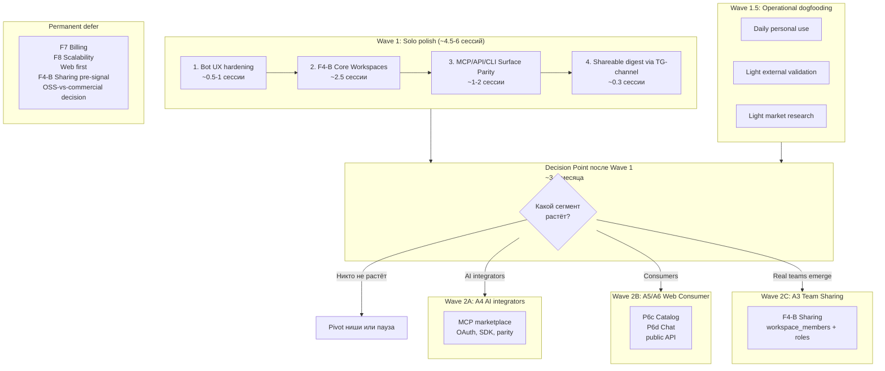

# Product Strategy: Audience-Driven Roadmap

**Назначение:** консолидированный стратегический документ, фиксирующий
переход проекта от feature-driven backlog'а к **audience-driven**
приоритезации. Используется как input для:

1. Будущих планирующих сессий по конкретным sprint'ам (F4-B Core,
   Bot UX hardening, Surface Parity, и т. д.).
2. Decision-фильтра при оценке новых backlog-items в
   [`FUTURE_FEATURES.md`](FUTURE_FEATURES.md).
3. Reference для всех «а под кого мы это делаем» вопросов.

**Дата:** 2026-05-02.

**Статус:** утверждено для пользования; **подлежит ревизии** через
3–4 месяца после Wave 1 в зависимости от собранного signal'а.

**Supersedes:** [`SESSION48_PRODUCT_STRATEGY.md`](SESSION48_PRODUCT_STRATEGY.md)
(черновик от 2026-03-26 — устарел: v4.0 baseline, оценка ЦА «команда
2–5 человек → внешние клиенты → SaaS» без детализации, без учёта
F4-A landed, F11/F6 ship'ed, F5-C ship'ed). Старый документ
оставляем в архиве для traceability.

**Когда использовать:**

- Перед началом любого нового sprint'а (вопрос «под какую ЦА это
  работает?»).
- При оценке кандидатов из `FUTURE_FEATURES.md` (вопрос «какой
  сегмент это закрывает?»).
- При product-вопросах от внешних людей («для кого продукт?»).

**Что НЕ делает этот документ:**

- НЕ заменяет [`docs/business-requirements.md`](../business-requirements.md)
  (бизнес-цели и UC) — он дополняет, фокусируясь на priority-фильтре.
- НЕ диктует конкретные sprint-промпты — это работа отдельных
  планирующих сессий.
- НЕ принимает решения, требующие commitment'а к monetization-модели
  (OSS vs commercial — explicitly deferred, см. § 4.6).

---

## 1. TL;DR

- Целевая аудитория делится на **8 сегментов** (A1–A8) по
  job-to-be-done, не по «персонам». См. § 3.
- **Solo-first focus**: Wave 1 закрывает A1, A4, A5, A6 одновременно
  за ~4.5–6 сессий. См. § 5.1.
- A2 (Solo Consumer Web), A3 (Team), A8 (SaaS) **откладываются** до
  validated signal'а. См. § 5.3, § 5.4.
- A7 (Compliance) **out-of-scope по идеологическим причинам** (см.
  § 4.4) — но F11 watchlist как функция остаётся ценной для A5/A6.
- OSS vs commercial **не решается сейчас**; архитектурно совместимо
  с обоими путями. См. § 4.6.
- Перед стартом F4-B Core (Wave 1 шаг 2) нужно закрыть **8 open
  design questions** — см. § 8 (preliminary рекомендации внутри).
- Critical-constraint: Telegram **MTProto / Telethon** ingestion —
  серая зона для коммерческого SaaS scraping; не закрывает personal
  / OSS / power-user пути, но **снижает** оценку A8 SaaS-плеча.
  См. § 7.1.

---

## 2. Контекст: почему сейчас audience-driven приоритизация

### 2.1 Симптомы feature-driven подхода

- [`FUTURE_FEATURES.md`](FUTURE_FEATURES.md) содержит **~40–50 сессий
  backlog'а** (12 крупных фич — F1, F3, F4-A/B, F5-A/B/C/D, F6, F7,
  F8, F11, и т. д.) без явного фильтра приоритетов.
- Старый [`SESSION48_PRODUCT_STRATEGY.md`](SESSION48_PRODUCT_STRATEGY.md)
  определяет ЦА как «команда 2–5 человек» — слишком общо, не даёт
  фильтра «делаем X / не делаем Y».
- Несколько недавних спринтов (F5-C Living Topics, F11 Watchlist,
  F6 Digest) реализованы **технически качественно**, но без явного
  ответа на вопрос «какой сегмент это активирует?».
- F4-A Multi-Tenancy landed (Sessions 1–3, ~150 тестов,
  [`docs/plans/F4_MULTI_TENANCY_FULL_PLAN.md`](../plans/F4_MULTI_TENANCY_FULL_PLAN.md)),
  но F4-B Workspaces всё ещё в prep-state
  ([`PLANNING_F4B_WORKSPACES_PREP.md`](PLANNING_F4B_WORKSPACES_PREP.md))
  — нужен ясный driver для приоритезации.

### 2.2 Что меняет audience-driven фильтр

- Каждая фича оценивается по «какой сегмент она активирует и
  насколько».
- Появляется **anti-pattern detection**: фичи, не закрывающие ни
  один приоритетный сегмент, отодвигаются.
- Roadmap-обсуждения становятся короче — спор «delicious vs
  important» разрешается «под какого user'а».
- При появлении внешних пользователей легче вести product-discovery
  («ты ближе всего к A1 или A5?»).

---

## 3. Целевая аудитория: 8 сегментов

### 3.1 Подход: jobs-to-be-done, не персоны

Сегментация — **по тому, что человек делает** с продуктом, не по
демографии. Это даёт более стабильную модель: «journalist» сегодня
и «marketing-аналитик» завтра имеют один и тот же JTBD «отслеживать
инфоповоды по теме».

### 3.2 Список сегментов (overview)

| ID | ЦА | JTBD | Fit-сегодня | Effort-добить | Wave |
|----|-----|------|-------------|---------------|------|
| **A1** | Solo Knowledge Curator | Собирать тематическую KB из каналов для собственных исследований | 4/5 | ~2.5 сессии | **Wave 1** (приоритет) |
| **A2** | Solo Consumer Researcher | Искать ответы / читать обзоры по уже собранной KB | 3/5 | ~3–4 сессии (Web) | Defer (Bot+MCP замещают) |
| **A3** | Small Research Team | Совместная работа над общей KB, разделение по проектам | 2/5 | ~5–7 сессий | **Wave 2C** (по signal'у) |
| **A4** | AI Agent Builder / Integrator | Подключить TG_parser как RAG-source к своему LLM-приложению | 4/5 | ~1–2 сессии | **Wave 1** |
| **A5** | Journalist / Content Analyst | Получать алерты на тему / еженедельный дайджест из 20+ каналов | 4/5 | ~1–2 сессии | **Wave 1** (light) |
| **A6** | Domain Curator (для аудитории) | Курировать тематическую базу для **третьих лиц** (читатели/коллеги) | 2/5 | ~4–5 сессий | **Wave 1** (light) + Wave 2B |
| **A7** | Compliance / Regulatory Monitor | Мониторинг каналов на регулируемые темы | 3/5 | ~3–4 сессии | **Out-of-scope** (§ 4.4) |
| **A8** | SaaS Operator / Reseller | Запускать инстанс для своих клиентов на коммерческой основе | 1/5 | ~10+ сессий | **Defer** (§ 4.5) |

### 3.3 Детализация по сегментам

#### A1 — Solo Knowledge Curator (Builder-роль)

- **Кто:** аналитик / исследователь / power-user, собирающий
  тематическую KB **для себя**. Платил бы $5–20/мес за инструмент
  (см. § 9 — self-paying signal owner проекта).
- **Главные jobs:** add channel → tag/group thematically → ensure
  quality of topics → search/ask within scope → re-summarize evolving
  topics.
- **Сегодня закрыто:** ingestion + processing + topicization
  ([`docs/pipeline.md`](../pipeline.md)), F5-C living topics
  ([`docs/plans/F5A_PERSISTENT_KB_PLAN.md`](../plans/F5A_PERSISTENT_KB_PLAN.md)),
  F4-A per-user channel ownership.
- **Чего не хватает:** workspaces (тематическая группировка) —
  единственный значимый gap. **Wave 1 шаг 2 (F4-B Core) закрывает
  100%.**
- **Примечание:** owner проекта сам в этом сегменте — это сильнейший
  validation-signal и dogfooding loop.

#### A2 — Solo Consumer Researcher

- **Кто:** одиночный потребитель уже собранной KB, не строит её сам;
  возможно, использует базу, которую кто-то другой курирует.
- **Главные jobs:** browse topics → search → ask → read details.
- **Сегодня закрыто:** RAG search/ask через Bot+MCP/CLI/API.
- **Чего не хватает:** Web Catalog + Web Chat (P6c+P6d из старого
  SESSION48). **Defer-стратегия:** Bot+MCP замещают UI до validated
  signal'а (см. § 4.2).

#### A3 — Small Research Team (3–10 человек)

- **Кто:** группа коллег, работающих над общим набором каналов с
  разделением по тематикам / проектам.
- **Главные jobs:** A1 + sharing workspaces, ACL roles,
  team digest, audit log.
- **Сегодня закрыто:** F4-A multi-user (изоляция per-user). Каналы
  всё ещё могут быть только у одного owner'а — нет sharing.
- **Чего не хватает:** F4-B Sharing (workspace_members M2M + roles),
  Q7/Q8 интеграция F11/F6 со shared workspaces, audit log,
  privacy review (Q6 cross-channel topic visibility — high risk
  при sharing).
- **Стратегия:** Wave 2C по signal'у (см. § 5.4). До тех пор не
  переинжинирять.
- **Подробный разбор:** см. § «Сценарий (4)» в conversation
  contexte (см. § 11 Связанные документы).

#### A4 — AI Agent Builder / Integrator

- **Кто:** разработчик, встраивающий TG_parser как **RAG-source**
  в свой LLM-product (Claude Desktop, Cursor, custom agent через
  Anthropic / OpenAI / etc.).
- **Главные jobs:** обнаружить MCP server → подключить → стабильная
  semantic API → JSON Schema для типобезопасной интеграции.
- **Сегодня закрыто:** MCP server с 25+ tools
  ([`tg_parser/mcp_server.py`](../../tg_parser/mcp_server.py)),
  схемы ([`docs/contracts/`](../contracts/)), MCP-client compatibility
  matrix ([`docs/mcp-clients-compatibility.md`](../mcp-clients-compatibility.md)),
  F4-A scoped auth.
- **Чего не хватает:** parity между MCP/API/CLI/Bot
  ([`PLANNING_SURFACE_COVERAGE_PARITY_PREP_2026-05-02.md`](PLANNING_SURFACE_COVERAGE_PARITY_PREP_2026-05-02.md)),
  OAuth / rate-limit, formal SDK или OpenAPI-generated client,
  marketplace presence (Smithery, Cline marketplace, Anthropic
  MCP directory).
- **Wave 1 шаг 3** (Surface Parity) закрывает большинство.

#### A5 — Journalist / Content Analyst

- **Кто:** контент-профессионал (журналист, аналитик трендов,
  marketing-исследователь), отслеживающий 10–50 каналов на конкретные
  темы.
- **Главные jobs:** subscribe to topic-watchlist → get alerts →
  weekly thematic digest → quick search by event.
- **Сегодня закрыто:** F11 watchlist
  ([`tg_parser/services/watchlist_service.py`](../../tg_parser/services/watchlist_service.py)),
  F6 digest
  ([`tg_parser/services/digest_service.py`](../../tg_parser/services/digest_service.py)),
  Bot интерфейс — **уже сегодня готовый продукт** для этого сегмента.
- **Чего не хватает:** Bot UX надёжность (открытые BUG_LOG-инциденты),
  лёгкий onboarding flow («подписаться на watchlist за 30 секунд»).
- **Wave 1 шаг 1** (Bot UX hardening) закрывает основное.

#### A6 — Domain Curator (для третьих лиц)

- **Кто:** эксперт в нише (медицина, finance, AI, и т. д.),
  курирующий KB для **аудитории читателей** (студенты, пациенты,
  коллеги, подписчики).
- **Главные jobs:** A1 + публикация digest'ов в публичный канал /
  чат / лист подписок → возможность чтения KB третьими лицами без
  необходимости им устанавливать продукт.
- **Сегодня закрыто:** F6 digest (только в private chat),
  workspaces — нет.
- **Чего не хватает:** workspaces (для тематического разделения),
  shareable digest (публикация в публичный TG-канал автора),
  long-term — public read-only API + Web (через Wave 2B).
- **Wave 1 шаги 2 + 4** дают minimum viable A6.

#### A7 — Compliance / Regulatory Monitor

- **Кто:** государственные / корпоративные структуры, мониторящие
  каналы на регулируемые темы (терроризм, экстремизм, нарушения
  reg-norm).
- **Out-of-scope по идеологическим причинам** (см. § 4.4).
- **Важное замечание:** функция «отслеживать информацию на заданную
  тематику из совокупности каналов» (= F11 watchlist) **остаётся
  ценной для A5/A6** — не позиционировать через regulatory framing,
  но не удалять функцию.

#### A8 — SaaS Operator / Reseller

- **Кто:** компания, запускающая TG_parser как hosted service для
  своих клиентов на коммерческой основе.
- **Главные jobs:** multi-tenant isolation, billing, quota,
  per-tenant analytics, compliance.
- **Сегодня закрыто:** F4-A multi-user (foundation).
- **Чего не хватает:** F4-B Sharing (если tenant'ы — это команды),
  F7 Billing, F8 Scalability/Redis, hardening, audit log, **legal
  framework для Telegram MTProto scraping** (см. § 7.1 — потенциальный
  showstopper).
- **Стратегия:** **defer** до появления первого paying-customer
  signal'а. Архитектурно держать совместимым (см. § 4.5).

---

## 4. Стратегические решения (зафиксированные 2026-05-02)

### 4.1 Solo-first focus: A1, A4, A5, A6

**Решение:** Wave 1 одновременно закрывает 4 solo-сегмента, потому
что они **сильно пересекаются** в нужных компонентах (workspaces,
Bot reliability, Surface parity).

**Обоснование:**

- A1 — owner проекта сам в этом сегменте (dogfooding).
- A4 — самый дешёвый «win» (parity prep уже готов).
- A5 — почти готов (F11 + F6 уже работают).
- A6 — overlap с A1+A4 + минимальный shareable-digest enabler
  даёт MVP без Web.

### 4.2 A2 (Solo Consumer) откладывается; Bot+MCP замещают UI

**Решение:** **не строить** Web Catalog / Web Chat (P6c+P6d) до
validated signal'а от внешних A2/A5/A6 пользователей.

**Обоснование:**

- Web — большая инвестиция (~5–7 сессий минимум, плюс ongoing
  maintenance).
- Bot + MCP покрывают **80%** consumer use cases (search, ask,
  list_topics, digest delivery).
- Без validation easy to over-invest: построить Web и обнаружить,
  что пользователи всё равно предпочитают Bot или MCP-через-Cursor.

**Trigger для пересмотра:** регулярные запросы «а где смотреть
подробнее?» / «есть ли веб-версия?» от ≥3 разных людей за месяц.

### 4.3 A3 (Team) — после signal'а

**Решение:** F4-B Sharing (workspace_members + ACL) **не делается**
в Wave 1; only Wave 2C по triggered signal'у.

**Обоснование:**

- Sharing-слой имеет **высокие privacy риски** (Q6 cross-channel
  topic leak), требует careful design.
- Без real team-пользователей optimization premature.
- F4-B Core (Wave 1 шаг 2) всё равно даёт foundation, на которой
  sharing можно надстроить позже.

**Trigger для пересмотра:** ≥2 запроса на team-collaboration от
разных групп за месяц, или явный paying-customer interest.

### 4.4 A7 (Compliance) — ideologically out-of-scope

**Решение:** проект **не позиционируется и не оптимизируется** под
compliance / regulatory monitoring use cases.

**Обоснование:** owner проекта явно артикулировал нежелание работать
на государство и его механизмы подавления человека. Это product
positioning constraint, фиксированный.

**Что остаётся:** функция F11 watchlist (тематический мониторинг
каналов) — ценная для A5 (журналисты), A6 (curators), A1 (researchers).
**Не позиционировать** через regulatory framing.

**Что НЕ делать:** не добавлять features, специфичные для compliance
(audit retention policies для regulator handover, deterministic
match для evidence chain, regulator-specific export formats и т. д.).

### 4.5 A8 (SaaS) — закладываем не-блокировать архитектурно

**Решение:** F7/F8 не делать сейчас; но при принятии любых
архитектурных решений **сохранять SaaS-compatibility** (без
hardcoded admin path, без single-tenant assumptions, без
license-locked features).

**Обоснование:**

- F4-A multi-tenancy уже даёт основу — продолжать держать.
- MCP server interoperability — хорошо для OSS adoption и для SaaS.
- Anti-pattern: упрощать сейчас под single-tenant, потом
  переписывать.

### 4.6 OSS vs Commercial — defer decision

**Решение:** **не выбирать сейчас** между OSS-публикацией и
commercial-запуском. Архитектурно совместимо с обоими.

**Trigger для решения:**

- Появление первого внешнего user'а, реально использующего → сигнал
  к OSS public release.
- Появление первого paying-customer'а → сигнал к SaaS / open-core.
- Telegram ToS-проблема при scraping для third-party → сигнал к
  ограничению `self-host only` (= practical OSS).

**До тех пор:** не закрывать ни одну дверь. Не добавлять license-
locked фичи. Не строить Stripe-infra.

**Подробный разбор монетизационных механизмов** (per-segment модели,
cross-cutting паттерны, реальные pricing precedents, 5-stage staged
approach, decision framework) — см.
[`MONETIZATION_MECHANISMS_2026-05-02.md`](MONETIZATION_MECHANISMS_2026-05-02.md).

---

## 5. Roadmap

### 5.1 Wave 1: Solo Polish (~4.5–6 сессий)

Последовательность важна — каждый шаг — prerequisite для следующих.

#### Шаг 1: Bot UX hardening (~1.5–2 сессии — extended scope зафиксирован 2026-05-03)

**Почему первый:** Bot — главный consumer surface (раз Web
откладывается). Без надёжного Bot никакая F4-B / parity / shareable
digests не доходит до пользователя.

**Scope (extended, hybrid packaging A3 — см.
[`PLANNING_WAVE1_EXECUTION_PLAN_2026-05-03.md` § 1](PLANNING_WAVE1_EXECUTION_PLAN_2026-05-03.md)):**

- **Session H** — BUG-011 read-context preservation (in-flight, см.
  [`START_PROMPT_FIX_BUG011_READ_CONTEXT_SESSION_H_2026-05-02.md`](START_PROMPT_FIX_BUG011_READ_CONTEXT_SESSION_H_2026-05-02.md)).
- **Session I** — BUG-010 username alias (issue #50, ~80 LOC).
- **Session J** — ADR 0005 mini-refactor (`reset_llm_config(scope='bot')`)
  + BOT_LLM_FALLBACK runbook (1 PR с 2 atomic commits).
- BUG-012 monitoring-only (cosmetic, mitigated в prompt v1.5.0 — не
  блокер Wave 1 step 1 closure).

**Что НЕ входит:** новые фичи в Bot (типа workspace switching) —
это после F4-B Core. TD-bot-confirm-coverage-completeness (~400 LOC,
~25 tests) — defer до concrete pain-driven use-case.

**Quality bar для каждой session:** 24h watch GREEN с тремя
Prometheus / log проверками (mirror Session G pattern — детали в
`PLANNING_WAVE1_EXECUTION_PLAN_2026-05-03.md` § 1.2).

#### Шаг 2: F4-B Core Workspaces (~2.5 сессии)

**Почему второй:** owner проекта сам в A1 — это его личная боль.
Workspaces foundation для A6.

**Scope:** строго MVP из
[`PLANNING_F4B_WORKSPACES_PREP.md` § 5](PLANNING_F4B_WORKSPACES_PREP.md).
Без sharing, без bot tools, без F11/F6 интеграции workspace_id.

**Открытые вопросы (8 шт.) к закрытию ПЕРЕД стартом:** см. § 8 этого
документа.

#### Шаг 3: MCP/API/CLI Surface Parity (~1–2 сессии)

**Почему третий:** prep уже готов. Закрывает A4 на 100%, делает
A6 (curator делящийся через AI) практически возможным.

**Scope:** см.
[`PLANNING_SURFACE_COVERAGE_PARITY_PREP_2026-05-02.md`](PLANNING_SURFACE_COVERAGE_PARITY_PREP_2026-05-02.md).

#### Шаг 4: Shareable Digest via TG-channel (~0.3 сессии)

**Почему четвёртый и light:** A6-enabler **без Web**. Минимальный
exit point для curators.

**Scope:** расширение F6 digest:
`subscribe_digest(..., publish_to_channel="@my_curated_digest")`
вместо private chat. Bot-account публикует в admin-канал автора,
который сам становится «share-link» курированной KB.

**Гипотеза для validation:** этого **достаточно** для validation
A6. Если люди начнут подписываться на curated digest-каналы —
есть signal к Wave 2B (Web). Если нет — Web всё равно не поможет.

### 5.2 Wave 1.5: Operational Dogfooding (parallel)

**Не sprint, операционная привычка** — критически важна.

1. **Использовать TG_parser ежедневно** для собственных каналов.
   Каждое «бесит, что нельзя X» → запись в `FUTURE_FEATURES.md` или
   `BUG_LOG.md`. Это primary priority-filter.
2. **Light external validation:** дать 2–3 знакомым (минимум через
   MCP / digest channel) попробовать. Слушать friction, не строить
   фокус-группу.
3. **Минимальное market-research:** проверить HN / Reddit /
   r/Telegram / r/LocalLLaMA на запросы типа «telegram channel
   rag» / «telegram knowledge base» / «structured telegram
   extraction». Список конкретных гипотез — § 9.

### 5.3 Decision Point после Wave 1 (~3–4 месяца)

Не решать сейчас. Решение зависит от signal'ов из Wave 1.5.

| Signal | Wave 2 |
|--------|--------|
| Пользователи AI-ассистентов (Cursor/Claude) ставят MCP server, GitHub stars начинают появляться | **2A: A4-focused** |
| Знакомые / подписчики digest-канала пишут «а где смотреть подробнее?» | **2B: A5/A6-focused** |
| Кто-то реально просит team-collaboration | **2C: A3-focused** |
| Никто не растёт, но **owner** активно использует | продолжать dogfooding, не строить publicity |
| Никто не растёт **и** owner тоже не использует активно | hard signal к pivot или паузе |

### 5.4 Wave 2: Conditional branches

#### 2A: A4-focused (AI integrators)

- OAuth для MCP / API
- Rate-limit per-token
- Stable schema versioning + deprecation policy
- MCP marketplace presence (Smithery / Cline / Anthropic directory)
- Optional: TypeScript / Python SDK через OpenAPI client gen
- Webhook target для F6/F11 push-доставки (per [ADR 0008](../adr/0008-subscription-target-model.md) § Recommendation — additive enum extension `target_kind = 'webhook'` + HMAC signature + retry policy; non-breaking для chat/channel callers)

**Объём:** ~3–5 сессий.

#### 2B: A5/A6-focused (Web Consumer)

- P6c Web Catalog (channels / topics / search)
- P6d Web Chat (RAG conversation history)
- Public read-only API для embeddable widgets
- Decision на frontend стек (см. SESSION48 § Q2 — React vs
  Streamlit vs Jinja+htmx)

**Объём:** ~6–10 сессий.

#### 2C: A3-focused (Team Sharing)

- F4-B Sharing: `workspace_members` M2M + roles (owner/editor/viewer)
- `share_workspace` / `unshare_workspace` / `list_workspace_members`
  tools
- Q7/Q8 интеграция F11/F6 с workspace_id
- Audit log
- Q6 privacy decision (cross-channel topic visibility) — high risk

**Объём:** ~2.5–3.5 сессии (поверх F4-B Core).

### 5.5 Visualization

---

## 6. Anti-patterns: что НЕ делать сейчас

| Anti-pattern | Почему НЕ делать | Когда вернуться |
|--------------|------------------|-----------------|
| **F7 Billing** | Без paying-customer'а bullshit | После первого commit'а на коммерческий путь |
| **F8 Redis / Scalability** | Premature optimization, один Postgres + один scheduler выдерживают много | Когда реальный нагрузочный bottleneck |
| **Web UI как первая инвестиция** | Гипотеза «Bot+MCP заменят Web» проверяется только если **не строить** Web сейчас | После signal от ≥3 разных людей за месяц |
| **F4-B Sharing (scenario 4) до Wave 2C** | Privacy-риски высокие, без real team пользы 0 | После ≥2 team-запросов |
| **Multi-language Bot** | Сейчас приоритет — надёжность, не богатство | Wave 2B+ |
| **«Show HN» / publicity до Wave 1 завершён** | Showing buggy Bot одинокому HN зрителю = waste of one-shot attention | После закрытия Wave 1 + 4 |
| **Compliance / regulatory features** | A7 ideologically out-of-scope (§ 4.4) | Никогда |
| **OSS-vs-commercial decision** | Premature без external signal | После первого внешнего user'а ИЛИ первого paying customer (§ 4.6) |
| **Удаление Telethon-isolation в `tg_parser/ingestion/telegram/`** | Нужна возможность подменить ingestion-плечо при ToS-проблеме | Никогда (держать порт) |

---

## 7. Constraints / Risks к учёту

### 7.1 Telegram MTProto / Telethon — серая зона для SaaS

**Контекст:** ingestion использует Telethon (MTProto, user-account
API), не Bot API. См. [`docs/adr/0002-telegram-ingestion-approach.md`](../adr/0002-telegram-ingestion-approach.md).

**Что это значит:**

- **Personal use:** OK, как обычный Telegram client.
- **OSS / self-hosted:** OK, ответственность на user'е.
- **Коммерческий SaaS scraping:** **серая зона**. MTProto от user
  account для commercial use — Telegram периодически банит массовые
  user-агенты (особенно с одного `api_id`). Per-tenant credentials
  усложняют onboarding.
- **Альтернатива (Bot API):** сильно ограничена — бот должен быть
  admin'ом канала или канал должен upload боту. Не работает для
  большинства публичных каналов без участия владельца.

**Влияние на стратегию:**

- **Снижает** оценку A8 SaaS-плеча. Не блокирует, но требует legal
  review перед launching.
- **Не закрывает** personal-tool / OSS / power-user пути.

> **Status (updated 2026-05-08):** Filed as **F-Prereq-1 — SaaS Telegram
> MTProto Legal Review** в [`FUTURE_FEATURES.md`](FUTURE_FEATURES.md) (L28
> в таблице фич + детальная секция L2296+). Cross-linked в
> [`MONETIZATION_MECHANISMS_2026-05-02.md`](MONETIZATION_MECHANISMS_2026-05-02.md)
> § «SaaS dependencies» (F-Prereq-1 — **обязательная предпосылка** для F7
> Billing и F8-C commercial SaaS-плеча, не для self-host / OSS / personal use).
> Это «riser» для будущих feature'ов A4 / A8 (multi-user SaaS), **не блокирует
> Wave 1** (audience-driven Wave 1 целиком single-tenant per A1 owner — § 5.1).

### 7.2 Bot UX backlog как gating risk

**Контекст:** Bot — главный consumer surface (раз Web откладывается).
В [`BUG_LOG.md`](BUG_LOG.md) накоплено много открытых багов.

**Риск:** любая фича Wave 1 (F4-B Core, Surface Parity, Shareable
Digest) **показывается через Bot**. Если Bot ненадёжен — фичи
не доходят до пользователя.

**Митигация:** Wave 1 шаг 1 (Bot UX hardening) — **первый**, не
последний.

### 7.3 Architectural decisions to maintain

При работе любого Wave 1 sprint'а **сохранять**:

- **Telethon isolation** в [`tg_parser/ingestion/telegram/`](../../tg_parser/ingestion/telegram/)
  — порт для возможной подмены ingestion-плеча.
- **F4-A `CurrentUser.allowed_channel_ids` контракт** — F4-B
  накладывается **сверху**, не вместо. См.
  [`docs/plans/F4_MULTI_TENANCY_FULL_PLAN.md`](../plans/F4_MULTI_TENANCY_FULL_PLAN.md).
- **MCP server interoperability** — не вводить proprietary
  расширения протокола.
- **Hexagonal порты / адаптеры** ([`docs/adr/0004-hexagonal-architecture-and-module-boundaries.md`](../adr/0004-hexagonal-architecture-and-module-boundaries.md)).
- **Karpathy-like Living-KB principles** ([`docs/adr/0006-karpathy-like-living-kb-principles.md`](../adr/0006-karpathy-like-living-kb-principles.md))
  — 7-checklist для каждого нового контракта.

---

## 8. Open Design Questions для F4-B Core (Wave 1 шаг 2)

Эти 8 вопросов **должны быть закрыты** до старта sprint'а F4-B Core.
Полный контекст — в
[`PLANNING_F4B_WORKSPACES_PREP.md` § 4](PLANNING_F4B_WORKSPACES_PREP.md);
здесь — список и preliminary рекомендации с обоснованиями.

### Q1. Default workspace — есть или нет?

**Варианты:**

- A: при создании user'а автоматически создаётся «My Channels»
  workspace.
- B: workspace создаётся только при явном `create_workspace`
  (lazy / opt-in).
- C: гибридный — default появляется при первом
  `add_workspace_source`.

**Preliminary рекомендация:** **B (opt-in)**. Backward-compatible
с F4-A; пользователь без workspaces работает идентично сегодня.

**Что нужно для финального решения:** проверить, что весь scoping
код корректно handle'ит null-workspace fallback (= F4-A behavior).

### Q2. Workspace identity в tools — параметр или session-state?

**Варианты:**

- A: каждый scoped MCP/Bot tool принимает optional `workspace_id`
  параметр (stateless).
- B: `CurrentUser` расширяется полем `active_workspace_id`,
  переключение через `set_active_workspace(ws_id)`.
- C: per-surface state (Bot — FSM, MCP — `ctx.metadata`, API —
  header).

**Preliminary рекомендация:** **A (explicit param)**. Простой,
stateless, не задевает auth-resolver cache, не требует session
storage.

**Trade-off:** verbose для UX (пользователь должен помнить
workspace в каждом запросе). Mitigation: client-side wrappers
могут хранить active workspace локально.

### Q3. Bot UX — как переключать workspace в free-form chat?

**Контекст:** [`PHASE3_IMPLEMENTATION_PLAN.md`](PHASE3_IMPLEMENTATION_PLAN.md)
фиксирует «free-form чат без специальных команд».

**Варианты:**

- A: slash-commands (`/workspace AI/ML`).
- B: natural language через LLM tool-call.
- C: показ context в каждом ответе («[В workspace AI/ML] ...»).

**Preliminary рекомендация:** **отложить bot integration F4-B Core**
(MCP+CLI only в MVP). По аналогии с F5-C MVP. Bot tools для
workspace-switching добавляются Phase 2 при UX-сигнале.

**Что это значит:** в Wave 1 владелец проекта использует workspaces
через MCP (Cursor / Claude Desktop) и CLI. Bot пользователи (A5)
продолжают работать в user-scope без workspace-сужения.

### Q4. Cross-workspace ops внутри одного пользователя

**Может ли user сделать cross-workspace search (поиск по A∪B)?**

- **Default рекомендация:** да, через `workspace_id=None` (без
  параметра) — search по всем своим каналам без сужения. Конкретный
  workspace — `workspace_id="..."`.

**Может ли перенести канал из A в B?**

- **Default рекомендация:** через `remove_workspace_source(A, ch)`
  + `add_workspace_source(B, ch)`. Отдельный `move_channel` не
  нужен в MVP.

**Cross-workspace topic-link visibility?**

- **Default рекомендация:** показывать (mirror текущего F4-A
  cross-channel topic linking).

### Q5. Shared channels — один `source_id` в нескольких workspaces

**Варианты:**

- A: shared (один канал в N workspaces одного user'а — M2M
  `workspace_sources`).
- B: exclusive (канал в ровно одном workspace —
  `sources.workspace_id`).

**Preliminary рекомендация:** **A (shared)**. Schema из prep уже
поддерживает: `workspace_sources(workspace_id, source_id) PK`.
Удаление канала из workspace ≠ удаление канала.

**Note:** sharing **между разными пользователями** — это уже Wave
2C (F4-B Sharing), не F4-B Core.

### Q6. Topics + Workspaces — где видна cross-channel тема?

**Контекст:** topic spans channels. Если канал A в workspace 1,
канал B в workspace 2 одного user'а — где видим?

**Варианты:**

- A: visible if user has access to **any** source (mirror F4-A
  `assert_topic_access`).
- B: visible only if **all** sources в active workspace (strict).
- C: hybrid — visible, но bundle-items из «не-active» каналов
  скрыты.

**Preliminary рекомендация:** **A** для F4-B Core. Mirror F4-A
поведения, минимум surprise. Backward-compat 100%.

**Note:** для Wave 2C (sharing) этот вопрос **резко** усложняется
— см. § «privacy риски» в обсуждении сценария (4) (cross-channel
topic leak между shared и private workspaces). В F4-B Core этой
проблемы нет.

### Q7. F11 Watchlist + Workspaces

**Контекст:** `watch_interests.user_id + channel_ids[]` — текущая
модель: per-user интерес с явным списком каналов.

**Варианты:**

- A: workspace-scoped subscription (eager-resolve channel_ids в
  subscription time).
- B: lazy resolve (`workspace_id` или `channel_ids` one-of, resolve
  в hot path).
- C: skip integration (F11 продолжает работать только с явными
  `channel_ids[]`).

**Preliminary рекомендация:** **C для F4-B Core MVP** (skip).
F11 уже работает — не ломать. Integration делать в отдельном
sprint'е по сигналу (опционально Wave 2).

### Q8. F6 Digest + Workspaces

**Аналогично Q7 для `digest_subscriptions.channel_ids`.**

**Preliminary рекомендация:** **C для F4-B Core MVP** (skip).
Та же логика что Q7.

---

### 8.x Сводка preliminary рекомендаций

| Q | Рекомендация | Status | Влияние на scope F4-B Core |
|---|--------------|--------|----------------------------|
| Q1 | B (opt-in, no default) | preliminary | Минимальный |
| Q2 | A (explicit `workspace_id` param) | **refined 2026-05-03** | Определяет сигнатуры всех scoped tools; см. detailed semantics |
| Q3 | Skip Bot integration в MVP (MCP+CLI only) | preliminary | Уменьшает scope на ~0.5 сессии |
| Q4 | `workspace_id=None` для cross-workspace; нет `move_channel` | **refined 2026-05-03** | Минимальный; см. detailed semantics |
| Q5 | A (M2M sharing внутри одного user'а) | preliminary | Schema из prep уже OK |
| Q6 | A (mirror F4-A any-source visibility) | preliminary | Backward-compat 100% |
| Q7 | C (skip F11 integration в MVP) | preliminary | Уменьшает scope на ~0.5 сессии |
| Q8 | C (skip F6 integration в MVP) | preliminary | Уменьшает scope на ~0.3 сессии |

**Refined deep-dive для Q2 + Q4 (2026-05-03):** см.
[`PLANNING_F4B_WORKSPACES_PREP.md` § 4 Q2 «Refined decisions»](PLANNING_F4B_WORKSPACES_PREP.md)
+ [§ 4 Q4 «Refined decisions»](PLANNING_F4B_WORKSPACES_PREP.md). Refinement
покрывает 3 edge cases для Q2 (missing/None семантика, unknown ws_id
404-like, admin role) и 3 refinements для Q4 (search semantics закрыты
Q2, no `move_workspace_source` в MVP с явным risk acknowledgement,
cross-workspace topic-link visibility = full bundle items: workspace —
scope-narrowing для list/search, но НЕ access control для get-details).

**Operational execution plan для Wave 1 step 1–4** (packaging,
quality bar, DONE markers, signals collection):
[`PLANNING_WAVE1_EXECUTION_PLAN_2026-05-03.md`](PLANNING_WAVE1_EXECUTION_PLAN_2026-05-03.md).

**Итоговый MVP scope F4-B Core:** ~2.5 сессии (без Bot, без F11/F6
integration). Это совпадает с минимальной оценкой из prep.

---

## 9. Validation hypotheses (для Wave 1.5 light market research)

Гипотезы, которые стоит проверить за 1–2 часа во время Wave 1.5:

1. **Direct competitor search:**
   - GitHub: «telegram rag», «telegram knowledge base», «telegram
     channel embeddings», «telegram mcp server».
   - PyPI / npm: те же ключевые слова.
   - MCP marketplaces (Smithery, Cline marketplace, Anthropic MCP
     directory).
2. **Indirect competitor / adjacency:**
   - tlgur.com, tgstat.ru, combot.org — analytics, не RAG, но
     смежная аудитория.
   - Recall.ai, Glasp — capture+annotate web/youtube.
   - Pocket / Readwise — capture + AI summarize.
   - Notion AI / Mem.ai — general KB с RAG.
3. **Demand signal:**
   - Reddit: r/Telegram, r/LocalLLaMA, r/ObsidianMD,
     r/SideProject, r/SaaS — search «telegram RAG», «telegram
     knowledge base».
   - HN: Algolia search by «telegram channel».
   - Telegram-сообщества Python / AI разработчиков.

**Anti-pattern:** «нет конкурентов» часто означает «нет рынка», не
«огромная возможность». Нужно понять **почему** нет (technical
barrier? legal — § 7.1 grey area? просто нет спроса?). Это
информирует strategic positioning.

---

## 10. Non-decisions (НЕ принимаем сейчас)

Эти вопросы намеренно оставляем открытыми — чтобы не commit'иться
до validation:

- **OSS vs commercial license.** § 4.6.
- **Frontend стек для Web (когда Wave 2B запустится).** SESSION48
  Q2 — React/Next.js vs Streamlit vs FastAPI+htmx.
- **Hosting model:** self-host docker-compose vs managed cloud
  service.
- **Pricing model для возможного SaaS:** per-user, per-channel,
  per-LLM-call, hybrid.
- **Specific vertical / domain focus.** Сейчас domain-agnostic.
  При Wave 2B можно решить «медицинская KB», «finance», «AI
  research» — узкая ниша часто работает лучше чем horizontal.

---

## 11. Связанные документы

### Стратегические / business

| Документ | Зачем |
|----------|-------|
| [`docs/business-requirements.md`](../business-requirements.md) | BR-1..6, UC-1..6, глоссарий, бизнес-уровень определений тем |
| [`docs/product-overview.md`](../product-overview.md) | Product overview |
| [`MONETIZATION_MECHANISMS_2026-05-02.md`](MONETIZATION_MECHANISMS_2026-05-02.md) | Per-segment monetization модели, cross-cutting паттерны, pricing precedents, staged-стратегия (Stage 0–4) |
| [`SESSION48_PRODUCT_STRATEGY.md`](SESSION48_PRODUCT_STRATEGY.md) | **SUPERSEDED** этим документом, оставлен в архиве |

### Roadmap / planning

| Документ | Зачем |
|----------|-------|
| [`FUTURE_FEATURES.md`](FUTURE_FEATURES.md) | Полный feature backlog (12 фич, ~40–50 сессий). Использовать с audience-фильтром этого документа |
| [`PLANNING_F4B_WORKSPACES_PREP.md`](PLANNING_F4B_WORKSPACES_PREP.md) | Prep для F4-B Core — full контекст 8 open questions, schema, integration points; Q2 + Q4 refined 2026-05-03 |
| [`PLANNING_SURFACE_COVERAGE_PARITY_PREP_2026-05-02.md`](PLANNING_SURFACE_COVERAGE_PARITY_PREP_2026-05-02.md) | Prep для Wave 1 шаг 3 (Surface Parity) |
| [`PARITY_DECISION_TRACKING.md`](PARITY_DECISION_TRACKING.md) | Журнал observations для Wave 1 step 3 planning (P-1..P-5 pre-references + растущий журнал) |
| [`PLANNING_WAVE1_EXECUTION_PLAN_2026-05-03.md`](PLANNING_WAVE1_EXECUTION_PLAN_2026-05-03.md) | **Operational companion** — packaging Sessions H/I/J (A3 hybrid), quality bar (24h watch mirror Session G), DONE marker template (C1), signals collection (D2), Wave 1 step 1–4 timeline |
| [`PLANNING_NEXT_CONTRACT_PREP.md`](PLANNING_NEXT_CONTRACT_PREP.md) | Prep для Karpathy-like next contract — **partially superseded** audience-driven приоритезацией; F11 P2 / F5-B / Wave E в parking-lot |
| [`docs/plans/F4_MULTI_TENANCY_FULL_PLAN.md`](../plans/F4_MULTI_TENANCY_FULL_PLAN.md) | F4-A finalized plan — DONE; F4-B накладывается сверху |
| [`ROADMAP_KARPATHY_LIKE_LIVING_KB.md`](ROADMAP_KARPATHY_LIKE_LIVING_KB.md) | Wave A/B/C/D/E roadmap |

### Архитектура / контракты

| Документ | Зачем |
|----------|-------|
| [`docs/architecture.md`](../architecture.md) | Архитектурный обзор |
| [`docs/adr/0001-overall-architecture.md`](../adr/0001-overall-architecture.md) | Overall architecture ADR |
| [`docs/adr/0002-telegram-ingestion-approach.md`](../adr/0002-telegram-ingestion-approach.md) | Telethon / MTProto choice — relevant for § 7.1 |
| [`docs/adr/0004-hexagonal-architecture-and-module-boundaries.md`](../adr/0004-hexagonal-architecture-and-module-boundaries.md) | Hexagonal — поддерживать |
| [`docs/adr/0006-karpathy-like-living-kb-principles.md`](../adr/0006-karpathy-like-living-kb-principles.md) | 7-checklist для каждого нового контракта |
| [`docs/contracts/`](../contracts/) | JSON schemas |

### Operational

| Документ | Зачем |
|----------|-------|
| [`BUG_LOG.md`](BUG_LOG.md) | Wave 1 шаг 1 input |
| [`docs/runbooks/`](../runbooks/) | Operational procedures |
| [`docs/quality/INBOX.md`](../quality/INBOX.md) | Quality observations |

---

## 12. История документа

| Дата | Изменение | Источник |
|------|-----------|----------|
| 2026-05-02 | Первая версия. Создан как ответ на запрос «оформи документально наше обсуждение». Консолидирует: (a) разбор сценариев multi-user × workspace (1)–(5); (b) детальный разбор сценариев (2), (3), (4); (c) audience-driven фрейминг (8 сегментов A1–A8); (d) подтверждённые решения owner'а проекта (solo-first, A2 deferred, A3 deferred-conditional, A7 ideologically out, A8 architectural-keep, OSS-vs-commercial deferred); (e) уточнённую Wave 1 sequence (Bot UX → F4-B Core → Surface Parity → Shareable Digest); (f) Telegram MTProto / ToS warning § 7.1; (g) F4-B 8 open design questions с preliminary рекомендациями. Supersedes `SESSION48_PRODUCT_STRATEGY.md`. | Conversation 2026-05-02 |
| 2026-05-03 | § 8.x — Q2 и Q4 помечены `refined 2026-05-03`, добавлен cross-link на detailed semantics в `PLANNING_F4B_WORKSPACES_PREP.md` § 4 (3 edge cases для Q2 + 3 refinements для Q4). § 11 — добавлены ссылки на `PARITY_DECISION_TRACKING.md` и **operational companion** `PLANNING_WAVE1_EXECUTION_PLAN_2026-05-03.md`. § 5.1 Wave 1 step 1 расширен: extended scope = Sessions H + I (BUG-010) + J (ADR 0005 mini-refactor + BOT_LLM_FALLBACK runbook). | Conversation 2026-05-03 (pre-Session-H planning + deep-dive Q2/Q4 + 4 развилки A3/B3/C1/D2) |
| 2026-05-23 | § 5.4 «2A: A4-focused (AI integrators)» — добавлен explicit bullet «Webhook target для F6/F11 push-доставки (per ADR 0008 § Recommendation — additive enum extension)», связывающий webhook delivery с Wave 2A roadmap. Изменение выпадает из Wave 1 step 4 formalization sub-session: step 4 ships subscription target model для `{chat, channel}` only; webhook target отложен в Wave 2A как additive non-breaking migration. Cross-link: [`PLAN_WAVE1_STEP4_2026-05-23.md` § 7 Q2](PLAN_WAVE1_STEP4_2026-05-23.md), [ADR 0008 § Recommendation](../adr/0008-subscription-target-model.md). | Wave 1 step 4 planning formalization sub-session 2026-05-23 |

---

## 13. Когда пересмотреть этот документ

- **После Wave 1 завершения** (~3–4 месяца): обязательная ревизия
  на основе собранных signal'ов. Decision Point из § 5.3.
- **При появлении первого внешнего user'а:** возможный сдвиг
  audience priorities, OSS-vs-commercial trigger.
- **При появлении Telegram ToS-проблемы:** ревизия § 7.1, возможный
  pivot к Bot API ingestion ИЛИ ограничение SaaS-плеча.
- **При завершении любого Wave 1 шага:** mini-update «что узнали,
  как это меняет следующий шаг».
- **Не реже чем раз в 6 месяцев** даже если ничего не меняется —
  fresh-eyes pass.
