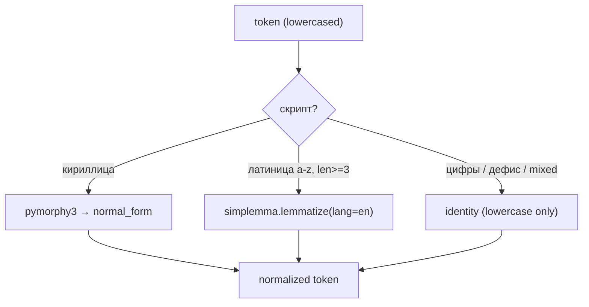

# START PROMPT — Fix F11 watchlist multilang tokenizer (scoring phase)

**Дата:** 2026-06-08 · **Контекст:** планирование-сессия после диагностики 2026-06-07/08 (Claude MCP + dry-run backfill на проде).
**Goal (одной строкой):** починить keyword-компонент F11 watchlist scoring — заменить exact-match токенизацию на гибридный script-routed `normalize_token()` (кириллица→pymorphy3, латиница→simplemma en, бренды→identity), верифицировать через dry-run backfill, рекомендовать пороги; **не** менять embedding canonical text в этой сессии.

> Рабочий режим: коммит — только по явному запросу пользователя ([`AGENTS.md`](../../AGENTS.md)). Scope — **только watchlist scoring**; не трогать unrelated-код. `docs/methodology/` — вне workspace.

---

## 1. Статус: первопричина локализована — нужна реализация, не диагностика

Диагностика завершена. Матчер работает, документы скорятся, env в порядке. Проблема — **заниженный keyword_score** из-за отсутствия морфологии на русскоязычном корпусе + пороги, откалиброванные под другую шкалу.

**Исходный анализ:** `/Users/alexanderefimov/Downloads/watchlist_fix_prompt.md` (вне репо).
**Runbook диагностики:** [`DIAG_WATCHLIST_ZERO_MATCHES_2026-06-07.md`](DIAG_WATCHLIST_ZERO_MATCHES_2026-06-07.md).

---

## 2. Доказательная база (прод, dry-run backfill, 5 активных watchlists)

Метод: `backfill_watchlist(dry_run=true)` — исторический корпус через текущий матчер.

| Watchlist | Каналы | scored_docs | max_combined | порог | would_match |
|---|---|---|---|---|---|
| GLP-1 агонисты | 3 | 52 | **0.527** | 0.45* | 0 |
| Биомаркеры старения | 5 | 89 | **0.318** | 0.5 | 0 |
| Микробиота | 6 | 104 | **0.256** | 0.5 | 0 |
| Гиперпролактинемия | 5 | 137 | **0.244** | 0.6 | 0 |
| mTOR и геропротекторы | 3 | 26 | **0.197** | 0.5 | 0 |

\* GLP-1 порог временно снижен оператором до 0.45; записан 1 матч при backfill.

**Единственный подтверждённый матч (GLP-1, после снижения порога):**

```
source_ref:     tg:profendocrinologist:post:3906
keyword_score:  0.5
semantic_score: 0.545
combined_score: 0.527   (= 0.4*keyword + 0.6*semantic)
```

**Выводы (что опровергнуто / подтверждено):**

| Гипотеза | Вердикт |
|---|---|
| A. Матчер падает на тике | ОПРОВЕРГНУТО |
| B. Новые документы не доходят | ОПРОВЕРГНУТО как блокер; B2 (история) — архитектурный пробел, есть `backfill_watchlist` |
| C. Пороги выше потолков | ПОДТВЕРЖДЕНО (симптом) |
| D. Деградация env | ОПРОВЕРГНУТО |
| E. Нет морфологии RU | **КОРНЕВАЯ ПРИЧИНА** — RU keyword≈0; GLP-1 (латиница) в 2× выше |

---

## 3. Текущая реализация (куда встраивать фикс)

**Скоринг:** [`tg_parser/services/watchlist_service.py`](../../tg_parser/services/watchlist_service.py)

```
combined = 0.4 * keyword + 0.6 * semantic   # веса из KEYWORD_WEIGHT/SEMANTIC_WEIGHT или settings
```

- **Keyword:** phrase-level recall — каждый keyword = фраза; фраза матчит, если **все** её токены ∈ doc_tokens.
- **Токенайзер:** regex `[a-zA-Zа-яА-ЯёЁ0-9]{2,}`, lower-case, **без лемматизации**.
- **Doc tokens:** `topics ∪ summary ∪ text_clean`.
- **Semantic:** cosine(interest.embedding, doc_embedding), clip [0,1].
- **Exclude:** любой exclude_keyword-токен в doc → combined = 0.
- **Порог:** `combined >= interest.threshold` (default 0.6 из settings).

**Настройки весов:** [`tg_parser/config/settings.py`](../../tg_parser/config/settings.py) — `watchlist_keyword_weight`, `watchlist_semantic_weight`, `watchlist_default_threshold`.

**Эмбеддер (прод):** `EMBEDDING_PROVIDER=openai`, `text-embedding-3-small`, 1536-dim. См. [`DIAG_WATCHLIST_ZERO_MATCHES_2026-06-07.md`](DIAG_WATCHLIST_ZERO_MATCHES_2026-06-07.md) §1.

**Тесты (регрессия):** [`tests/test_watchlist_score.py`](../../tests/test_watchlist_score.py), [`tests/test_watchlist_service.py`](../../tests/test_watchlist_service.py) (`TestPhraseKeywordScore` — уже фиксирует провал RU-морфологии).

---

## 4. Утверждённое решение: гибрид script-routing (A+C)

**НЕ** langdetect на документ. Маршрутизация **per-token по Unicode-скрипту**.



| Ветка | Правило | Примеры |
|---|---|---|
| **Кириллица** | `pymorphy3` → `parse(word)[0].normal_form` (fallback: as-is) | пролактина → пролактин |
| **Латиница** | `simplemma.lemmatize(token, lang='en')` (unknown → as-is) | inhibitors → inhibitor |
| **Identity** | только lower-case | `glp-1`, `mtor`, `mica2`, `psd3` |

### Правила identity-токенов (не лемматизировать)

Токен идёт в identity-ветку, если **любое** из:
- содержит цифру;
- содержит дефис (`-`);
- смешанный скрипт (латиница + кириллица в одном токене);
- длина < 3 для чистой латиницы (сохранить `mTOR`→`mtor`, `etf`, `цб`).

### Принятые оговорки

1. **Кириллица → русский pymorphy3.** Украинские каналы могут получить неточные леммы; для типичных TG RU-каналов приемлемо. Точный `uk` — future (`interest.locale`).
2. **Транслит не матчит кириллицу:** `семаглутид` ≠ `semaglutide` на keyword-пути (semantic компенсирует).
3. **Compound-слова:** `гиперпролактинемия` ↔ `пролактин` — **вне scope** этой сессии; substring — только если dry-run недостаточен.
4. **Embedding canonical text** (`build_canonical_interest_text`) — **не менять** в этой сессии.

### Расширяемость

Новый язык = новая ветка в `normalize_token()` (напр. `simplemma lang='de'`) без изменения `_keyword_score`.

---

## 5. План реализации

### Ветка

`fix/watchlist-multilang-tokenizer`

### Файлы

| Файл | Действие |
|---|---|
| [`pyproject.toml`](../../pyproject.toml) | +`pymorphy3`, `pymorphy3-dicts-ru`, `simplemma` |
| [`tg_parser/services/watchlist_tokenizer.py`](../../tg_parser/services/watchlist_tokenizer.py) | **NEW** — фасад `normalize_token()` |
| [`tg_parser/services/watchlist_service.py`](../../tg_parser/services/watchlist_service.py) | интеграция в `_tokenize` + exclude path |
| [`tests/test_watchlist_score.py`](../../tests/test_watchlist_score.py) | multilang unit tests |
| [`tests/test_watchlist_service.py`](../../tests/test_watchlist_service.py) | при необходимости — integration-level cases |

### `watchlist_tokenizer.py` — контракт

```python
def normalize_token(token: str) -> str:
    """Script-routed lemma/stem/identity for F11 keyword matching."""

def normalize_tokens(tokens: Iterable[str]) -> set[str]:
    """Batch helper for doc token sets."""
```

**Требования к реализации:**
- `@functools.lru_cache(maxsize=8192)` на `normalize_token`
- lazy singleton `MorphAnalyzer` (pymorphy3) — не создавать на каждый токен
- simplemma stateless — вызывать напрямую
- pymorphy/simplemma exception → return token as-is (graceful degradation)
- **Не** менять `MIN_TOKEN_LENGTH`, phrase-level recall, формулу combined

### Интеграция в `watchlist_service.py`

Точка встраивания — `_tokenize()` (после regex-extract + lower):

```python
# было:
return {match.lower() for match in _TOKEN_RE.findall(value)}
# станет:
return {normalize_token(match.lower()) for match in _TOKEN_RE.findall(value)}
```

Тот же path автоматически покрывает:
- `_build_doc_tokens` (doc side)
- keyword phrases (`_keyword_score` → `_tokenize(kw)`)
- `exclude_keywords`

**Не трогать:** `compute_watch_score` формулу, `KEYWORD_WEIGHT`/`SEMANTIC_WEIGHT`, scheduler hook, MCP handlers.

---

## 6. Unit-тесты (обязательные кейсы)

Добавить в `tests/test_watchlist_score.py` (класс `TestMultilangNormalize` или аналог):

### RU (pymorphy3 path)

| keywords / doc text | ожидание keyword_score |
|---|---|
| `["пролактин"]` / doc с «пролактина» | 1.0 |
| `["пролактин"]` / doc с «пролактином» | 1.0 |
| `["рапамицин"]` / doc с «рапамицина» | 1.0 |
| `["агонисты дофамина"]` / doc с «агонистов дофамина» | 1.0 |
| `["агонисты дофамина"]` / doc только с «агонисты» | 0.0 (phrase recall) |

### EN (simplemma path)

| keywords / doc text | ожидание |
|---|---|
| `["inhibitor"]` / doc с «inhibitors» | keyword ≥ 1.0 (или 1.0) |

### Identity (без лемматизации)

| token | после normalize |
|---|---|
| `GLP-1` | `glp-1` |
| `MiCA` | `mica` |
| `mTOR` | `mtor` |
| `wegovy` | lemma или identity (не деградировать vs сейчас) |

### Регрессия существующих EN-тестов

- `TestPhraseKeywordScore::test_single_token_keywords_behave_like_old_overlap` — для латинских токенов без inflection поведение не меняется
- `TestComputeWatchScore::test_combined_formula_uses_weights` — формула 0.4/0.6

### Mixed (документирующий тест — не баг)

- keyword `семаглутид`, doc `Semaglutide` → keyword 0.0 (разные скрипты); тест фиксирует ожидаемое поведение

**Команда локальной верификации:**

```bash
.venv/bin/python -m pytest tests/test_watchlist_score.py tests/test_watchlist_service.py -k watchlist -q
```

---

## 7. Верификация на проде (после деплоя, с согласования)

### Фаза 2 — dry-run (READ-ONLY по данным, без notify)

MCP: `backfill_watchlist(interest_id=..., dry_run=true)` × 5:

| Interest | interest_id | threshold |
|---|---|---|
| GLP-1 агонисты | `9f23fd49-8794-427d-a5c0-235a24e175cb` | 0.45 |
| Гиперпролактинемия | `cfc94eb9-164e-4232-a10b-8d5c4d6634db` | 0.6 |
| Микробиота | `9deccefc-c388-4721-bb1f-b7e7dd51d8a5` | 0.5 |
| Биомаркеры старения | `c4d87f14-9619-4394-8505-68ab20230d45` | 0.5 |
| mTOR и геропротекторы | `64ce09c3-fa5c-4f57-8512-dde5fd160993` | 0.5 |

**Цель:** `max_combined` заметно выше эталонов из §2; релевантные интересы — `would_match > 0`.

### Фаза 3 — калибровка + real backfill (только после явного OK)

1. Рекомендовать финальные пороги по числам dry-run (единый ~0.45–0.55 или per-interest)
2. `backfill_watchlist(dry_run=false)` — **без notify** (`notify=false` если параметр есть; иначе согласовать)
3. `get_watchlist_matches` — покомпонентные скоры лучших матчей

**Не менять** пороги на проде без согласования (кроме уже сделанного GLP-1=0.45).

---

## 8. Формат итогового отчёта сессии

1. Подтверждение формулы combined и места интеграции `normalize_token` (цитаты из кода).
2. Описание гибридного tokenizer (диф / краткое описание веток).
3. Таблица `max_combined` **ДО/ПОСЛЕ** по 5 интересам (dry-run).
4. Рекомендованные финальные пороги с обоснованием.
5. Результат real backfill (`inserted` per interest) — если выполнялся.
6. Открытые вопросы (compound-слова, embedding dilution, uk-locale).

---

## 9. Ограничения (CRITICAL)

- Scope: **только** watchlist keyword/exclude token normalization.
- **Не** менять: `build_canonical_interest_text`, interest embeddings, `KEYWORD_WEIGHT`/`SEMANTIC_WEIGHT` до замера.
- **Не** менять пороги watchlists на проде без согласования.
- **Не** слать уведомления при тестовых backfill.
- **Не** выводить секреты; SQL на проде — только SELECT (кроме backfill через MCP).
- **Не** трогать: BUG-025, `preview_watchlist`, embedding model switch.
- Коммит / PR — только по запросу пользователя.

---

## 10. Вне scope (сознательно отложено)

| Item | Почему |
|---|---|
| Substring matching (`пролактин` in `гиперпролактинемия`) | Риск false positives; только если dry-run недостаточен |
| `build_canonical_interest_text` / re-embed interests | Отдельная сессия после замера keyword-fix |
| BUG-025 UUID pre-validation | Ортогонально |
| `preview_watchlist` (ENH-13) | Nice-to-have |
| Смена embedding model (e5/BGE) | ADR-level |
| `interest.locale` для uk/de | Future |

---

## 11. Ссылки

- [`tg_parser/services/watchlist_service.py`](../../tg_parser/services/watchlist_service.py) — скоринг
- [`docs/notes/DIAG_WATCHLIST_ZERO_MATCHES_2026-06-07.md`](DIAG_WATCHLIST_ZERO_MATCHES_2026-06-07.md) — runbook
- [`docs/MCP_AGENT_GUIDE.md`](../../docs/MCP_AGENT_GUIDE.md) § F11 — MCP tools incl. `backfill_watchlist`
- [`docs/adr/0006-karpathy-like-principles.md`](../../docs/adr/0006-karpathy-like-principles.md) — F11 hybrid score
- [`docs/adr/0007-mcp-scheduler-split.md`](../../docs/adr/0007-mcp-scheduler-split.md) — matcher в `tg_parser`, не MCP
- [`docs/notes/START_PROMPT_SPRINT_F11.md`](START_PROMPT_SPRINT_F11.md) — оригинальный sprint spec

---

## 12. Acceptance criteria (Definition of Done)

- [ ] `watchlist_tokenizer.py` с `normalize_token()` и script-routing по §4
- [ ] `_tokenize` в `watchlist_service.py` использует нормализацию; exclude path покрыт
- [ ] Зависимости в `pyproject.toml`; `pip install -e .` проходит
- [ ] Unit-тесты §6 зелёные; существующие watchlist-тесты не сломаны
- [ ] Локальный pytest watchlist suite — green
- [ ] (После деплоя) dry-run backfill × 5 — таблица ДО/ПОСЛЕ в отчёте
- [ ] Рекомендация порогов по данным (не хардкод без обоснования)
- [ ] Нет изменений вне watchlist scoring scope

---

## 13. Self-review (2026-06-08) — pre-flight перед реализацией

**Вердикт: GO** — план согласован с кодом, scope сужен корректно, гибрид A+C обоснован данными.

### Сильные стороны

- Первопричина (E) подтверждена прод-метриками; формула 0.4/0.6 верна (GLP-1 матч сходится арифметически).
- Точка интеграции (`_tokenize`) минимальна — автоматически покрывает doc, keywords, exclude.
- `backfill_watchlist` уже имеет `dry_run=true` и `notify=false` по умолчанию — совпадает с планом верификации.
- Docker-деплой идёт через `pip install .` из `pyproject.toml` ([`Dockerfile`](../../Dockerfile)) — достаточно для VPS.
- Phrase-level recall и compound/substring вне scope — правильное сужение.

### Пробелы — закрыть в сессии реализации

| # | Пробел | Действие |
|---|---|---|
| 1 | **CI** ([`.github/workflows/ci.yml`](../../.github/workflows/ci.yml)) ставит зависимости из `requirements.txt`, не из `pyproject.toml` | Синхронизировать **оба** файла. По AGENTS.md — только с явного OK оператора (зависимости запрошены планом). |
| 2 | Критерий успеха dry-run размыт («заметно выше») | Зафиксировать: RU-интересы `max_combined` ≥ порога **или** `would_match ≥ 1`; минимальный прирост keyword-компонента на лучшем кандидате. |
| 3 | `simplemma` на латинице len≥3 затронет `mica`, `wegovy` в существующих тестах | Прогнать полный `test_watchlist_score.py` + `TestTokenize::test_keeps_short_abbreviations` — регрессия критична. |
| 4 | `mTOR` (len 4) пойдёт в simplemma, не identity — OK если unknown→as-is | Явный тест: `normalize_token("mtor") == "mtor"`. |
| 5 | Оба контейнера (`tg_parser` + `mcp`) — один image; backfill в MCP вызывает `make_watchlist_service` локально | Rebuild **обоих** контейнеров после деплоя. |
| 6 | pymorphy3-dicts ≈30 MB → cold start / image size | Приемлемо; lazy singleton MorphAnalyzer обязателен. |
| 7 | Риск false-positive (разные слова → одна лемма) | Низкий для medical keywords; при аномалиях в dry-run — зафиксировать в отчёте, не чинить наугад. |
| 8 | Кириллица = RU pymorphy3 (не uk) | Принятая оговорка §4; не блокер. |

### Коллизия правил identity (уточнение для имплементатора)

Порядок проверок в `normalize_token`:

1. empty / len < `MIN_TOKEN_LENGTH` → as-is (не должно приходить из `_TOKEN_RE`)
2. identity: цифра, дефис, mixed script
3. кириллица → pymorphy3
4. чистая латиница a-z, len ≥ 3 → simplemma en
5. иначе → as-is

`psd3`, `glp-1` → identity. `etf` (len 3) → simplemma (допустимо). `mtor`, `mica`, `wegovy` → simplemma (unknown → as-is).

### Критерии «провал сессии» (escalate, не снижать пороги молча)

- Dry-run после фикса: все 5 интересов `would_match=0` при росте keyword на unit-тестах.
- Регрессия GLP-1: `max_combined` падает ниже 0.527.
- CI red из-за несинхронизированного `requirements.txt`.

### Не делать в этой сессии (подтверждено review)

- Substring / compound matching
- Re-embed interests
- Смена весов 0.4/0.6
- Прод-пороги без согласования
