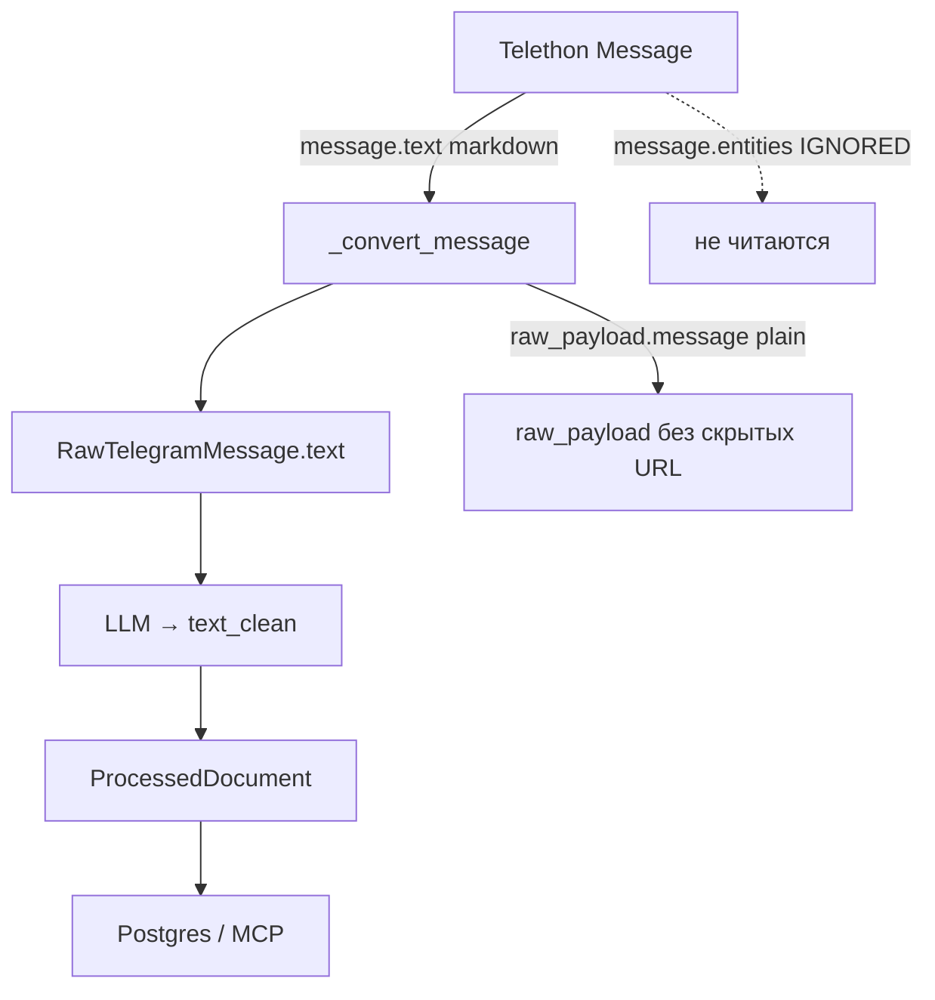

# START PROMPT — Preserve external URLs from Telegram messages (ingestion/processing)

> **IMPLEMENTED 2026-06-03** — PR [#171](https://github.com/AlexEfimov/TG_parser/pull/171) on prod (`ea826b7`); prod smoke PASS. Authority: [`REVIEW_2026-06-03_WAVE1_DONE.md`](REVIEW_2026-06-03_WAVE1_DONE.md) § 4.

**Дата:** 2026-06-02 · **Автор контекста:** перенос из диалога диагностики 2026-05-30 и handoff `HANDOFF_PRESERVE_TG_URLS_2026-05-30.md` (файл не в git; текст восстановлен из [транскрипта диагностики](0fedc5df-85c8-4644-a079-2774deedef44)).
**Диагностика:** 2026-05-30 · **Статус:** **implemented** (PR [#171](https://github.com/AlexEfimov/TG_parser/pull/171), prod `ea826b7`).
**`main` HEAD:** `2c0a187` · re-anchor: `git pull --ff-only origin main && git rev-parse HEAD`.
**Связанный контекст (bot, вне scope):** кластер BUG-047…053 закрыт — см. [`START_PROMPT_POST_BUG050_FOLLOWUPS_2026-06-02.md`](START_PROMPT_POST_BUG050_FOLLOWUPS_2026-06-02.md). Деплой бота **не** нужен для этой задачи.

> **Не путать с `telegram_url`:** [`tg_parser/export/telegram_url.py`](../../tg_parser/export/telegram_url.py) (`resolve_telegram_url`) строит permalink **самого поста** в Telegram (`https://t.me/.../<message_id>`) для export/KB. **Эта задача** — сохранение **внешних** URL из текста сообщения (`MessageEntityUrl` / `MessageEntityTextUrl`) в `raw_payload["urls"]` → `metadata["urls"]`, независимо от permalink поста.

> **BUG number:** не назначен — это **feature/backlog item**, не дефект из BUG_LOG. При закрытии: one-liner в `CHANGELOG.md`; опционально наблюдение в `docs/quality/INBOX.md`. **Не** заводить BUG-0XX без явного запроса пользователя.

> Рабочий режим (опционально): **Multitask Mode** — subagents для тестов/ревью; коммит только по явному запросу (AGENTS.md).

---

## 1. Проблема (диагностика, актуально на `main`)

Пайплайн формирует `ProcessedDocument.text_clean` (Postgres, MCP). При нормализации **внешние ссылки могут теряться**.

Telegram отдаёт ссылки двумя способами:

- **`MessageEntityUrl`** — URL прямо в тексте (голый адрес).
- **`MessageEntityTextUrl`** — скрытая гиперссылка: видимый текст и URL разделены; URL в `entity.url`, не в плоском тексте. **Главный риск.**

Что происходит сейчас:

| Шаг | Что | Evidence (`main` HEAD `094ecda`) |
|-----|-----|----------------------------------|
| Ingestion | `message.entities` **не читаются** | [`telethon_client.py`](../../tg_parser/ingestion/telegram/telethon_client.py) `_convert_message` 178–253: только `text = message.text or message.message`, `raw_payload["message"] = message.message` — без entities/urls |
| Raw | Скрытых URL в `raw_payload` нет | `grep MessageEntity` по `tg_parser/` — 0 совпадений |
| Domain `text` | Markdown от Telethon для TextUrl | `message.text` (default `parse_mode=markdown`) → `[видимый текст](url)` до LLM |
| Processing | `text_clean` **только от LLM** | [`pipeline.py`](../../tg_parser/processing/pipeline.py) 424: `text_clean = response_data["text_clean"]`; regex/strip по тексту поста **нет** |
| Промпт | «remove noise, fix formatting» без сохранения URL | [`prompts/processing.yaml`](../../prompts/processing.yaml) 22–38; [`processing/prompts.py`](../../tg_parser/processing/prompts.py) `PROCESSING_SYSTEM_PROMPT` 12–35 |

**Вывод:**

- `MessageEntityUrl` — обычно сохраняется в плоском тексте; LLM теоретически может выкинуть как «шум».
- `MessageEntityTextUrl` — **на грани потери**: структурно не хранится; в `raw_payload.message` URL нет; LLM может схлопнуть `[текст](url)` → `текст`.

Угроза — **LLM-нормализация** + **отсутствие entities на ingestion**, не regex в processing.



---

## 2. Решение (зафиксировано с пользователем, 2026-05-30)

**Вариант A: `metadata["urls"]`** на processed-слое; извлечение на ingestion из `entities` (не полагаться на LLM).

| Решение | Содержание |
|---------|------------|
| Хранение | Только `metadata["urls"]` — **не** дописывать в `text_clean` (не трогает `content_hash` 481–486 и эмбеддинги; поиск/RAG по URL отложен) |
| Промпт | Хардненинг в **эту же** итерацию (мягкая страховка, не замена шагам 1–2) |
| Backfill | **New-only**; восстановление старых TextUrl — только re-ingest канала (§7) |

**Форма записи URL (конвенция, не JSON Schema property):**

```json
{"url": "https://example.com/path", "text": "видимый текст или тот же URL", "type": "text_url"}
```

`type`: `"text_url"` для `MessageEntityTextUrl`, `"url"` для `MessageEntityUrl`.

Контракты: [`raw_telegram_message.schema.json`](../../docs/contracts/raw_telegram_message.schema.json) и [`processed_document.schema.json`](../../docs/contracts/processed_document.schema.json) — `additionalProperties: true`; `raw_payload` / `metadata` free-form. **Миграции Alembic и DDL не требуются.**

---

## 3. Шаги реализации

### Шаг 1 — извлечение URL на ingestion

**Файл:** [`tg_parser/ingestion/telegram/telethon_client.py`](../../tg_parser/ingestion/telegram/telethon_client.py), `_convert_message` (178–253).

- Импорты: `from telethon.tl.types import Message, MessageEntityTextUrl, MessageEntityUrl` (рядом с существующим импортом `Message`).
- Хелпер `_extract_urls(message) -> list[dict]`:
  - `message.entities is None` → `[]`; прочие типы entity игнорировать.
  - `MessageEntityTextUrl` → `url = entity.url`, `text` = срез видимого текста по `offset`/`length`, `type = "text_url"`.
  - `MessageEntityUrl` → срез по `offset`/`length` (голый URL), `type = "url"`, `text` = тот же URL.
  - Срезать по **`message.message`** (offsets относятся к плоскому тексту), **не** по `message.text`.
  - Offsets в **UTF-16 code units** (`.encode("utf-16-le")` / decode), иначе ломается на эмодзи/не-BMP.
  - Порядок появления сохранять; опционально дедуп точных повторов `url`.
- В `_convert_message` после сборки `raw_payload` (228–240): `raw_payload["urls"] = urls` **только если список непустой**.
- TR-19: только метаданные, без скачивания медиа.

### Шаг 1b — сохранить `urls` при усечении payload (TR-20, обязательно)

**Файл:** [`tg_parser/storage/sqlalchemy/raw_message_repo.py`](../../tg_parser/storage/sqlalchemy/raw_message_repo.py), `_serialize_payload` (249–272).

- Processing читает raw **из БД** (`run_processing` → repos); при `raw_payload > 256KB` (`RAW_PAYLOAD_MAX_SIZE` = 262144, строка 21) payload заменяется на `{"truncated": true, "original_size_bytes": N}` — **`urls` молча теряются**.
- **Фикс:** при усечении: `truncated_payload["urls"] = payload.get("urls")` (если ключ есть).

### Шаг 2 — проброс в `ProcessedDocument`

**Файл:** [`tg_parser/processing/pipeline.py`](../../tg_parser/processing/pipeline.py).

- `_process_single_message` (343+): после блока thread metadata (452–458), **до** `doc_id` / `ProcessedDocument(...)` (460–478):
  - `urls = (message.raw_payload or {}).get("urls") or []`
  - если непусто → `metadata["urls"] = urls`
- `_build_media_only_document` (523+): после thread metadata (549–551), **до** `ProcessedDocument(...)` (553–564) — то же.
- Round-trip: `metadata_json` в upsert ~84; load `_row_to_model` ~323 в [`processed_document_repo.py`](../../tg_parser/storage/sqlalchemy/processed_document_repo.py).
- **Не** менять `text_clean` → `content_hash` (481–486) и эмбеддинги без изменений.

### Шаг 3 — хардненинг промпта

Править **оба** источника (иначе дрейф):

- [`prompts/processing.yaml`](../../prompts/processing.yaml) — system-prompt (рантайм, `PromptLoader`); поднять `metadata.version` (сейчас `"1.0.0"`, строка 10 → например `"1.0.1"`).
- `PROCESSING_SYSTEM_PROMPT` в [`tg_parser/processing/prompts.py`](../../tg_parser/processing/prompts.py) (fallback).

Добавить строку (EN, как в плане):

`Preserve all URLs and markdown links [text](url) verbatim; never drop the URL part.`

- Меняет `prompt_id` для **новых** документов (172–177); авто-переобработки нет (skip по `source_ref`). Тесты не пинят текст/хэш промпта.

---

## 4. Тесты

| Область | Что |
|---------|-----|
| `_extract_urls` | TextUrl (скрытый url), Url (голый), UTF-16 + эмодзи, `entities=None`, смешанные типы, пустой случай — расширить [`tests/test_telethon_client.py`](../../tests/test_telethon_client.py) или новый `tests/test_telethon_extract_urls.py` |
| `_serialize_payload` | payload >256KB → `urls` в усечённом payload |
| Pipeline | `raw_payload["urls"]` → `metadata["urls"]` (обычный пост + media-only) — [`tests/test_processing_pipeline.py`](../../tests/test_processing_pipeline.py) |
| Регрессия | Существующие ingestion/pipeline тесты зелёные (аддитивность); **не** `test_bot_*` |

**Запуск (локально):**

```bash
.venv/bin/pytest tests/test_telethon_client.py tests/test_processing_pipeline.py -q --tb=short
# после добавления extract_urls-модуля:
.venv/bin/pytest tests/test_telethon_extract_urls.py -q --tb=short
```

**CI / ruff:** `uvx ruff@0.15.11 format --check . && uvx ruff@0.15.11 check .` (как в других START_PROMPT). Required CI check: **Test Python 3.12**.

**AGENT_PLAYBOOK:** где уместно — failing-first на pre-fix коде (тест на `_extract_urls` / pipeline metadata до правок ingestion/pipeline).

---

## 5. Acceptance criteria (линия «можно останавливаться»)

- [ ] `_extract_urls` покрывает TextUrl, Url, UTF-16/эмодзи, пустой/`None` entities; unit-тесты зелёные.
- [ ] `_serialize_payload`: при truncate >256KB ключ `urls` сохранён в усечённом JSON.
- [ ] Pipeline: `raw_payload["urls"]` → `ProcessedDocument.metadata["urls"]` для LLM-поста и media-only synthetic doc.
- [ ] `text_clean` и `content_hash` **не** меняются относительно baseline (вариант A).
- [ ] Оба промпт-источника обновлены; `metadata.version` в `processing.yaml` поднята.
- [ ] `uvx ruff@0.15.11 format --check . && uvx ruff@0.15.11 check .` — clean.
- [ ] Targeted pytest (§4) + полный suite без регрессий (`Test Python 3.12` green).
- [ ] Контракты [`raw_telegram_message.schema.json`](../../docs/contracts/raw_telegram_message.schema.json) / [`processed_document.schema.json`](../../docs/contracts/processed_document.schema.json) не нарушены (`additionalProperties` достаточно).
- [ ] (Post-deploy, по запросу) smoke: новый ingest поста с TextUrl → MCP `get_document` / SQL — `metadata.urls[].url` на месте.

---

## 6. Self-review (проверено против кода, 2026-05-30 + re-check 2026-06-02)

- Контракты не нарушаются; миграции схем не нужны.
- `metadata` round-trip → `metadata["urls"]` доступен в MCP (`get_document` и т.д.).
- Парсинг entities в telethon-адаптере — hexagonal boundaries (**[ADR 0004](../../docs/adr/0004-hexagonal-architecture-and-module-boundaries.md)**).
- Детерминизм (**TR-32** / **TR-38**): порядок URL из entities сохраняем.
- Учтено: усечение payload (**TR-20**, шаг 1b); `ON CONFLICT DO NOTHING` на raw (**TR-8**, §7).
- Вариант A: `text_clean` / `content_hash` / эмбеддинги не трогаем.
- `telegram_url.resolve_telegram_url` — **другая** фича (permalink поста); не смешивать с `metadata["urls"]`.
- Кластер **BUG-047…053**, bot middleware, watchlist-parity — **не связаны** с ingestion/processing URL.
- Line refs сверены на `094ecda`: `_convert_message` 178–253, `_serialize_payload` 249–272, `text_clean` 424, metadata 440–458, `content_hash` 481–486, `_build_media_only_document` 523–575.

---

## 7. Backfill (вне scope этой итерации)

Старые сообщения **не** получат URL автоматически: в `raw_payload` скрытых `MessageEntityTextUrl` уже нет. Простая переобработка processed **не** восстановит entities.

**TR-8:** [`raw_message_repo.py`](../../tg_parser/storage/sqlalchemy/raw_message_repo.py) 60 — `ON CONFLICT(source_ref) DO NOTHING` → повторный ingest **не** обновит существующие raw-строки.

**По требованию для канала:** cascade `delete_by_channel` (raw + processed + embeddings и др. — см. `remove_channel` / repo ports) + повторный ingest + reprocess (`force=True` / MCP `trigger_pipeline`). В код этой итерации backfill **не входит**.

---

## 8. Ограничения (AGENTS.md)

- Ветка `main`; работа в свежей `feat/...` или `fix/...` ветке; **`git commit` / push — только по явному запросу**.
- **Не** создавать `docs/methodology/**` в этом workspace.
- **Не** править `pyproject.toml` / `requirements.txt` без явного запроса (здесь не требуются).
- Accepted ADR ([`docs/adr/`](../../docs/adr/)) и JSON Schema ([`docs/contracts/`](../../docs/contracts/)) — нормативны.
- Новые тесты по [`docs/quality/AGENT_PLAYBOOK.md`](../../docs/quality/AGENT_PLAYBOOK.md) — failing-first на pre-fix коде, где уместно.

---

## 9. Деплой / smoke (не bot-only)

Изменения затрагивают **ingestion + processing + prompts**, не conversational bot.

| Действие | Детали |
|----------|--------|
| Контейнеры | `docker compose up -d --build tg_parser mcp` (и `postgres` при необходимости). **Не** достаточно `docker compose --profile bot up -d tg_bot` — bot не читает entities. |
| Миграции | **Нет** — только Python + prompts. |
| Промпты | После деплоя: MCP **`reload_prompts`** (или рестарт `mcp`/`tg_parser`, если без MCP). |
| Smoke (unit) | §4 pytest green на CI. |
| Smoke (integration, по запросу) | Ingest поста с `MessageEntityTextUrl` → `trigger_pipeline` → MCP `get_document`: в `metadata` есть `urls` с ожидаемым `url`; `text_clean` может остаться без URL (вариант A). |

**Вне scope:** Grafana ops, watchlist-parity, BUG-047…053 bot cluster, `tg_parser_bot` redeploy.

---

## 10. Первое действие в новом окне

1. `git checkout main && git pull --ff-only origin main` → зафиксировать `git rev-parse HEAD` (ожидаемо ≥ `094ecda`).
2. Ветка от `main` (например `feat/preserve-tg-urls-metadata`).
3. Failing-first: написать/запустить тесты §4 на текущем `main` (должны падать).
4. Реализовать шаги **1 → 1b → 2 → 3** → тесты зелёные → `uvx ruff@0.15.11`.
5. Коммит / PR / деплой — **только по явному запросу пользователя**.

---

## Paste-ready start prompt (copy into new chat)

```text
Контекст: сохранение внешних URL из Telegram при обработке каналов — ingestion
(MessageEntityUrl / MessageEntityTextUrl) → raw_payload["urls"] → metadata["urls"].
НЕ permalink поста (telegram_url / export) — см. tg_parser/export/telegram_url.py.

Статус: реализация НЕ начата на main (094ecda). Диагностика 2026-05-30 актуальна.
Полный бриф: docs/notes/START_PROMPT_PRESERVE_TG_URLS_2026-06-02.md.

Решения (зафиксированы):
- Вариант A: только metadata["urls"], НЕ text_clean (content_hash/эмбеддинги не трогаем).
- Форма записи: {"url", "text", "type"} где type = text_url | url.
- Промпт: хардненинг в эту итерацию (processing.yaml + PROCESSING_SYSTEM_PROMPT + version bump).
- Backfill: new-only; re-parse канала = delete_by_channel cascade + re-ingest + force (ON CONFLICT DO NOTHING).
- BUG number не назначен — feature item; CHANGELOG при закрытии.

Порядок:
0. main, свежая ветка, HEAD зафиксировать.
1. telethon_client._extract_urls → raw_payload["urls"] (UTF-16, message.message).
1b. raw_message_repo._serialize_payload — keep urls при truncate >256KB.
2. pipeline._process_single_message + _build_media_only_document → metadata["urls"].
3. prompts/processing.yaml + processing/prompts.py — Preserve URLs verbatim.
4. Тесты: extract_urls, truncate, pipeline metadata; pytest + ruff 0.15.11.

Acceptance: §5 брифа (metadata round-trip, text_clean unchanged, CI green).

Деплой: docker compose up -d --build tg_parser mcp + reload_prompts; НЕ только tg_bot.
Вне scope: BUG-047…053 bot cluster.

AGENTS.md: commit только по запросу; не docs/methodology/**; не pyproject без запроса.
```

---

## Key refs

| Item | Value |
|------|--------|
| `main` HEAD (prep) | `094ecda` |
| Bot cluster (out of scope) | [`START_PROMPT_POST_BUG050_FOLLOWUPS_2026-06-02.md`](START_PROMPT_POST_BUG050_FOLLOWUPS_2026-06-02.md) |
| Source handoff (не в git) | `HANDOFF_PRESERVE_TG_URLS_2026-05-30.md` — восстановлен из transcript `0fedc5df-85c8-4644-a079-2774deedef44` |
| Diagnosis transcript | [0fedc5df-85c8-4644-a079-2774deedef44](0fedc5df-85c8-4644-a079-2774deedef44) |
| ADR | [0004 hexagonal architecture](../../docs/adr/0004-hexagonal-architecture-and-module-boundaries.md) |
| Permalink export (other feature) | `tg_parser/export/telegram_url.py` → `resolve_telegram_url` |
| Contracts | `docs/contracts/raw_telegram_message.schema.json`, `processed_document.schema.json` |
