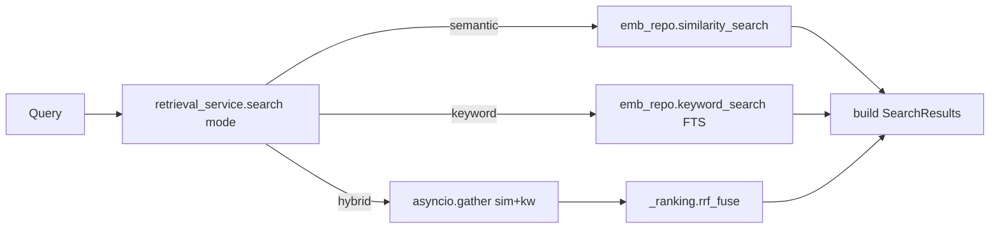

# F5-A Phase 1 — Implementation Plan (Hybrid Search)

**Версия проекта:** 4.4.0+ (post F8-A Hardening, коммит `8012021`)
**Scope:** Добавить hybrid search (FTS + pgvector через RRF) в retrieval pipeline.
**Предыдущие фазы:** Wave 1.5 → F8-A ✅. Следующие: F5-A Phase 2 (relevance tuning), Phase 3 (dedup).
**Design-doc:** [`F5A_PERSISTENT_KB_PLAN.md`](F5A_PERSISTENT_KB_PLAN.md)
**Starter prompt:** [`../prompts/F5A_PHASE1_IMPLEMENTATION_PROMPT.md`](../prompts/F5A_PHASE1_IMPLEMENTATION_PROMPT.md)

---

## Контекст (после разведки)

- Текущая `search()` — [`tg_parser/services/retrieval_service.py`](../../tg_parser/services/retrieval_service.py) строка 45; вызывает только `emb_repo.similarity_search` (pgvector cosine).
- Класс repo — **`SAEmbeddingRepo`** (не `SAmbeddingRepo` как в первоначальном промпте) — [`tg_parser/storage/sqlalchemy/embedding_repo.py`](../../tg_parser/storage/sqlalchemy/embedding_repo.py).
- `EmbeddingRepo` ABC — [`tg_parser/storage/ports.py`](../../tg_parser/storage/ports.py) строки 815–870.
- DDL/ensure — [`tg_parser/storage/sqlalchemy/schemas/processing_storage.py`](../../tg_parser/storage/sqlalchemy/schemas/processing_storage.py): `PROCESSING_STORAGE_DDL` (15–238), `_ensure_embedding_columns` (272–314).
- Alembic head: `c3d4e5f6a7b8` (`20260416_add_embedding_channel_ids.py`).
- Потребители `search`/`answer`: [`tg_parser/api/routes/rag.py`](../../tg_parser/api/routes/rag.py), [`tg_parser/mcp_server.py`](../../tg_parser/mcp_server.py), [`tg_parser/bot/tools.py`](../../tg_parser/bot/tools.py), [`tg_parser/cli/app.py`](../../tg_parser/cli/app.py).
- Существующие тесты создают `emb_repo = AsyncMock()` **без spec** — значит `.keyword_search` авто-стабится в `MagicMock`, но попытка итерации в RRF приведёт к TypeError. Решение: **патчить моки** в затронутых файлах.

---

## Архитектура



---

## Коммит 1 — FTS слой (миграции + repo + RRF)

### 1.1 Миграции и DDL

**Новая миграция** `migrations/versions/processing/20260417_add_fts_to_processed_documents.py`
- `revision="d4e5f6a7b8c9"`, `down_revision="c3d4e5f6a7b8"`.
- `upgrade()`:
  - Проверка через `sa.inspect(conn).get_columns("processed_documents")`; если `search_vector` отсутствует — `ALTER TABLE processed_documents ADD COLUMN search_vector tsvector GENERATED ALWAYS AS (setweight(to_tsvector('simple', coalesce(summary, '')), 'A') || setweight(to_tsvector('russian', coalesce(text_clean, '')), 'B') || setweight(to_tsvector('english', coalesce(text_clean, '')), 'B')) STORED`.
  - `CREATE INDEX IF NOT EXISTS idx_pd_search_vector ON processed_documents USING GIN(search_vector)`.
- `downgrade()`: `DROP INDEX` + `DROP COLUMN`.

**Новая миграция** `migrations/versions/processing/20260417_add_fts_to_topic_cards.py`
- `revision="e5f6a7b8c9d0"`, `down_revision="d4e5f6a7b8c9"`.
- `upgrade()` аналогично для `topic_cards`:
  - `search_vector` = `setweight(to_tsvector('simple', coalesce(title, '')), 'A') || setweight(to_tsvector('russian', coalesce(summary, '') || ' ' || coalesce(scope_in_json, '')), 'B') || setweight(to_tsvector('english', coalesce(summary, '') || ' ' || coalesce(scope_in_json, '')), 'B')`.
  - `CREATE INDEX IF NOT EXISTS idx_tc_search_vector ON topic_cards USING GIN(search_vector)`.
- `downgrade()`: drop index + column.

**Правки** [`tg_parser/storage/sqlalchemy/schemas/processing_storage.py`](../../tg_parser/storage/sqlalchemy/schemas/processing_storage.py):
- В `PROCESSING_STORAGE_DDL` добавить `search_vector tsvector GENERATED ...STORED` прямо в `CREATE TABLE processed_documents (...)` и `CREATE TABLE topic_cards (...)` — для fresh DB без ALTER.
- Добавить `CREATE INDEX IF NOT EXISTS idx_pd_search_vector ...` и `idx_tc_search_vector ...` в DDL.
- Новая функция `_ensure_fts_columns(engine: AsyncEngine) -> None` по паттерну `_ensure_embedding_columns` (272–314): idempotent ALTER + CREATE INDEX IF NOT EXISTS. Ловит `ProgrammingError`/`OperationalError` (для SQLite/тестовых БД без pgvector).
- В `init_processing_storage_schema()` вызвать `await _ensure_fts_columns(engine)` после `await _ensure_embedding_columns(engine)`.

> **Предупреждение (для release notes и USER_GUIDE):** `ADD COLUMN ... GENERATED ... STORED` делает **table rewrite**. На prod-инсталляциях > 1M строк применять в maintenance window.

### 1.2 Repo: `keyword_search`

**ABC** [`tg_parser/storage/ports.py`](../../tg_parser/storage/ports.py) — добавить после `similarity_search` (~855):

```python
@abstractmethod
async def keyword_search(
    self,
    query: str,
    limit: int = 10,
    entry_types: list[str] | None = None,
    channel_ids: list[str] | None = None,
    min_rank: float = 0.0,
) -> list[SimilarityResult]:
    """FTS search (ts_rank_cd) across processed_documents and topic_cards (UNION ALL).

    Args:
        query: Natural-language query; tokenized via plainto_tsquery('simple', ...).
        limit: Max rows fetched from the UNION result (before Python-side filtering).
        entry_types: Optional post-fetch Python filter by entry_type.
        channel_ids: SQL filter for processed_documents.channel_id; topic_cards channel
                     filtering happens downstream in retrieval_service via card.sources.
        min_rank: Python-side ts_rank_cd cutoff.
    """
    ...
```

**Реализация** в [`tg_parser/storage/sqlalchemy/embedding_repo.py`](../../tg_parser/storage/sqlalchemy/embedding_repo.py):

```sql
WITH q AS (SELECT plainto_tsquery('simple', :query) AS tsq)
SELECT source_ref,
       ts_rank_cd(search_vector, q.tsq) AS score,
       'message' AS entry_type,
       NULL::text AS topic_id
FROM processed_documents, q
WHERE search_vector @@ q.tsq
  AND (:channel_ids IS NULL OR channel_id = ANY(CAST(:channel_ids AS text[])))
UNION ALL
SELECT id AS source_ref,
       ts_rank_cd(search_vector, q.tsq) AS score,
       'topic' AS entry_type,
       id AS topic_id
FROM topic_cards, q
WHERE search_vector @@ q.tsq
ORDER BY score DESC
LIMIT :limit
```

- Python-side: применить `entry_types` фильтр и `min_rank` cutoff перед возвратом.
- Возврат `list[SimilarityResult]`.

### 1.3 Pure RRF модуль

Новый файл [`tg_parser/services/_ranking.py`](../../tg_parser/services/_ranking.py):

```python
from collections.abc import Sequence
from tg_parser.storage.ports import SimilarityResult


def rrf_fuse(
    *lists: Sequence[SimilarityResult],
    k: int = 60,
) -> list[SimilarityResult]:
    """Reciprocal Rank Fusion.

    - Rank = 1-indexed позиция в исходном (отсортированном) списке.
    - Дубликаты по source_ref агрегируются: RRF score суммируется по всем спискам.
    - Возвращаемый `score` — RRF score (не original cosine/ts_rank).
    - `entry_type` и `topic_id` берутся из первого встреченного.
    - Пустой список одного из источников — не крашит; fusion возвращает оставшиеся.
    """
```

### 1.4 Тесты коммита 1

Новый файл `tests/test_f5a_hybrid_search.py`:

- **`TestRRFFusion`** (~10): одинаковый doc в обоих списках; пустой список; разные `k`; дубликаты агрегируются; стабильность сортировки; только semantic; только keyword; `entry_type`/`topic_id` preserved.
- **`TestKeywordSearchRepo`** (pg+pgvector, skip-marker `SKIP_PGVECTOR_TESTS` по паттерну `test_f4_embedding_channel_ids.py`) ~6: FTS по `processed_documents`; FTS по `topic_cards`; UNION возвращает оба типа; `channel_id` filter; `min_rank` cutoff; ru+en запросы на смешанном корпусе.
- **`TestMigrationIdempotency`** (pg) ~2: повторный `_ensure_fts_columns` не падает; индексы существуют.

### Коммит 1 message

```
feat(f5a-phase1): add FTS migrations, keyword_search repo, and rrf_fuse module
```

---

## Коммит 2 — Service + API + Wiring

### 2.1 Settings

В [`tg_parser/config/settings.py`](../../tg_parser/config/settings.py) после `embedding_dimension` (~470):

```python
hybrid_enabled: bool = Field(default=True, description="Enable hybrid (keyword+semantic) retrieval")
hybrid_rrf_k: int = Field(default=60, description="RRF constant; higher = less discrimination", ge=1)
fts_languages: str = Field(default="russian,english", description="Informational: FTS languages baked into search_vector DDL")
```

Обновить `.env.example`.

### 2.2 Service: `mode` + RRF fusion

В [`tg_parser/services/retrieval_service.py`](../../tg_parser/services/retrieval_service.py):

- Расширить сигнатуру `search()` (строка 45):

```python
from typing import Literal
# ... в параметрах search():
mode: Literal["semantic", "keyword", "hybrid"] = "hybrid",
```

- Заменить прямой вызов `similarity_search` (строки 110–116) на ветвление:

```python
effective_mode = mode
if effective_mode == "hybrid" and not settings.hybrid_enabled:
    effective_mode = "semantic"

if effective_mode == "semantic":
    similar = await emb_repo.similarity_search(query_vec, limit=limit * 2 if channel_id else limit, ...)
elif effective_mode == "keyword":
    similar = await emb_repo.keyword_search(query, limit=limit * 2 if channel_id else limit, ...)
else:  # hybrid
    import asyncio
    sem_task = emb_repo.similarity_search(query_vec, limit=limit * 2, ...)
    kw_task = emb_repo.keyword_search(query, limit=limit * 2, ...)
    sem, kw = await asyncio.gather(sem_task, kw_task)
    from tg_parser.services._ranking import rrf_fuse
    similar = rrf_fuse(sem, kw, k=settings.hybrid_rrf_k)[: (limit * 2 if channel_id else limit)]
```

- Расширить `answer()` параметром `mode: Literal[...] = "hybrid"` и пробросить в `search(...)`.
- `_build_context` не трогаем.

### 2.3 API wiring

[`tg_parser/api/routes/rag.py`](../../tg_parser/api/routes/rag.py):

- В `SearchRequest` и `AskRequest` добавить:

```python
mode: Literal["semantic", "keyword", "hybrid"] = Field(default="hybrid", description="Retrieval mode")
```

- Пробросить `mode=body.mode` в вызовы `search(...)` (строка 76) и `answer(...)` (строка 105).

**Не меняем в Phase 1:**
- MCP tools [`tg_parser/mcp_server.py`](../../tg_parser/mcp_server.py) — дефолт hybrid неявно.
- Bot tools [`tg_parser/bot/tools.py`](../../tg_parser/bot/tools.py).
- CLI [`tg_parser/cli/app.py`](../../tg_parser/cli/app.py).

### 2.4 Патч существующих моков

Стратегия: **добавить `mock_emb_repo.keyword_search = AsyncMock(return_value=[])`** в тесты, которые используют `AsyncMock()` без spec.

Затронутые файлы:
- [`tests/test_f4_scoped_access.py`](../../tests/test_f4_scoped_access.py) — 2 места (строки 46, 71).
- [`tests/test_f4_coverage_supplement.py`](../../tests/test_f4_coverage_supplement.py) — 2 места (строки 444, 488).
- [`tests/test_f5a_topic_rag.py`](../../tests/test_f5a_topic_rag.py) — ~8 мест (436, 483, 511, 994, 1028, 1052, 1078 и др.).
- [`tests/test_f4_vector_search_isolation.py`](../../tests/test_f4_vector_search_isolation.py) — при необходимости.

### 2.5 Тесты коммита 2

В `tests/test_f5a_hybrid_search.py`:

- **`TestSearchModeSwitch`** (~6): `mode="semantic"` не вызывает `keyword_search`; `mode="keyword"` не вызывает `similarity_search`; `mode="hybrid"` вызывает оба через `asyncio.gather`; `hybrid_enabled=False` + `mode="hybrid"` → fallback semantic; неверный `mode` → Pydantic ValidationError на уровне API.
- **`TestHybridIntegration`** (pg+pgvector, ~4): hybrid без дубликатов; редкий термин доминирует через keyword; семантический запрос без exact match; пустой корпус.
- **`TestSettings`** (~3): `hybrid_enabled`, `hybrid_rrf_k`, `fts_languages` из env; дефолты.

### 2.6 Документация

- [`docs/USER_GUIDE.md`](../../docs/USER_GUIDE.md) — новая секция "Hybrid Search" (режимы, env vars, multilingual, table-rewrite warning).
- [`docs/MCP_AGENT_GUIDE.md`](../../docs/MCP_AGENT_GUIDE.md) — заметка: `search_knowledge_base` теперь hybrid по умолчанию.
- [`ENV_VARIABLES_GUIDE.md`](../../ENV_VARIABLES_GUIDE.md) — `HYBRID_ENABLED`, `HYBRID_RRF_K`, `FTS_LANGUAGES`.
- [`docs/plans/F5A_PERSISTENT_KB_PLAN.md`](F5A_PERSISTENT_KB_PLAN.md) — пометить "Phase 1: DONE" со ссылкой на коммиты.

### Коммит 2 message

```
feat(f5a-phase1): wire hybrid mode with RRF fusion in retrieval_service and API
```

---

## Порядок работы

1. Ветка `feat/f5a-phase1-hybrid-search` от актуального `main`.
2. **Коммит 1** (TDD: сначала `rrf_fuse` + unit-тесты, затем миграции + DDL, затем `keyword_search` + pg-тесты).
3. `.venv/bin/pytest tests/test_f5a_hybrid_search.py::TestRRFFusion -x -q`
4. `TEST_POSTGRES=1 .venv/bin/pytest tests/test_f5a_hybrid_search.py::TestKeywordSearchRepo tests/test_f5a_hybrid_search.py::TestMigrationIdempotency -x -q`
5. **Коммит 2** (settings → service → API → моки → integration тесты → доки).
6. Финальный regression: `TEST_POSTGRES=1 .venv/bin/pytest tests/ -x -q` — ожидаемо ~1362 теста (1331 + ~31).

---

## Критерии готовности

1. Обе FTS-миграции применяются идемпотентно на fresh и existing БД.
2. GIN-индексы `idx_pd_search_vector` и `idx_tc_search_vector` созданы.
3. `SAEmbeddingRepo.keyword_search()` возвращает `list[SimilarityResult]` с `ts_rank_cd` score.
4. `EmbeddingRepo` ABC содержит abstract `keyword_search`.
5. `retrieval_service.search(mode=...)` и `answer(mode=...)` поддерживают `"semantic" | "keyword" | "hybrid"`; дефолт `hybrid`.
6. [`tg_parser/services/_ranking.py`](../../tg_parser/services/_ranking.py) содержит `rrf_fuse()` + ≥10 unit-тестов.
7. Settings `hybrid_enabled`, `hybrid_rrf_k`, `fts_languages` читаются; `hybrid_enabled=False` отключает keyword path.
8. `POST /api/v1/search` и `/ask` принимают опциональный `mode` (Pydantic Literal validation).
9. `tests/test_f5a_hybrid_search.py` ~31 тест; все проходят.
10. Существующие тесты проходят с минимальным добавлением `keyword_search` stub в 3–4 файлах.
11. Документация обновлена.
12. Два коммита с message выше.

---

## Что НЕ входит в scope Phase 1

- Relevance tuning / topic quotas / min_score cutoff в hybrid — Phase 2.
- Topic-weighted RAG context — Phase 2.
- Deduplication (content hash, near-duplicate) — Phase 3.
- Cross-encoder / LLM re-ranking — вне F5-A.
- Linear fusion (alpha-weighted) — не добавляем.
- GIN по `topic_cards.channel_ids` для SQL-level tenancy — Phase 2/3.
- Автодетекция языка запроса — универсальный `plainto_tsquery('simple', ...)`.
- Добавление `mode` в MCP tools / bot tools / CLI — Phase 2.
- Rename `SAEmbeddingRepo` — не трогаем.
