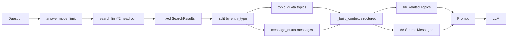

# F5-A Phase 2 — Implementation Plan (Relevance tuning & Topic-weighted RAG)

**Версия проекта:** 4.5.0+ (после мёрджа Phase 1 — `feat/f5a-phase1-hybrid-search`, PR #2)
**Scope:** Тонкая настройка relevance (min_score cutoffs + topic/message квоты) и структурированный RAG-контекст с разделами `## Related Topics` и `## Source Messages`. Проброс `mode` в MCP-tools.
**Предыдущие фазы:** Wave 1.5 → F8-A ✅ → F5-A Phase 1 (Hybrid Search) ✅. Следующие: F5-A Phase 3 (dedup).
**Design-doc:** [`F5A_PERSISTENT_KB_PLAN.md`](F5A_PERSISTENT_KB_PLAN.md) §4.
**Starter prompt:** [`../prompts/F5A_PHASE2_IMPLEMENTATION_PROMPT.md`](../prompts/F5A_PHASE2_IMPLEMENTATION_PROMPT.md)

---

## Контекст (что уже есть после Phase 1)

- `retrieval_service.search(mode="semantic"|"keyword"|"hybrid")` — [`tg_parser/services/retrieval_service.py`](../../tg_parser/services/retrieval_service.py) строка 49. Дефолт `hybrid`. Параметр `threshold` применяется только к semantic ветке (pgvector cosine cutoff).
- `retrieval_service.answer(mode=...)` — строка 239. Вызывает `search(limit=5)`, затем строит `_build_context` (строка 208) без разделения по типам: все блоки в одном пуле с префиксом `[TOPIC]` или `[1] channel:`.
- `emb_repo.keyword_search(min_rank=0.0)` — [`tg_parser/storage/sqlalchemy/embedding_repo.py`](../../tg_parser/storage/sqlalchemy/embedding_repo.py) строка 177. Python-side cutoff на `ts_rank_cd`. Сервис сейчас передаёт дефолт `0.0`.
- `rrf_fuse` — [`tg_parser/services/_ranking.py`](../../tg_parser/services/_ranking.py). RRF score не нормализован и не сопоставим с cosine/ts_rank → **post-fusion cutoff не применяем**.
- Settings — [`tg_parser/config/settings.py`](../../tg_parser/config/settings.py) строки 476–488: `hybrid_enabled`, `hybrid_rrf_k`, `fts_languages`.
- MCP tools `search_knowledge_base` (строка 436) и `ask_question` (строка 477) — [`tg_parser/mcp_server.py`](../../tg_parser/mcp_server.py). Оба БЕЗ параметра `mode`, hybrid используется неявно по дефолту.
- Прочие потребители `search`/`answer`: [`tg_parser/api/routes/rag.py`](../../tg_parser/api/routes/rag.py) (уже имеет `mode`), [`tg_parser/bot/tools.py`](../../tg_parser/bot/tools.py), [`tg_parser/cli/app.py`](../../tg_parser/cli/app.py).
- Существующие тесты `_build_context`: `tests/test_f5a_topic_rag.py` (9 методов: строки 540, 556, 570, 593, 605, 611, 1108, 1121, 1134) и `tests/test_rag_prompt_config.py` (8 методов: строки 286, 305, 320, 338, 342, 356, 377, 1401) — суммарно ~17 тестов, ~50 ассертов. **Ломаются при изменении формата**; включаем в scope обновления (Commit 2).
- Существующий `rag.yaml` v1.1.0 — [`prompts/rag.yaml`](../../prompts/rag.yaml). Будет обновлён до v1.2.0 с описанием двух разделов.

---

## Архитектура



---

## Коммит 1 — Relevance tuning (min_score + type quotas)

### 1.1 Settings

В [`tg_parser/config/settings.py`](../../tg_parser/config/settings.py) после `fts_languages` (~488):

```python
# ==========================================================================
# RAG Relevance Tuning (F5-A Phase 2)
# ==========================================================================

fts_min_rank: float = Field(
    default=0.0,
    description="Default ts_rank_cd cutoff for keyword search (0.0 = no cutoff)",
    ge=0.0,
)
rag_topic_quota: int = Field(
    default=2,
    description="Number of topic cards reserved in answer() context before filling with messages",
    ge=0,
    le=20,
)
rag_search_overfetch_factor: int = Field(
    default=2,
    description="answer() fetches limit * factor before applying quotas for headroom",
    ge=1,
    le=10,
)
```

Обновить `.env.example`:

```bash
# --- F5-A Phase 2: RAG Relevance Tuning ---
# FTS score cutoff (0.0 = no cutoff). Typical useful range 0.001–0.05.
FTS_MIN_RANK=0.0
# Reserve N topic cards in answer() context; remainder goes to messages.
RAG_TOPIC_QUOTA=2
# answer() fetches limit * factor before quota split (headroom against under-fill).
RAG_SEARCH_OVERFETCH_FACTOR=2
```

### 1.2 Service: pipe `fts_min_rank` через service layer

В [`tg_parser/services/retrieval_service.py`](../../tg_parser/services/retrieval_service.py):

- Добавить параметр `fts_min_rank: float | None = None` в `search()` (после `threshold`).
- В веточках `keyword` и `hybrid` передавать `min_rank=fts_min_rank if fts_min_rank is not None else settings.fts_min_rank` в `emb_repo.keyword_search(...)`.
- Semantic путь продолжает использовать `threshold` как есть.

### 1.3 Service: type quotas в `answer()`

Текущий `answer()` (строка 239) вызывает `search(limit=limit)` и сразу строит context. Phase 2:

```python
async def answer(
    question: str,
    channel_id: str | None = None,
    limit: int = 5,
    allowed_channel_ids: list[str] | None = None,
    mode: SearchMode = "hybrid",
    topic_quota: int | None = None,
    *,
    emb_repo: EmbeddingRepo | None = None,
    proc_repo: ProcessedDocumentRepo | None = None,
    llm_client: "LLMClient | None" = None,
) -> AnswerResult:
    effective_topic_quota = topic_quota if topic_quota is not None else settings.rag_topic_quota
    effective_topic_quota = min(effective_topic_quota, limit)

    overfetch = max(1, settings.rag_search_overfetch_factor)
    raw = await search(
        question,
        channel_id=channel_id,
        limit=limit * overfetch,
        allowed_channel_ids=allowed_channel_ids,
        mode=mode,
        emb_repo=emb_repo,
        proc_repo=proc_repo,
    )

    sources = _apply_type_quotas(raw, limit=limit, topic_quota=effective_topic_quota)

    # ... далее как сейчас (no-results branch, prompt build, _call_llm)
```

**Новая pure-function `_apply_type_quotas`** (в том же модуле, приватная):

```python
def _apply_type_quotas(
    results: list[SearchResult],
    limit: int,
    topic_quota: int,
) -> list[SearchResult]:
    """Split results by entry_type, apply quotas with underflow fallback.

    Rules:
    - Take up to ``topic_quota`` topics (preserving score order).
    - Fill remaining slots with messages (preserving score order).
    - If topics < topic_quota, backfill shortfall with extra messages.
    - If messages < available slots, backfill shortfall with extra topics.
    - Return topics first, then messages (stable section-ordering for
      downstream _build_context).
    """
    topics = [r for r in results if r.entry_type == "topic"]
    messages = [r for r in results if r.entry_type == "message"]

    picked_topics = topics[:topic_quota]
    remaining = limit - len(picked_topics)
    picked_messages = messages[:remaining]

    # Underflow: messages < remaining → backfill with extra topics
    shortfall = limit - len(picked_topics) - len(picked_messages)
    if shortfall > 0 and len(topics) > len(picked_topics):
        extra_topics = topics[len(picked_topics) : len(picked_topics) + shortfall]
        picked_topics.extend(extra_topics)

    return picked_topics + picked_messages
```

**Важно:**
- `search()` не меняем в части квот — квотирование только в RAG path (`answer()`).
- Order within each type preserved (score-descending from `search()`).
- `topics` блок всегда первым в результате → `_build_context` (Commit 2) делает это явно через секции.

### 1.4 Тесты Коммита 1

Новый файл `tests/test_f5a_phase2_tuning.py`:

- **`TestApplyTypeQuotas`** (~8 unit-тестов, no DB):
  - `test_empty_results_returns_empty`
  - `test_topics_within_quota_fill_exact`
  - `test_messages_fill_remainder`
  - `test_topic_underflow_backfills_with_messages`
  - `test_message_underflow_backfills_with_topics`
  - `test_both_types_sparse_returns_all_available`
  - `test_topic_quota_zero_returns_only_messages`
  - `test_topic_quota_equals_limit_returns_only_topics`
  - `test_order_within_type_preserved`

- **`TestAnswerQuotas`** (~5 integration-style, mocked search):
  - `test_answer_default_topic_quota_2` — patch `search`, verify `_apply_type_quotas` called with `topic_quota=2`.
  - `test_answer_topic_quota_override` — explicit `topic_quota=3` overrides settings default.
  - `test_answer_overfetches_for_quota_headroom` — asserts `search(limit=limit * factor)`.
  - `test_answer_returns_at_most_limit_sources_after_quotas` — `len(result.sources) <= limit` even after overfetch.
  - `test_answer_empty_results_returns_no_results_message`.

- **`TestFtsMinRankPipeline`** (~3):
  - `test_search_passes_settings_default_min_rank` — `keyword_search` called with `min_rank=settings.fts_min_rank`.
  - `test_search_explicit_min_rank_overrides` — `search(fts_min_rank=0.05)` wins over settings.
  - `test_semantic_mode_unaffected_by_fts_min_rank` — semantic branch still uses `threshold`.

- **`TestSettingsPhase2`** (~3):
  - `test_defaults` (`fts_min_rank=0.0`, `rag_topic_quota=2`, `rag_search_overfetch_factor=2`).
  - `test_env_overrides`.
  - `test_rag_topic_quota_validator` (reject negative).

### 1.5 Commit 1 message

```
feat(f5a-phase2): add RAG type quotas and FTS min_rank pipeline
```

---

## Коммит 2 — Structured topic-weighted context + MCP mode passthrough

### 2.1 Structured `_build_context`

В [`tg_parser/services/retrieval_service.py`](../../tg_parser/services/retrieval_service.py) заменить `_build_context` (строка 208):

```python
def _build_context(results: list[SearchResult], char_limit: int) -> str:
    """Build structured RAG context with separate topic and message sections.

    Output format (both sections optional; empty when no matches of that type):

        ## Related Topics
        [T1] ref: <topic_id> | channels: <csv> | score: <float>
        Title: <card.title>
        Summary: <card.summary>
        Scope: <csv>            (when scope_in non-empty)
        Tags: <csv>             (when tags non-empty)

        ---

        [T2] ...

        ## Source Messages
        [M1] channel: <id> | ref: <source_ref> | score: <float>
        Title: <summary or text[:80]>
        Text: <text_clean[:char_limit]>
        Topics: <csv>           (when topics non-empty)

        ---

        [M2] ...
    """
    topics = [r for r in results if r.entry_type == "topic" and r.topic_card is not None]
    messages = [r for r in results if r.entry_type != "topic" and r.document is not None]

    sections: list[str] = []

    if topics:
        parts = []
        for i, r in enumerate(topics, 1):
            card = r.topic_card
            channels = ", ".join(card.sources) if card.sources else "unknown"
            header = f"[T{i}] ref: {r.source_ref} | channels: {channels} | score: {r.score:.3f}"
            body_lines = [f"Title: {card.title}", f"Summary: {card.summary}"]
            if card.scope_in:
                body_lines.append(f"Scope: {', '.join(card.scope_in)}")
            if card.tags:
                body_lines.append(f"Tags: {', '.join(card.tags)}")
            parts.append(header + "\n" + "\n".join(body_lines))
        sections.append("## Related Topics\n\n" + "\n\n---\n\n".join(parts))

    if messages:
        parts = []
        for i, r in enumerate(messages, 1):
            doc = r.document
            title = doc.summary or doc.text_clean[:80]
            header = f"[M{i}] channel: {doc.channel_id} | ref: {r.source_ref} | score: {r.score:.3f}"
            body_lines = [f"Title: {title}", f"Text: {doc.text_clean[:char_limit]}"]
            if doc.topics:
                body_lines.append(f"Topics: {', '.join(doc.topics)}")
            parts.append(header + "\n" + "\n".join(body_lines))
        sections.append("## Source Messages\n\n" + "\n\n---\n\n".join(parts))

    return "\n\n".join(sections)
```

Ключевые отличия от v1:
- Префиксы `[T1]`/`[M1]` (было `[1] [TOPIC]` и `[1] channel:`).
- Два раздела через `## Related Topics` / `## Source Messages` (markdown H2).
- Score отображается с 3 знаками (было 2) — даёт лучший signal на hybrid.
- Порядок: сначала топики, потом сообщения (quota-split уже обеспечен в `answer()`).

### 2.2 Обновить `prompts/rag.yaml` до v1.2.0

```yaml
metadata:
  version: "1.2.0"
  description: "RAG Q&A prompt for answering questions; topic-weighted context (F5-A Phase 2)"

system:
  prompt: |
    You are a knowledge base assistant that answers questions using content from Telegram channels.

    Context structure:
    - The context contains two optional sections: "## Related Topics" and "## Source Messages".
    - Topic blocks (prefixed "[T1]", "[T2]", ...) describe thematic groupings with a title, summary, scope and source channels.
    - Message blocks (prefixed "[M1]", "[M2]", ...) are individual posts with a channel id, source ref and text.

    Instructions:
    - Answer ONLY based on the provided context. Do not use prior knowledge.
    - If the context does not contain enough information, say so explicitly.
    - Use the "## Related Topics" section for high-level thematic reasoning; use the "## Source Messages" section for concrete evidence.
    - Cite sources using their ref value, NOT the bracket index. Prefer message citations [tg:channel:post:123] for factual claims and topic citations for thematic framing.
    - Structure your answer: direct answer first, then supporting details with citations.
    - Respond in the SAME LANGUAGE as the user's question.
    - Do NOT wrap your response in markdown code blocks unless showing code.
```

Остальное (`user.template`, `no_results`, `model`) — без изменений.

### 2.3 MCP tools `mode` passthrough

В [`tg_parser/mcp_server.py`](../../tg_parser/mcp_server.py):

- `search_knowledge_base` (строка 436):
  ```python
  from typing import get_args
  from tg_parser.services.retrieval_service import SearchMode

  _VALID_MODES = set(get_args(SearchMode))

  async def search_knowledge_base(
      query: str,
      channel_id: str | None = None,
      limit: int = 10,
      mode: str = "hybrid",  # NEW
      ctx: Context | None = None,
  ) -> list[SearchResultItem]:
      """... Args: ... mode: Retrieval strategy — 'semantic' | 'keyword' | 'hybrid' (default). ..."""
      if mode not in _VALID_MODES:
          raise ValueError(f"invalid mode: {mode!r}; expected one of {sorted(_VALID_MODES)}")
      # ...
      results = await search(
          query=query, channel_id=channel_id, limit=limit,
          allowed_channel_ids=user.allowed_channel_ids,
          mode=mode,
      )
  ```

- `ask_question` (строка 477): аналогично, параметр `mode: str = "hybrid"` + validation + проброс.

- Обновить блок Search & Q&A в `_MCP_INSTRUCTIONS` в `mcp_server.py` (строки 50–51): "search_knowledge_base for semantic search" → "search_knowledge_base for hybrid search (mode=semantic|keyword|hybrid; default hybrid)". Аналогично — упомянуть `mode` у `ask_question`.

**Bot/CLI** — в Phase 2 **не трогаем** (неявный дефолт hybrid). Пометить в плане как "Phase 3 candidate".

### 2.4 Обновить существующие тесты под новый формат контекста

Затронутые файлы:

- [`tests/test_f5a_topic_rag.py`](../../tests/test_f5a_topic_rag.py) — 9 методов с `_build_context` (строки 540, 556, 570, 593, 605, 611, 1108, 1121, 1134). Нужно:
  - Изменить ассерты `"[1] channel: ch1"` → `"[M1] channel: ch1"` + `"## Source Messages"`.
  - `"[TOPIC]"` → `"[T1]"` + `"## Related Topics"`.
  - `"[1] channel:", "[2] [TOPIC]"` (mixed) → проверять обе секции и presence маркеров `[M1]`/`[T1]`.

- [`tests/test_rag_prompt_config.py`](../../tests/test_rag_prompt_config.py) — 8 методов (строки 286, 305, 320, 338, 342, 356, 377, 1401). Аналогичные правки.

**Стратегия:** заменяем хрупкие строчные ассерты на структурные (содержит ли `## Related Topics`; есть ли `[M1]`; нет ли утечки текста).

### 2.5 Тесты Коммита 2

В `tests/test_f5a_phase2_tuning.py` добавить:

- **`TestStructuredContext`** (~8):
  - `test_empty_results_returns_empty_string`
  - `test_topics_only_emits_topics_section_only`
  - `test_messages_only_emits_messages_section_only`
  - `test_mixed_emits_both_sections_topics_first`
  - `test_topic_marker_format_is_T_prefixed` (regex: `\[T\d+\]`)
  - `test_message_marker_format_is_M_prefixed` (regex: `\[M\d+\]`)
  - `test_section_separator_triple_dash_between_blocks`
  - `test_char_limit_truncates_message_text_only`

- **`TestMcpModePassthrough`** (~5):
  - `test_search_knowledge_base_default_mode_hybrid` — patch `search`, assert `mode="hybrid"`.
  - `test_search_knowledge_base_explicit_keyword` — `mode="keyword"` forwarded.
  - `test_search_knowledge_base_rejects_invalid_mode` — ValueError.
  - `test_ask_question_default_mode_hybrid`.
  - `test_ask_question_mode_forwarded`.

- **`TestRagPromptV12`** (~2):
  - `test_rag_prompt_loads_v1_2_0` — version string.
  - `test_system_prompt_mentions_sections` — contains `"## Related Topics"` и `"## Source Messages"`.

### 2.6 Документация

- [`docs/USER_GUIDE.md`](../../docs/USER_GUIDE.md) — расширить раздел "Hybrid Search" (добавленный в Phase 1) новой подсекцией "RAG context structure & type quotas":
  - Структура контекста `## Related Topics` / `## Source Messages`.
  - Как менять квоту тем через `RAG_TOPIC_QUOTA`.
  - `FTS_MIN_RANK` — когда полезно (шумные короткие сообщения).

- [`docs/MCP_AGENT_GUIDE.md`](../../docs/MCP_AGENT_GUIDE.md) — обновить:
  - `search_knowledge_base` и `ask_question` теперь принимают `mode`.
  - Формат контекста в `ask_question` теперь structured.

- [`ENV_VARIABLES_GUIDE.md`](../../ENV_VARIABLES_GUIDE.md) — добавить:
  - `FTS_MIN_RANK`, `RAG_TOPIC_QUOTA`, `RAG_SEARCH_OVERFETCH_FACTOR`.

- [`docs/plans/F5A_PERSISTENT_KB_PLAN.md`](F5A_PERSISTENT_KB_PLAN.md) — отметить Phase 2 DONE.

- [`docs/LLM_PROMPTS.md`](../../docs/LLM_PROMPTS.md) — если упоминает `rag.yaml` версию, обновить до 1.2.0.

### 2.7 Commit 2 message

```
feat(f5a-phase2): structured topic-weighted RAG context + MCP mode passthrough
```

---

## Порядок работы

1. **Ветка** `feat/f5a-phase2-relevance-tuning` от актуального `main` (после мёрджа PR #2 с Phase 1).
2. **Коммит 1**:
   - Settings → `.env.example` → tests `TestSettingsPhase2` (TDD).
   - `_apply_type_quotas` pure function → unit-тесты.
   - `answer(topic_quota=..., overfetch)` wiring → mocked tests.
   - `fts_min_rank` pipeline → mocked tests.
   - `.venv/bin/pytest tests/test_f5a_phase2_tuning.py::TestApplyTypeQuotas tests/test_f5a_phase2_tuning.py::TestFtsMinRankPipeline tests/test_f5a_phase2_tuning.py::TestSettingsPhase2 tests/test_f5a_phase2_tuning.py::TestAnswerQuotas -x -q`
3. **Коммит 2**:
   - Новый `_build_context` → `TestStructuredContext` (TDD).
   - Обновить все существующие `_build_context` ассерты (`test_f5a_topic_rag.py`, `test_rag_prompt_config.py`).
   - `rag.yaml` v1.2.0 → `TestRagPromptV12`.
   - MCP tools `mode` → `TestMcpModePassthrough` (с моком `search`/`answer` как в `tests/test_mcp_server.py`).
   - Docs.
4. **Финальный regression:** `TEST_POSTGRES=1 .venv/bin/pytest tests/ -x -q`. Ожидаемо 1384 → ~1410 тестов (+25–30).
5. **PR** против `main`. После мёрджа — Phase 3 (dedup).

---

## Критерии готовности

1. `settings.fts_min_rank`, `rag_topic_quota`, `rag_search_overfetch_factor` читаются из env; проходят валидаторы.
2. `retrieval_service.search(fts_min_rank=...)` пробрасывает в `keyword_search.min_rank`; дефолт берётся из settings.
3. `retrieval_service.answer(topic_quota=..., ...)` применяет `_apply_type_quotas` с overfetch; fallback при underflow работает для обоих типов.
4. `_apply_type_quotas` — pure function; ≥8 unit-тестов.
5. `_build_context` выдаёт `## Related Topics` и `## Source Messages`; форматы `[T1]` / `[M1]`.
6. `prompts/rag.yaml` — v1.2.0; system prompt описывает две секции и правила цитирования.
7. MCP tools `search_knowledge_base` и `ask_question` принимают `mode: str = "hybrid"`; валидируют значение; пробрасывают в сервис.
8. Существующие тесты `_build_context` (`test_f5a_topic_rag.py`, `test_rag_prompt_config.py`) обновлены под новый формат и проходят.
9. Новый файл `tests/test_f5a_phase2_tuning.py` содержит ~25 тестов (`TestApplyTypeQuotas`, `TestAnswerQuotas`, `TestFtsMinRankPipeline`, `TestSettingsPhase2`, `TestStructuredContext`, `TestMcpModePassthrough`, `TestRagPromptV12`), все проходят.
10. Полный regression проходит (`TEST_POSTGRES=1 pytest tests/ -x -q` → ≥1410 passed).
11. Документация обновлена (USER_GUIDE, MCP_AGENT_GUIDE, ENV_VARIABLES_GUIDE, LLM_PROMPTS, F5A_PERSISTENT_KB_PLAN → Phase 2 DONE).
12. Два коммита с указанными messages.

---

## Что НЕ входит в scope Phase 2

- Deduplication (content hash, near-duplicate) — Phase 3.
- Cross-encoder / LLM re-ranking — вне F5-A.
- Linear fusion как альтернатива RRF — отложено.
- `mode` в bot tools и CLI `search`/`answer` — отдельный минорный коммит после Phase 2 (или в рамках Phase 3, по ситуации).
- GIN по `topic_cards.channel_ids` для SQL-level tenancy — отложено.
- Автодетекция языка запроса для FTS.
- A/B telemetry (track какой режим выбран, какая квота сработала) — опционально, в рамках F9 observability.
- Динамическое квотирование (adaptive) — отложено; дефолт 2 темы + остальное сообщения достаточен для MVP.
- Изменение формата `SearchResultItem` в API/MCP (`text_preview` и т.п.) — остаётся v1.

---

## Риски и митигация

| Риск | Митигация |
|---|---|
| Обновление формата контекста ломает кастомные `rag.yaml` у пользователей | Backward-compatible prompts fallback; версия 1.2.0 явно; в USER_GUIDE пример миграции |
| Квотирование даёт пустой context если `topic_quota >= limit` и сообщений нет | `_apply_type_quotas` fallback backfill; тест `test_topic_underflow_backfills_with_messages` |
| Новый prompt на малых LLM (локальный Ollama) хуже работает со структурированным контекстом | Оставляем `rag.yaml` override механизм; документируем совет "use flat context for small models" |
| `overfetch_factor=2` удваивает стоимость embedding в semantic/hybrid ветках | Применяется только в `answer()`, не в raw `search()`; пользователь контролирует через env |
| Ломаются ~50 существующих ассертов `_build_context` (~17 тест-методов) | Явно в scope; централизованная правка; структурные ассерты вместо строчных |
| MCP клиенты с closed schema падают на новом параметре `mode` | MCP tools optional args — клиенты без параметра получают дефолт; документируем в MCP_AGENT_GUIDE |
| Bot/CLI потребители видят меньше sources (квота-фильтрация в `answer()`) | Намеренно — они и до Phase 2 ожидали `limit` записей; overfetch — внутренняя оптимизация; добавить unit-тест `test_answer_returns_at_most_limit_sources_after_quotas` |
| `_apply_type_quotas` подставляет topic перед message — может перевзвесить ответы LLM | Структура контекста явно отделяет секции; system prompt в `rag.yaml` v1.2.0 говорит "use topics for thematic framing, messages for facts" |

---

## Связанные документы

- [`F5A_PHASE1_IMPLEMENTATION_PLAN.md`](F5A_PHASE1_IMPLEMENTATION_PLAN.md) — завершённая Phase 1.
- [`F5A_PERSISTENT_KB_PLAN.md`](F5A_PERSISTENT_KB_PLAN.md) §4 — исходный набросок Phase 2.
- [`../prompts/F5A_PHASE1_IMPLEMENTATION_PROMPT.md`](../prompts/F5A_PHASE1_IMPLEMENTATION_PROMPT.md) — образец стартового промпта.
- [`../../docs/LLM_PROMPTS.md`](../../docs/LLM_PROMPTS.md) — документация prompts-loader.
- PR #2 ([`feat/f5a-phase1-hybrid-search`](https://github.com/AlexEfimov/TG_parser/pull/2)) — prerequisite.
