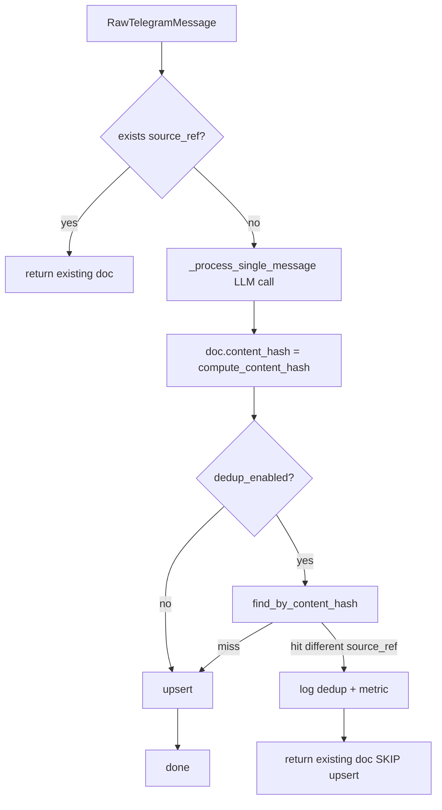

# F5-A Phase 3 — Implementation Plan (Deduplication via content hash)

**Версия проекта:** 4.5.0+ (после мёрджа Phase 2 — `feat/f5a-phase2-relevance-tuning`, PR #8)
**Scope:** Exact-duplicate detection через SHA-256 `content_hash` по нормализованному `text_clean`; composite index `(channel_id, content_hash)`; integration в processing pipeline (single + batch); backfill CLI для существующих данных.
**Предыдущие фазы:** Wave 1.5 → F8-A ✅ → F5-A Phase 1 (Hybrid) ✅ → F5-A Phase 2 (Relevance tuning) ✅.
**Design-doc:** [`F5A_PERSISTENT_KB_PLAN.md`](F5A_PERSISTENT_KB_PLAN.md) §5.
**Starter prompt:** [`../prompts/F5A_PHASE3_IMPLEMENTATION_PROMPT.md`](../prompts/F5A_PHASE3_IMPLEMENTATION_PROMPT.md)

---

## Контекст (что уже есть после Phase 2)

- `processed_documents` PK — `source_ref`; `ON CONFLICT(source_ref) DO UPDATE` в [`SAProcessedDocumentRepo.upsert`](../../tg_parser/storage/sqlalchemy/processed_document_repo.py) (строки 31-77) и `upsert_batch` (79-127). **Нет `content_hash`**.
- Legacy DDL [`PROCESSING_STORAGE_DDL`](../../tg_parser/storage/sqlalchemy/schemas/processing_storage.py) строки 14-37 — `CREATE TABLE IF NOT EXISTS processed_documents (...)` без `content_hash`.
- Idempotent DDL helpers: `_ensure_embedding_columns` (283), `_ensure_fts_columns` (337). Добавим `_ensure_content_hash_column` по тому же паттерну.
- Последняя миграция processing-схемы: [`20260417_add_fts_to_processed_documents.py`](../../migrations/versions/processing/20260417_add_fts_to_processed_documents.py) — `revision="d4e5f6a7b8c9"`. Следующая миграция имеет `down_revision="d4e5f6a7b8c9"`.
- `ProcessedDocument` domain model: [`tg_parser/domain/models.py:105-158`](../../tg_parser/domain/models.py). Поля: `id`, `source_ref`, `source_message_id`, `channel_id`, `processed_at`, `text_clean`, `summary`, `topics`, `entities`, `language`, `metadata`. **Нет `content_hash`**.
- Pipeline [`tg_parser/processing/pipeline.py`](../../tg_parser/processing/pipeline.py):
  - `process_message` (185-306): `exists(source_ref)` check → `_process_single_message` (LLM) → `upsert`.
  - `_process_batch_sequential` (650-696): цикл `process_message` — dedup ловится автоматически через single-path.
  - `_process_batch_parallel` (698-823): `gather(*llm_only_tasks)` → `upsert_batch`. Dedup нужно вставить **между** этими двумя шагами.
- Metrics: [`tg_parser/api/metrics.py`](../../tg_parser/api/metrics.py) — использует Prometheus `Counter`. Добавим `tg_dedup_duplicates_detected_total{channel_id}`.
- `ProcessedDocumentRepo` port: [`tg_parser/storage/ports.py:373`](../../tg_parser/storage/ports.py). Добавим abstract `find_by_content_hash`.
- Settings: последние записи Phase 2 — `rag_search_overfetch_factor` (строка 505-510). Phase 3 идёт следом.
- `ProcessedDocument.metadata: dict[str, Any] | None` — готово поддержать `duplicate_of` marker (если вдруг решим писать), но **в Phase 3 пишем НЕ будем** — только skip + log.

---

## Архитектура



Batch-path:


---

## Коммит 1 — Schema + domain + hash utils + repo

### 1.1 Alembic миграция

Новый файл [`migrations/versions/processing/20260418_add_content_hash.py`](../../migrations/versions/processing/):

```python
"""add content_hash to processed_documents (F5-A Phase 3)

Revision ID: e5f6a7b8c9d0
Revises: d4e5f6a7b8c9
Create Date: 2026-04-18

F5-A Phase 3: Deduplication via SHA-256 content-hash.

Adds nullable CHAR(64) column + partial composite B-tree index on
(channel_id, content_hash) WHERE content_hash IS NOT NULL.

Safe for large tables: column is NULLable so ADD COLUMN is O(1); index
is created concurrently-safe (the partial predicate lets us rebuild
without blocking).  Backfill is done via the ``backfill-content-hash``
CLI, not in this migration.
"""

from collections.abc import Sequence

import sqlalchemy as sa
from alembic import op

revision: str = "e5f6a7b8c9d0"
down_revision: str | None = "d4e5f6a7b8c9"
branch_labels: str | Sequence[str] | None = None
depends_on: str | Sequence[str] | None = None


def upgrade() -> None:
    conn = op.get_bind()
    inspector = sa.inspect(conn)
    columns = [c["name"] for c in inspector.get_columns("processed_documents")]

    if "content_hash" not in columns:
        conn.execute(sa.text(
            "ALTER TABLE processed_documents ADD COLUMN content_hash CHAR(64)"
        ))

    conn.execute(sa.text(
        "CREATE INDEX IF NOT EXISTS idx_pd_channel_content_hash "
        "ON processed_documents (channel_id, content_hash) "
        "WHERE content_hash IS NOT NULL"
    ))


def downgrade() -> None:
    conn = op.get_bind()
    conn.execute(sa.text("DROP INDEX IF EXISTS idx_pd_channel_content_hash"))
    conn.execute(sa.text(
        "ALTER TABLE processed_documents DROP COLUMN IF EXISTS content_hash"
    ))
```

**Production notes:**
- `ALTER TABLE ADD COLUMN` с NULL-able колонкой и без `DEFAULT` → Postgres 11+
  делает O(1) metadata-only change, не переписывает таблицу. Безопасно на
  больших БД.
- `CREATE INDEX` (без `CONCURRENTLY`) берёт `ShareLock` на таблицу — блокирует
  DML на время построения. Для маленьких/средних БД приемлемо, соответствует
  паттерну предыдущих Phase 1/Phase 2 миграций (`20260417_add_fts_...`).
  Для production с высоким write-load рекомендуется pre-run вручную через
  `CREATE INDEX CONCURRENTLY idx_pd_channel_content_hash ...` до запуска
  `alembic upgrade` — после этого `CREATE INDEX IF NOT EXISTS` в миграции
  становится no-op. Задокументировать в deploy-runbook при rollout'е.

### 1.2 Legacy DDL + idempotent helper

В [`tg_parser/storage/sqlalchemy/schemas/processing_storage.py`](../../tg_parser/storage/sqlalchemy/schemas/processing_storage.py):

- Обновить `PROCESSING_STORAGE_DDL` (CREATE TABLE IF NOT EXISTS processed_documents): добавить строку `content_hash CHAR(64),` после `metadata_json TEXT,`.
- Добавить функцию:

```python
async def _ensure_content_hash_column(engine: AsyncEngine) -> None:
    """Add content_hash CHAR(64) column + partial composite index (idempotent)."""
    try:
        async with engine.begin() as conn:
            await conn.execute(text(
                "ALTER TABLE processed_documents "
                "ADD COLUMN IF NOT EXISTS content_hash CHAR(64)"
            ))
            await conn.execute(text(
                "CREATE INDEX IF NOT EXISTS idx_pd_channel_content_hash "
                "ON processed_documents (channel_id, content_hash) "
                "WHERE content_hash IS NOT NULL"
            ))
    except (ProgrammingError, OperationalError) as e:
        logger.debug("content_hash column/index creation skipped: %s", e)
```

- Вызвать `_ensure_content_hash_column(engine)` в `init_processing_storage_schema` (после `_ensure_fts_columns`).

### 1.3 Domain model

В [`tg_parser/domain/models.py`](../../tg_parser/domain/models.py) добавить поле в `ProcessedDocument` (после `metadata`):

```python
content_hash: str | None = Field(
    None,
    pattern=r"^[0-9a-f]{64}$",
    description="SHA-256 hex digest of normalized text_clean for exact-dedup (F5-A Phase 3)",
)
```

`model_config.json_schema_extra.examples` — добавить `"content_hash": "abc123..."` в пример (опционально).

### 1.4 Hash utilities

Новый файл [`tg_parser/domain/hashing.py`](../../tg_parser/domain/hashing.py):

```python
"""Content-hash utilities for F5-A Phase 3 deduplication.

Pure functions, zero I/O dependencies. Keep this module free of settings
imports so it can be used from migrations / backfill scripts without pulling
in config.
"""

import hashlib
import re

_WHITESPACE_RE = re.compile(r"\s+")
_URL_QUERY_RE = re.compile(r"(https?://[^\s?#]+)[?#][^\s]*")


def normalize_for_hash(text: str, *, strip_url_query: bool = True) -> str:
    """Deterministic normalization for content-hash.

    Rules:
    - If ``strip_url_query`` (default): strip ``?query#fragment`` from URLs.
    - Lowercase (unicode-aware via ``str.lower``).
    - Collapse consecutive whitespace (incl. \\t \\n) to a single space.
    - Trim leading/trailing whitespace.

    Order matters: URL strip first (preserves original case in path),
    then lowercase, then whitespace collapse.
    """
    if strip_url_query:
        text = _URL_QUERY_RE.sub(r"\1", text)
    text = text.lower()
    text = _WHITESPACE_RE.sub(" ", text).strip()
    return text


def compute_content_hash(text_clean: str, *, strip_url_query: bool = True) -> str:
    """SHA-256 hex digest (64 lowercase chars) of normalized ``text_clean``."""
    normalized = normalize_for_hash(text_clean, strip_url_query=strip_url_query)
    return hashlib.sha256(normalized.encode("utf-8")).hexdigest()
```

### 1.5 Settings

В [`tg_parser/config/settings.py`](../../tg_parser/config/settings.py) после `rag_search_overfetch_factor` (~510):

```python
# ==========================================================================
# Deduplication (F5-A Phase 3)
# ==========================================================================

dedup_enabled: bool = Field(
    default=True,
    description="Enable SHA-256 content-hash deduplication in processing pipeline (within-channel scope)",
)
dedup_strip_url_query: bool = Field(
    default=True,
    description="Strip URL query strings (?...#...) before hashing; catches tracking-param variants",
)
```

`.env.example`:

```bash
# --- F5-A Phase 3: Deduplication ---
# Enable content-hash dedup in the processing pipeline (within-channel only).
# When a duplicate is detected the LLM-generated document is dropped (not
# written to processed_documents) and the existing record is returned.
DEDUP_ENABLED=true
# Strip "?query#fragment" from URLs before hashing — catches tracking params
# (utm_*, fbclid, etc.). Disable if you rely on full-URL identity.
DEDUP_STRIP_URL_QUERY=true
```

### 1.6 Port

В [`tg_parser/storage/ports.py`](../../tg_parser/storage/ports.py) — абстрактный метод в `ProcessedDocumentRepo`:

```python
@abstractmethod
async def find_by_content_hash(
    self,
    channel_id: str,
    content_hash: str,
) -> "ProcessedDocument | None":
    """Return the first processed document in ``channel_id`` whose
    ``content_hash`` matches exactly, or ``None`` if absent.

    Lookup relies on the composite partial index
    ``idx_pd_channel_content_hash (channel_id, content_hash)
    WHERE content_hash IS NOT NULL``.
    """
```

### 1.7 Repo implementation

В [`tg_parser/storage/sqlalchemy/processed_document_repo.py`](../../tg_parser/storage/sqlalchemy/processed_document_repo.py):

- `upsert` (31-77): добавить `content_hash` в INSERT и в `ON CONFLICT DO UPDATE SET`:
  ```python
  # ... INSERT columns:
  text_clean, summary, topics_json, entities_json, language, metadata_json, content_hash
  # VALUES:
  :text_clean, :summary, :topics_json, :entities_json, :language, :metadata_json, :content_hash
  # DO UPDATE SET:
  ...
  content_hash = excluded.content_hash
  ```
  В params-dict: `"content_hash": doc.content_hash`.

- `upsert_batch` (79-127): идентично.

- Все SELECT-ы (`get_by_source_ref`, `get_by_source_refs`, `list_by_channel`, `list_all`): добавить `content_hash` в projection.

- `_row_to_model` (270-291): `content_hash=row.content_hash` в constructor call.

- Новый метод:
  ```python
  async def find_by_content_hash(
      self,
      channel_id: str,
      content_hash: str,
  ) -> ProcessedDocument | None:
      query = text("""
          SELECT source_ref, id, source_message_id, channel_id, processed_at,
                 text_clean, summary, topics_json, entities_json, language,
                 metadata_json, content_hash
          FROM processed_documents
          WHERE channel_id = :channel_id AND content_hash = :content_hash
          LIMIT 1
      """)
      result = await self.session.execute(
          query,
          {"channel_id": channel_id, "content_hash": content_hash},
      )
      row = result.fetchone()
      return self._row_to_model(row) if row else None
  ```

### 1.8 Тесты Коммита 1

Новый файл `tests/test_f5a_phase3_dedup.py`:

- **`TestNormalizeForHash`** (~7, no I/O):
  - `test_lowercase_folding`
  - `test_whitespace_collapse_all_kinds` (spaces, tabs, newlines, multiple)
  - `test_leading_trailing_whitespace_stripped`
  - `test_url_query_stripped_by_default`
  - `test_url_query_preserved_when_flag_off`
  - `test_url_fragment_also_stripped`
  - `test_url_in_path_not_touched`
  - `test_unicode_safe` (emoji, cyrillic)
  - `test_empty_string_returns_empty`

- **`TestComputeContentHash`** (~4):
  - `test_hash_length_is_64`
  - `test_hash_is_lowercase_hex`
  - `test_same_input_produces_same_hash`
  - `test_normalized_variants_produce_same_hash`  — например `"Hello  world"` vs `"hello world"`.

- **`TestSettingsPhase3`** (~3):
  - `test_defaults` — `dedup_enabled=True`, `dedup_strip_url_query=True`.
  - `test_env_override_disabled`.
  - `test_env_override_strip_url_false`.

- **`TestProcessedDocumentDomainContentHash`** (~2):
  - `test_accepts_valid_sha256_hex`.
  - `test_rejects_non_sha256_format` (нижний кейс, короткая строка, не-hex).

- **`TestProcessedDocRepoContentHash`** (~4, requires Postgres fixture):
  - `test_upsert_persists_content_hash`.
  - `test_find_by_content_hash_hit`.
  - `test_find_by_content_hash_different_channel_miss`.
  - `test_upsert_batch_persists_content_hash`.
  - `test_upsert_overwrites_content_hash_on_conflict` (reprocess обновляет hash).

- **`TestMigrationIdempotency`** (~3, requires Postgres fixture; по образцу
  `tests/test_f5a_hybrid_search.py::TestMigrationIdempotency`):
  - `test_ensure_content_hash_column_is_idempotent` — вызвать
    `_ensure_content_hash_column` 3 раза подряд, убедиться что не падает.
  - `test_content_hash_column_exists` — после `init_processing_storage_schema`
    проверить через `information_schema.columns` что колонка `content_hash`
    присутствует в `processed_documents`. Тип проверять не обязательно —
    round-trip-тест `TestProcessedDocRepoContentHash::test_upsert_persists_content_hash`
    неявно покрывает это (если бы тип был неправильным, INSERT 64-char hex
    сломался бы).
  - `test_content_hash_index_exists` — через `pg_indexes` проверить
    `idx_pd_channel_content_hash`.

Дополнительно **расширить** существующий smoke-тест
[`tests/test_migrations.py::test_init_processing_storage_schema`](../../tests/test_migrations.py)
— добавить assertion что колонка `content_hash` присутствует после
`init_processing_storage_schema`. Это ловит регрессию "забыли подключить
`_ensure_content_hash_column` в init" без дублирования DDL-проверок.

```python
# добавить в конец test_init_processing_storage_schema:
async with engine.connect() as conn:
    result = await conn.execute(text(
        "SELECT column_name FROM information_schema.columns "
        "WHERE table_name = 'processed_documents' AND column_name = 'content_hash'"
    ))
    assert result.fetchone() is not None, (
        "content_hash column missing after init_processing_storage_schema "
        "— did you forget to wire _ensure_content_hash_column()?"
    )
```

**Alembic upgrade/downgrade** отдельно не тестируем — проект использует
`init_*_schema()` как единую точку bootstrap-а тестовой БД (см. комментарий
в `tests/test_migrations.py`: *Replaces the old SQLite/Alembic migration
tests*). Alembic-revisions проверяются только статически на линте и через
production deployment pipeline.

### 1.9 Commit 1 message

```
feat(f5a-phase3): add content_hash column, domain field, and normalization helpers
```

---

## Коммит 2 — Pipeline integration + backfill CLI + docs

### 2.1 Pipeline single-path

В [`tg_parser/processing/pipeline.py`](../../tg_parser/processing/pipeline.py):

- **`_process_single_message`** (строка 308): после построения `ProcessedDocument`, до `return`, присвоить `content_hash`:

  ```python
  from tg_parser.domain.hashing import compute_content_hash

  # ... в конце метода, перед return processed:
  if processed.text_clean:
      processed.content_hash = compute_content_hash(
          processed.text_clean,
          strip_url_query=settings.dedup_strip_url_query,
      )
  # else: media-only без text_clean — content_hash остаётся None (не дедупится)
  ```

  **Media-only documents**: `_build_media_only_document` генерирует syn text типа `"[Фото]"`. Для них `text_clean` непустой — hash computed normally. Это sane default: два "[Фото]" сообщения без текста в одном канале действительно подозрительны.

- **`process_message`** (185-306): между `_process_single_message` и `upsert`. **Важно:** dedup-check и `upsert` оборачиваем в **один** `self._db_lock`, иначе между релизом lock'а после `find_by_content_hash` и его повторным захватом в `upsert` другой concurrent task может вставить дубликат, и наш `upsert` создаст третью копию. Также добавляем `not force` guard — явный `force=True` reprocess не должен неожиданно возвращать чужой документ, даже если новый hash совпал с другим существующим doc:

  ```python
  processed = await self._process_single_message(message)

  # Phase 3: content-hash dedup (post-LLM, within-channel).
  # Combined into a single lock with upsert to avoid a TOCTOU window
  # where another task inserts a duplicate between check and write.
  async with self._db_lock:
      if (
          settings.dedup_enabled
          and processed.content_hash
          and not force  # explicit reprocess bypasses dedup
      ):
          existing = await self.processed_doc_repo.find_by_content_hash(
              channel_id=message.channel_id,
              content_hash=processed.content_hash,
          )
          if existing is not None and existing.source_ref != message.source_ref:
              from tg_parser.api.metrics import record_dedup_duplicate_detected

              record_dedup_duplicate_detected(channel_id=message.channel_id)
              logger.info(
                  "dedup_duplicate_found",
                  source_ref=message.source_ref,
                  duplicate_of=existing.source_ref,
                  channel_id=message.channel_id,
                  content_hash=processed.content_hash,
              )
              return existing  # skip upsert

      await self.processed_doc_repo.upsert(processed)
      if self.failure_repo:
          await self.failure_repo.delete_failure(message.source_ref)
  ```

### 2.2 Pipeline batch-path

В `_process_batch_parallel` (строка 698): после `gather(*llm_tasks)` и перед `upsert_batch`. `force=True` batch bypass'ит dedup аналогично single-path:

```python
new_docs = [r for r in completed_results if r is not None]

# Phase 3: within-batch + DB dedup (force bypasses)
if settings.dedup_enabled and new_docs and not force:
    new_docs = await self._filter_duplicates(new_docs)
```

Helper (private instance method). Lock **не** используется — `_filter_duplicates`
вызывается в serial post-gather фазе `_process_batch_parallel`, там же где
и `upsert_batch`, который сам тоже не оборачивается в `self._db_lock`
(см. `tg_parser/processing/pipeline.py:781-786`). Единая serial-последовательность
`_filter_duplicates` → `upsert_batch` выполняется без конкуренции за сессию:

```python
async def _filter_duplicates(
    self,
    docs: list[ProcessedDocument],
) -> list[ProcessedDocument]:
    """Remove within-batch + DB duplicates from ``docs``.

    Preserves input order for kept documents. Emits one log + metric
    per duplicate detected.

    Called in the serial post-gather phase of _process_batch_parallel;
    no db_lock needed (matches upsert_batch pattern).
    """
    from tg_parser.api.metrics import record_dedup_duplicate_detected

    seen: dict[tuple[str, str], str] = {}  # (channel_id, hash) → source_ref
    unique: list[ProcessedDocument] = []
    for doc in docs:
        if not doc.content_hash:
            unique.append(doc)
            continue
        key = (doc.channel_id, doc.content_hash)
        if key in seen:
            record_dedup_duplicate_detected(channel_id=doc.channel_id)
            logger.info(
                "dedup_within_batch_duplicate",
                source_ref=doc.source_ref,
                duplicate_of=seen[key],
                channel_id=doc.channel_id,
                content_hash=doc.content_hash,
            )
            continue
        existing = await self.processed_doc_repo.find_by_content_hash(
            channel_id=doc.channel_id,
            content_hash=doc.content_hash,
        )
        if existing is not None and existing.source_ref != doc.source_ref:
            record_dedup_duplicate_detected(channel_id=doc.channel_id)
            logger.info(
                "dedup_db_duplicate",
                source_ref=doc.source_ref,
                duplicate_of=existing.source_ref,
                channel_id=doc.channel_id,
                content_hash=doc.content_hash,
            )
            continue
        seen[key] = doc.source_ref
        unique.append(doc)
    return unique
```

**Важно:**
- `_process_batch_sequential` идёт через `process_message` в цикле → dedup
  уже покрыт single-path. Отдельно править не нужно.
- **Visible behavior change:** `process_batch(...)` теперь может вернуть
  список **короче**, чем `len(messages)`, если в батче есть дубликаты
  (они не добавляются обратно в `results` — в отличие от already-existing
  `source_ref`, которые подтягиваются через `get_by_source_ref` в Phase 4).
  Это намеренно и документируется в USER_GUIDE: caller интерпретирует
  diff как "N было, M осталось после dedup". Тест `test_batch_return_excludes_skipped_duplicates`
  фиксирует это поведение.

### 2.3 Metrics

В [`tg_parser/api/metrics.py`](../../tg_parser/api/metrics.py):

```python
from prometheus_client import Counter

DEDUP_DUPLICATES_DETECTED = Counter(
    "tg_dedup_duplicates_detected_total",
    "Total duplicate messages detected and skipped by content-hash",
    ["channel_id"],
)


def record_dedup_duplicate_detected(*, channel_id: str) -> None:
    DEDUP_DUPLICATES_DETECTED.labels(channel_id=channel_id).inc()
```

Убедиться, что Counter регистрируется в том же `REGISTRY`, что и остальные метрики модуля.

### 2.4 Backfill CLI

В [`tg_parser/cli/app.py`](../../tg_parser/cli/app.py) — новая команда:

```
tg_parser backfill-content-hash [--channel-id ID] [--batch-size 500] [--dry-run]
```

Реализация (эскиз; адаптировать под существующий Typer-стиль CLI):

```python
@app.command("backfill-content-hash")
def backfill_content_hash(
    channel_id: str | None = typer.Option(None, "--channel-id", help="Limit to a single channel"),
    batch_size: int = typer.Option(500, "--batch-size", min=1, max=10_000),
    dry_run: bool = typer.Option(False, "--dry-run", help="Count only; do not write"),
) -> None:
    """Compute and persist content_hash for existing processed_documents rows
    where content_hash IS NULL. Idempotent — safe to run repeatedly.
    """
    import asyncio
    asyncio.run(_run_backfill_content_hash(channel_id, batch_size, dry_run))
```

Алгоритм `_run_backfill_content_hash`:

1. Открыть session к processing storage.
2. **Цикл до пустого результата** (cursor-style, НЕ использовать `OFFSET`):
   ```sql
   SELECT source_ref, channel_id, text_clean
   FROM processed_documents
   WHERE content_hash IS NULL [AND channel_id = :cid]
   ORDER BY source_ref
   LIMIT :batch_size
   ```
   После каждого UPDATE-батча набор `IS NULL` сокращается — именно поэтому
   `OFFSET` **НЕЛЬЗЯ** использовать (он бы пропускал строки между итерациями).
   Цикл завершается, когда SELECT вернёт 0 строк.
   Для `--dry-run` набор не изменяется между итерациями → используется
   cursor по `source_ref > :last_source_ref` (иначе первый же SELECT будет
   возвращаться бесконечно).
3. Для каждой строки: `h = compute_content_hash(text_clean, strip_url_query=settings.dedup_strip_url_query)`.
   Если `text_clean` пустой — skip (content_hash остаётся NULL, инкремент
   `total_skipped_empty_text`).
4. Если `dry_run=False`: `UPDATE processed_documents SET content_hash=:h WHERE source_ref=:sr`, commit per batch.
5. Прогресс-бар (rich or plain counter) + итоговая сводка: `total_scanned`, `total_hashed`, `total_skipped_empty_text`, `elapsed_sec`.
6. `KeyboardInterrupt` → flush current batch + exit 130.

### 2.5 Тесты Коммита 2

В `tests/test_f5a_phase3_dedup.py` добавить:

- **`TestDedupPipeline`** (~7, mocks repo):
  - `test_single_message_dedup_skip_same_channel`.
  - `test_single_message_different_channel_not_deduped`.
  - `test_dedup_disabled_bypasses_lookup`.
  - `test_empty_text_no_hash_not_deduped`.
  - `test_self_match_on_reprocess_does_not_skip` (существующий `exists(source_ref)` должен перехватывать раньше, но если нет — content_hash равен existing, `existing.source_ref == message.source_ref` → не скипается).
  - `test_force_reprocess_bypasses_dedup` — `force=True` должен всегда
    выполнять `upsert`, даже если новый hash совпал с другим существующим
    документом (иначе пользовательский явный reprocess вернул бы чужой doc).
  - `test_metric_incremented_on_detection`.

- **`TestBatchDedup`** (~5):
  - `test_within_batch_duplicates_removed`.
  - `test_within_batch_plus_db_duplicate_removed` — DB-match побеждает при
    коллизии hash в батче и в БД.
  - `test_batch_with_no_duplicates_passes_all_through`.
  - `test_batch_metric_incremented_per_duplicate`.
  - `test_batch_return_excludes_skipped_duplicates` — фиксирует документированное
    behavior change: `process_batch(...)` возвращает список короче, чем
    `len(messages)`, когда в батче были дубликаты (не добавляются в `results`
    post-hoc, в отличие от already-existing source_ref).

- **`TestBackfillCLI`** (~4, requires Postgres fixture):
  - `test_backfill_dry_run_does_not_write` — `--dry-run` с 3 NULL-записями:
    после завершения все 3 остались `content_hash IS NULL`.
  - `test_backfill_fills_null_hashes` — без флагов; после завершения все
    записи имеют валидный 64-char hash.
  - `test_backfill_channel_filter_scopes_update` — 2 канала, `--channel-id A`:
    только записи канала A получают hash, канал B остаётся NULL.
  - `test_backfill_existing_duplicates_all_get_same_hash` — 2 существующих
    записи (разные `source_ref`) с идентичным `text_clean` в одном канале:
    после backfill обе получают **одинаковый** `content_hash` (оригинальные
    дубликаты в БД не удаляются — это scope отдельной команды
    `--prune-duplicates` в Phase 3.5).

- **`TestDedupMetric`** (~1):
  - `test_record_dedup_duplicate_detected_increments_counter`.

### 2.6 Документация

- [`docs/USER_GUIDE.md`](../../docs/USER_GUIDE.md) — новая подсекция в разделе processing/search:

  ```markdown
  ### Deduplication (F5-A Phase 3)

  Processing pipeline вычисляет SHA-256 хэш от нормализованного `text_clean`
  (lowercase + collapse whitespace + strip URL query strings). Если в том же
  канале уже есть документ с таким же hash — новое сообщение пропускается
  (не пишется в `processed_documents`, embedding не генерируется).

  **Scope:** only within same `channel_id` — тот же пост в разных каналах
  дубликатом не считается.

  **Конфигурация:**
  - `DEDUP_ENABLED=true` (default) — выключите для обратной совместимости.
  - `DEDUP_STRIP_URL_QUERY=true` (default) — снимает `?utm_*` / `#fragment`
    перед хэшированием.

  **Метрика:** `tg_dedup_duplicates_detected_total{channel_id}`.

  **Backfill существующих данных:**

  ```bash
  tg_parser backfill-content-hash --batch-size 1000
  tg_parser backfill-content-hash --channel-id my_channel --dry-run
  ```
  ```

- [`ENV_VARIABLES_GUIDE.md`](../../ENV_VARIABLES_GUIDE.md) — блок после RAG Relevance Tuning:

  ```markdown
  ### Deduplication (F5-A Phase 3)

  | Variable | Type | Default | Description |
  |---|---|---|---|
  | `DEDUP_ENABLED` | bool | `true` | Enable SHA-256 content-hash dedup in the processing pipeline |
  | `DEDUP_STRIP_URL_QUERY` | bool | `true` | Strip `?query#fragment` from URLs before hashing |
  ```

- [`docs/MCP_AGENT_GUIDE.md`](../../docs/MCP_AGENT_GUIDE.md) — короткая ремарка в разделе про `search_knowledge_base`:

  > Duplicate messages (exact-text within a channel) are filtered at
  > processing time and never appear in search results. See USER_GUIDE §
  > Deduplication.

- [`docs/plans/F5A_PERSISTENT_KB_PLAN.md`](F5A_PERSISTENT_KB_PLAN.md):
  - §5: "Phase 3 DONE" + ссылки на коммиты.
  - Список "что отложено в Phase 3.5": near-dup через embedding ≥0.97, pre-LLM raw-text hash, duplicate-tracking table, prune-duplicates command.

### 2.7 Commit 2 message

```
feat(f5a-phase3): integrate content-hash dedup into processing pipeline with backfill CLI
```

---

## Порядок работы

1. **Ветка** `feat/f5a-phase3-deduplication` от актуального `main` (после мёрджа Phase 2 PR #8). **Создано ранее, используем её.**
2. **Коммит 1 — имплементация:**
   - Миграция (dry-apply на тестовой БД → upgrade / downgrade).
   - Legacy DDL + `_ensure_content_hash_column` + integration в `init_processing_storage_schema`.
   - Domain model `ProcessedDocument.content_hash`.
   - `tg_parser/domain/hashing.py`.
   - Settings + `.env.example`.
   - Port + Repo implementation + all SELECT projections.
   - `TestNormalizeForHash`, `TestComputeContentHash`, `TestSettingsPhase3`, `TestProcessedDocumentDomainContentHash` (TDD).
   - `TestProcessedDocRepoContentHash` + `TestMigrationIdempotency` (Postgres fixture).
   - Расширение `tests/test_migrations.py::test_init_processing_storage_schema` (assertion на колонку).
3. **Коммит 1 — local gate (первый прогон):**
   ```bash
   .venv/bin/pytest tests/test_f5a_phase3_dedup.py -x -q
   TEST_POSTGRES=1 .venv/bin/pytest \
     tests/test_f5a_phase3_dedup.py \
     tests/test_migrations.py \
     tests/test_processed_document*.py -x -q
   ```
4. **Коммит 1 — self-review loop (обязательный шаг перед commit):**
   - Перечитать весь новый и затронутый код (`hashing.py`, `processed_document_repo.py`, `schemas/processing_storage.py`, migration, settings) с точки зрения "что ещё может сломаться".
   - Перечитать все новые тесты и оценить покрытие по чек-листу:
     - [ ] **Edge cases для pure-функций:** пустая строка, только пробелы, unicode/emoji, очень длинный input (>10k chars), многобайтовые последовательности, текст без URL, текст с несколькими URL подряд, URL в начале/середине/конце строки.
     - [ ] **Pydantic валидатор:** ровно 64 hex-символа, 63 char (rejected), 65 char (rejected), uppercase hex (rejected, т.к. regex требует lowercase), non-hex chars (rejected), None accepted.
     - [ ] **Repo roundtrip:** `None → NULL` в колонке и обратно в модель; UPDATE на conflict меняет `content_hash`; `find_by_content_hash` корректно использует partial index (тест что `WHERE content_hash IS NULL` rows не находятся); batch upsert сохраняет hash для всех записей одинаково.
     - [ ] **Migration idempotency:** повторный вызов helper'а не дублирует индекс; после `init_processing_storage_schema` колонка `content_hash` создана; round-trip-тест неявно подтверждает корректность типа (INSERT 64-char hex работает).
     - [ ] **Regression-риск:** существующие `tests/test_processing_pipeline.py`, `tests/test_processed_document_repo.py`, `tests/test_postgres_integration.py` не ломаются (в них могут быть assertions на точный SQL / набор колонок).
   - Если в чек-листе что-то не покрыто — добавить тесты/правки в том же коммите.
5. **Коммит 1 — re-run gate + full regression:**
   ```bash
   .venv/bin/pytest tests/test_f5a_phase3_dedup.py -x -q
   TEST_POSTGRES=1 .venv/bin/pytest tests/ -x -q
   ```
   Полный прогон обязателен перед commit'ом — ловит неочевидные регрессии в processing/repo/migration-тестах.
6. **Коммит 1 — commit** с указанным message.
7. **Коммит 2 — имплементация:**
   - Pipeline single-path hook + `_filter_duplicates` batch-path.
   - Metric в `tg_parser/api/metrics.py`.
   - CLI `backfill-content-hash`.
   - `TestDedupPipeline`, `TestBatchDedup`, `TestBackfillCLI`, `TestDedupMetric`.
   - Docs (USER_GUIDE, ENV_VARIABLES_GUIDE, MCP_AGENT_GUIDE, F5A_PERSISTENT_KB_PLAN).
8. **Коммит 2 — local gate (первый прогон):**
   ```bash
   .venv/bin/pytest tests/test_f5a_phase3_dedup.py -x -q
   .venv/bin/pytest tests/test_processing*.py -x -q
   ```
9. **Коммит 2 — self-review loop (обязательный шаг перед commit):**
   - Перечитать изменения в `processing/pipeline.py` (single + batch path) и `cli/app.py` (backfill) с позиции "что может пойти не так в продакшене".
   - Перечитать новые тесты и оценить покрытие по чек-листу:
     - [ ] **Pipeline single-path:** `dedup_enabled=False` полностью bypass'ит lookup; empty `content_hash` (media-only без text) не вызывает `find_by_content_hash`; self-match (`existing.source_ref == message.source_ref`) не скипается; **`force=True` полностью bypass'ит dedup** (даже если новый hash совпал с другим существующим doc — возвращать свежий результат upsert'а, а не чужой existing); metric emitted ровно один раз per detect; duplicate в другом канале не дедупится; log содержит `duplicate_of` и `content_hash` (и не содержит `text_clean`); **check + upsert обёрнуты в один `self._db_lock`** (не в два последовательных — иначе TOCTOU-окно для concurrent insert'а дубля).
     - [ ] **Pipeline batch-path:** within-batch дубликаты ловятся детерминировано (stable order preservation); взаимодействие within-batch + DB корректно (DB-match побеждает при одинаковом hash в батче и в БД); `dedup_enabled=False` bypass; `force=True` bypass'ит `_filter_duplicates`; empty hash не ломает логику; order of kept docs сохранён; **`process_batch` возвращает список короче `len(messages)`, если в батче были дубликаты** (это намеренное и задокументированное поведение — fixed тестом `test_batch_return_excludes_skipped_duplicates`).
     - [ ] **Backfill CLI:** `--dry-run` не делает UPDATE (assert через `SELECT content_hash IS NULL` после прогона); **cursor-pagination (НЕ `OFFSET`)** — пагинация через `WHERE content_hash IS NULL LIMIT N` в цикле до пустого результата, иначе пропускаются строки после первого UPDATE; `--channel-id` ограничивает скоуп (другие каналы не затронуты); batch-size > rows-count не падает; уже-hashed записи (`content_hash IS NOT NULL`) пропускаются; **natural duplicates в existing данных** получают одинаковый hash и не удаляются (prune — отдельная задача Phase 3.5); `KeyboardInterrupt` не теряет незакоммиченных данных (если реализовано).
     - [ ] **Metric:** `tg_dedup_duplicates_detected_total{channel_id="X"}` инкрементируется ровно один раз per duplicate; label cardinality не взрывается (`channel_id` — bounded).
     - [ ] **Regression:** существующие processing/pipeline тесты (`tests/test_processing_pipeline.py`, `tests/test_processing_service.py`, `tests/test_topicization*.py`) проходят без модификаций, т.к. `dedup_enabled=True` в settings дефолтно; если они создают exact duplicates в одном канале для тестовых нужд — разобраться: либо отключить dedup в fixture, либо использовать разные `text_clean`; если они полагаются на `len(results) == len(messages)` в batch-path — обновить под новое документированное поведение.
   - Если что-то не покрыто — добавить тесты/правки в том же коммите.
10. **Коммит 2 — re-run gate + full regression:**
    ```bash
    .venv/bin/pytest tests/test_f5a_phase3_dedup.py -x -q
    TEST_POSTGRES=1 .venv/bin/pytest tests/ -x -q
    ```
    Ожидаемо ≥1386 passed (1346 baseline + ~40 новых: 23 в Commit 1 + 17 в Commit 2). Если меньше — разобраться с регрессиями **до** коммита.
11. **Коммит 2 — commit** с указанным message.
12. **PR** против `main` → CI green → rebase-and-merge (по паттерну Phase 2).

---

## Критерии готовности

1. Миграция `20260418_add_content_hash.py` применяется и откатывается; `content_hash` колонка и `idx_pd_channel_content_hash` присутствуют.
2. Legacy DDL helper `_ensure_content_hash_column` идемпотентен; подключен в `init_processing_storage_schema`.
3. `ProcessedDocument.content_hash` — optional с regex `^[0-9a-f]{64}$`.
4. `compute_content_hash` — pure function; все edge cases покрыты (`TestNormalizeForHash`, `TestComputeContentHash`).
5. `SAProcessedDocumentRepo.upsert` / `upsert_batch` / все SELECT пишут и читают `content_hash`; `_row_to_model` корректен.
6. `find_by_content_hash(channel_id, content_hash)` — composite-index lookup; fixture roundtrip-тесты зелёные.
7. `_process_single_message` присваивает `content_hash` для непустых `text_clean`.
8. `process_message` с `dedup_enabled=True`: при совпадении hash в том же канале возвращает existing doc без `upsert`.
9. `_process_batch_parallel._filter_duplicates` удаляет within-batch + DB-дубликаты перед `upsert_batch`.
10. Prometheus Counter `tg_dedup_duplicates_detected_total` увеличивается при каждом detect.
11. CLI `backfill-content-hash` заполняет `content_hash` батчами; `--dry-run` не пишет; `--channel-id` фильтрует.
12. `tests/test_f5a_phase3_dedup.py` содержит ~40 тестов (включая `TestMigrationIdempotency` — 3 теста по образцу `tests/test_f5a_hybrid_search.py::TestMigrationIdempotency`, а также `test_force_reprocess_bypasses_dedup`, `test_batch_return_excludes_skipped_duplicates`, `test_backfill_existing_duplicates_all_get_same_hash`); все проходят локально.
13. `tests/test_migrations.py::test_init_processing_storage_schema` расширен assertion'ом на колонку `content_hash` — ловит регрессию подключения `_ensure_content_hash_column` в `init_processing_storage_schema`.
14. `TEST_POSTGRES=1 pytest tests/ -x -q` — ≥1386 passed; существующие processing/repo/migration тесты не регрессируют.
15. **Self-review loop выполнен перед каждым коммитом** (шаги 3–5 и 8–10 в §"Порядок работы"): первый прогон новых тестов → чек-лист покрытия → доработки → повторный прогон → полный regression → commit. **Не коммитить** без зелёного полного regression'а и пройденного чек-листа.
16. Документация: USER_GUIDE, ENV_VARIABLES_GUIDE, MCP_AGENT_GUIDE, F5A_PERSISTENT_KB_PLAN обновлены.
17. Два коммита с указанными messages; PR с green CI.

---

## Что НЕ входит в scope Phase 3

- **Near-duplicate** через embedding cosine ≥ 0.97 — отложено в Phase 3.5 (или до явного требования).
- **Pre-LLM raw-text hash** — экономия LLM-tokens на exact-forwards; отложено в Phase 3.5 как `DEDUP_PRE_LLM_RAW_HASH`.
- **Cross-channel deduplication** — намеренно: multi-tenancy требует keep-separate.
- **Duplicate-tracking table** (реестр пар `(duplicate_source_ref, original_source_ref, detected_at)`) — отложено; сейчас только logs + metric.
- **Prune existing duplicates** — `backfill-content-hash` только заполняет hash; удаление дубликатов — отдельная команда/решение.
- **Auto-detect reposts через `message.forward_from_*`** — не используем метаданные; только чистый content-hash.
- **MinHash / SimHash** — не применимо для короткого Telegram-текста.
- **Hash для `topic_cards`** — нет смысла, singleton-cards уникальны по дизайну.

---

## Риски и митигация

| Риск | Митигация |
|---|---|
| Post-LLM dedup не экономит LLM-tokens — только storage | Явно зафиксировано в USER_GUIDE; Phase 3.5 pre-LLM hash — отдельный feature-toggle |
| `ALTER TABLE ADD COLUMN` на больших БД может блокировать | Колонка `NULL`-able → O(1); partial index по `WHERE content_hash IS NOT NULL` — не трогает NULL rows |
| Backfill на 1M+ записей займёт часы | CLI батчит по 500, progress-bar, `KeyboardInterrupt` safe; запускается вне приложения (cron / migration window) |
| False-positives: разные сообщения дают одинаковый hash после нормализации | SHA-256 + нормализация консервативна (lowercase + ws collapse + optional url-query strip); эмодзи и Unicode сохраняются; коллизий SHA-256 на корпусе <1B документов = 0 |
| Дубликат в разных каналах теряется (within-channel scope) | Документировано; multi-tenancy требует keep-separate; если нужен cross-channel — отдельный feature |
| `_process_single_message` для media-only даёт hash от `"[Фото]"` — all media-only become duplicates | **Намеренно** — повторы "[Фото]" без текста в одном канале действительно лишены ценности для RAG. Документируем в USER_GUIDE |
| `dedup_strip_url_query` снимает важные query params (авторизованные ссылки) | Toggle-able; default `true` покрывает UTM/tracker кейсы; если пользователь зависит — `DEDUP_STRIP_URL_QUERY=false` |
| Reprocess (`force=True`) с изменённым `text_clean` (например, новый prompt даёт другой clean) → новый hash → совпадает с hash-ом другого existing doc → пользовательский `force=True` молча возвращает чужой doc | `process_message` и `_filter_duplicates` пропускают dedup-check при `force=True`. Self-match guard (`existing.source_ref != message.source_ref`) дополнительно защищает от skip самого себя |
| TOCTOU между `find_by_content_hash` и `upsert` в single-path: concurrent task вставляет дубль в окне между двумя lock-acquire | Check и `upsert` в `process_message` обёрнуты в **один** `async with self._db_lock` |
| Backfill с `OFFSET` пропускает строки: после UPDATE набор `WHERE content_hash IS NULL` сдвигается | CLI использует cursor-pagination (repeat `WHERE content_hash IS NULL LIMIT N` до пустого результата); для `--dry-run` — cursor по `source_ref > :last_seen` |
| `process_batch` возвращает список короче `len(messages)` при dedup skip → callers могут полагаться на равенство | Документировано в USER_GUIDE + test `test_batch_return_excludes_skipped_duplicates` фиксирует поведение; при необходимости в Phase 3.5 можно добавить returned-as-existing подтяжку по аналогии с already-processed |
| `_filter_duplicates` делает N DB-лукапов в batch-path → slowdown на больших батчах | Индекс `(channel_id, content_hash)` — O(log N) per lookup; 500 lookups ≈ <100ms. Если окажется медленно — оптимизация через `SELECT ... WHERE (channel_id, content_hash) IN (...)` одним запросом в Phase 3.5 |
| Тесты, которые создают `ProcessedDocument` без `content_hash`, ломаются из-за строгого валидатора | `content_hash` — optional; дефолт `None`; existing tests не ломаются |

---

## Связанные документы

- [`F5A_PHASE2_IMPLEMENTATION_PLAN.md`](F5A_PHASE2_IMPLEMENTATION_PLAN.md) — завершённая Phase 2.
- [`F5A_PHASE1_IMPLEMENTATION_PLAN.md`](F5A_PHASE1_IMPLEMENTATION_PLAN.md) — завершённая Phase 1.
- [`F5A_PERSISTENT_KB_PLAN.md`](F5A_PERSISTENT_KB_PLAN.md) §5 — исходный набросок Phase 3.
- [`../prompts/F5A_PHASE3_IMPLEMENTATION_PROMPT.md`](../prompts/F5A_PHASE3_IMPLEMENTATION_PROMPT.md) — стартовый промпт.
- PR #8 ([`feat/f5a-phase2-relevance-tuning`](https://github.com/AlexEfimov/TG_parser/pull/8)) — prerequisite.
