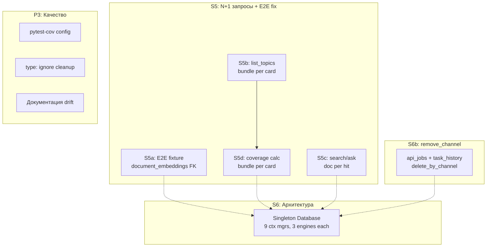

# Технический долг: аудит и план закрытия

> Составлен 2026-03-30 после завершения S1–S3.
> Обновлён 2026-03-30 после завершения S4.

## Статус выполнения

| Сессия | Задачи | Статус |
|--------|--------|--------|
| S1 | MCP logging (stderr redirect) | **Выполнено** |
| S2+S2.5 | Management tools + remove_channel | **Выполнено** |
| S3 | DB optimization (batch stats, count_by_channel) | **Выполнено** |
| S4 | Quick wins: 5 тестов TestListTopicsTool + get_channel_stats на stats_repos | **Выполнено** |
| S4+ | Fix TestCLIModeDispatch (positional vs keyword args) | **Выполнено** |
| S5 | E2E fixture fix + N+1 запросы | Запланировано |
| S6b | remove_channel cleanup (api_jobs, task_history) | Запланировано |
| S6 | Singleton Database | Запланировано |

---

## Карта оставшихся проблем

---

## S5: N+1 запросы + E2E fixture (~1.5 часа)

### S5a: E2E fixture — FK violation (5 мин)

**Файл:** `tests/test_e2e_pipeline.py` (строка 159)

**Проблема:** `e2e_db` fixture делает `DELETE FROM processed_documents` без предварительного удаления `document_embeddings`, что даёт FK violation. Блокирует все 7 E2E тестов.

**Фикс:** Добавить `DELETE FROM document_embeddings` перед строкой 159.

### S5b: N+1 в `list_topics` (30 мин)

**Файл:** `tg_parser/mcp_server.py` (строки 281-294)

**Проблема:** Цикл `for card in page: bundle = await topic_bundle_repo.get_by_topic_id(card.id)`. При limit=50 — 50 последовательных запросов.

**Решение:**
- Загрузить все bundles одним `topic_bundle_repo.list_by_channel()` (метод существует в ports.py:459)
- Для случая без `channel_id`: добавить `list_all()` в `TopicBundleRepo` (отсутствует)
- Построить `dict[topic_id, TopicBundle]`, использовать `bundle_map.get(card.id)` вместо `get_by_topic_id`
- Обновить mock `_mock_processing_repos` в тестах

### S5c: N+1 в `search` / `ask_question` (40 мин)

**Файл:** `tg_parser/services/retrieval_service.py` (строка 85)

**Проблема:** `proc_repo.get_by_source_ref(sim.source_ref)` в цикле. До `limit * 2` = 20 запросов.

**Решение:**
- Добавить `get_by_source_refs(refs: list[str]) -> dict[str, ProcessedDocument]` в `ProcessedDocumentRepo`
- SA-реализация: `WHERE source_ref IN (:refs)`
- Загрузить все документы одним batch-запросом, фильтровать в памяти

### S5d: N+1 в coverage calc (20 мин)

**Файл:** `tg_parser/services/channel_service.py` (строки 40-44, 89-93)

**Проблема:** `get_by_topic_id` per card в `get_channel_stats()` и `get_all_channel_stats()`.

**Решение:** Заменить на один `topic_bundle_repo.list_by_channel(cid)`, извлечь все source_refs из bundles в set.

---

## S6b: remove_channel cleanup (~1 час)

**Файлы:** `tg_parser/storage/ports.py`, SA-реализации, `tg_parser/mcp_server.py`

**Проблема:** `remove_channel` не чистит `api_jobs` и `task_history` с `channel_id` удаляемого канала.

**Решение:**
- Добавить `delete_by_channel()` в `JobRepo` (ports.py, после строки 527) и `TaskHistoryRepo` (после строки 816)
- SA-реализации с `DELETE FROM ... WHERE channel_id = :channel_id`
- Вызывать в `remove_channel` перед удалением source
- Убедиться, что `removal_repos()` контекст предоставляет эти репозитории

---

## S6: Singleton Database (~3-4 часа, высокий риск)

**Файлы:** `tg_parser/storage/sqlalchemy/database.py`, `tg_parser/services/db_context.py`, `tg_parser/storage/engine_factory.py`

**Проблема:** 9 context managers в `db_context.py` — каждый создаёт `Database` + `init()` (3 engines) + `close()` (dispose). Engines создаются и уничтожаются на каждый запрос.

**Решение:**
- `Database.from_settings()` возвращает singleton (кэшированный per-settings инстанс)
- `init()` — один раз при первом использовании
- `close()` — только при shutdown (atexit / app lifespan)
- Все 9 context managers переиспользуют singleton
- FastAPI/CLI/MCP: lifecycle management

**Риски:** Влияет на CLI, тесты, REST API. Тесты должны получать свежие инстансы. Требует тщательного тестирования.

---

## P3: Качество кода (по мере работы)

- **pytest-cov:** установлен, не сконфигурирован. Добавить `[tool.coverage]` в `pyproject.toml`.
- **type: ignore:** 4 файла (`cli/app.py`, `topicization_service.py`, `ingestion_service.py`, `agents/base.py`). Исправлять при работе в этих файлах.
- **Документация:** обновлять `technical-debt-roadmap.md` после каждой сессии.

---

## Рекомендуемый порядок

| Порядок | Сессия | Задачи | Оценка | Риск |
|---------|--------|--------|--------|------|
| 1 | S5 | E2E fixture + N+1 (list_topics, search, coverage) | ~1.5 часа | Низкий |
| 2 | S6b | remove_channel cleanup (api_jobs, task_history) | ~1 час | Низкий |
| 3 | S6 | Singleton Database | ~3-4 часа | Высокий |
| -- | P3 | pytest-cov, type:ignore, docs | попутно | Нет |
