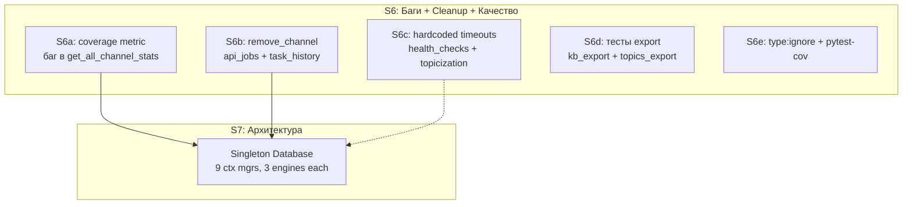

# Технический долг: аудит и план закрытия

> Составлен 2026-03-30 после завершения S1–S3.
> Обновлён 2026-03-30 после завершения S5.

## Статус выполнения

| Сессия | Задачи | Статус |
|--------|--------|--------|
| S1 | MCP logging (stderr redirect) | **Выполнено** |
| S2+S2.5 | Management tools + remove_channel | **Выполнено** |
| S3 | DB optimization (batch stats, count_by_channel) | **Выполнено** |
| S4 | Quick wins: тесты TestListTopicsTool + get_channel_stats на stats_repos | **Выполнено** |
| S4+ | Fix TestCLIModeDispatch (positional vs keyword args) | **Выполнено** |
| S5 | E2E fixture fix + N+1 запросы (list_topics, search, coverage) | **Выполнено** |
| S6 | Coverage bug + remove_channel cleanup + hardcoded values + export tests | Запланировано |
| S7 | Singleton Database | Запланировано |

---

## Карта оставшихся проблем

---

## S6: Баги, cleanup, качество (~2-3 часа, низкий риск)

### S6a: Coverage metric inconsistency (15 мин) — БАГ

**Файл:** `tg_parser/services/channel_service.py`

**Проблема:**
- `get_channel_stats()` (строка 45): `covered_documents = len(covered_refs & processed_refs)` — пересечение
- `get_all_channel_stats()` (строка 96-99): `len(covered_refs) / processed_count * 100` — без пересечения

Batch-функция может давать завышенный `coverage_percent`, если bundle содержит source_refs из другого канала.

**Решение:**
- Привести `get_all_channel_stats()` к тому же паттерну с пересечением
- Извлечь общий helper `_compute_coverage(bundles, processed_refs) -> tuple[int, float]`

### S6b: remove_channel cleanup (40 мин)

**Файлы:** `tg_parser/storage/ports.py`, `tg_parser/storage/sqlalchemy/job_repo.py`, `tg_parser/storage/sqlalchemy/task_history_repo.py`, `tg_parser/mcp_server.py`, `tg_parser/services/db_context.py`

**Проблема:** `remove_channel` не чистит `api_jobs` и `task_history` с `channel_id` удалённого канала.

**Текущее состояние:**
- `SAJobRepo` имеет `channel_id` в записях, но **нет** `delete_by_channel()`
- `SATaskHistoryRepo` имеет `channel_id` в записях, но **нет** `delete_by_channel()`
- `removal_repos()` контекст не предоставляет эти два репозитория

**Решение:**
1. Добавить `delete_by_channel()` в `JobRepo` и `TaskHistoryRepo` (ports.py)
2. SA-реализации: `DELETE FROM api_jobs WHERE channel_id = :cid` / `DELETE FROM task_history WHERE channel_id = :cid`
3. Расширить `removal_repos()` в `db_context.py` — добавить `SAJobRepo` и `SATaskHistoryRepo`
4. Вызвать в `remove_channel` перед удалением source
5. Обновить mock `_mock_removal_repos` в `tests/test_mcp_management.py`

### S6c: Hardcoded timeouts → settings (30 мин)

**Файлы и значения:**

| Файл | Строки | Значение | Куда в settings |
|------|--------|----------|-----------------|
| `tg_parser/api/health_checks.py` | 149, 161, 180 | `timeout=10.0` | `health_check_timeout` |
| `tg_parser/api/health_checks.py` | 193 | `timeout=5.0` | `health_check_timeout` (или `ollama_timeout`) |
| `tg_parser/processing/topicization.py` | 271, 335, 969 | `asyncio.sleep(2.0)` | `llm_retry_delay` |

**Решение:** Добавить поля в `Settings` класс, заменить хардкоды на `settings.xxx`.

### S6d: Тесты export-модулей (45 мин)

**Файлы без тестов:**
- `tg_parser/export/kb_export.py`
- `tg_parser/export/topics_export.py`

Ни один тест не импортирует эти модули. Нужны базовые unit-тесты с mock repos.

### S6e: type:ignore + pytest-cov (20 мин)

**type:ignore (5 мест):**

| Файл | Строка | Причина |
|------|--------|---------|
| `tg_parser/cli/app.py` | 733 | `mode=mode` |
| `tg_parser/services/topicization_service.py` | 171, 355 | `llm_client=None` |
| `tg_parser/services/ingestion_service.py` | 66 | `mode=mode` |
| `tg_parser/agents/base.py` | 260 | `self.process(agent_input)` |

**pytest-cov:** установлен, нет конфигурации. Добавить `[tool.coverage]` в `pyproject.toml`.

---

## S7: Singleton Database (~3-4 часа, высокий риск)

**Файлы:** `tg_parser/storage/sqlalchemy/database.py`, `tg_parser/services/db_context.py`, `tg_parser/storage/engine_factory.py`

**Проблема:** 9 context managers в `db_context.py` — каждый создаёт `Database` + `init()` (3 engines) + `close()` (dispose). Engines создаются и уничтожаются на каждый запрос.

**Дополнительные проблемы db_context.py:**
- `stats_repos` и `removal_repos` открывают одни и те же 3 сессии, отличаются только набором repo в yield
- Весь boilerplate `from_settings → init → sessions → close` повторяется 9 раз

**Решение:**
- `Database.from_settings()` возвращает singleton (кэшированный per-settings инстанс)
- `init()` — один раз при первом использовании
- `close()` — только при shutdown (atexit / app lifespan)
- Все 9 context managers переиспользуют singleton
- FastAPI/CLI/MCP: lifecycle management
- Опционально: объединить stats_repos + removal_repos через general helper

**Риски:** Влияет на CLI, тесты, REST API. Тесты должны получать свежие инстансы. Требует тщательного тестирования.

---

## Рекомендуемый порядок

| Порядок | Сессия | Задачи | Оценка | Риск |
|---------|--------|--------|--------|------|
| 1 | S6a | Fix coverage metric bug | 15 мин | Низкий |
| 2 | S6b | remove_channel cleanup (api_jobs, task_history) | 40 мин | Низкий |
| 3 | S6c | Hardcoded timeouts → settings | 30 мин | Низкий |
| 4 | S6d | Тесты export-модулей | 45 мин | Низкий |
| 5 | S6e | type:ignore + pytest-cov | 20 мин | Нет |
| 6 | S7 | Singleton Database | 3-4 часа | Высокий |
